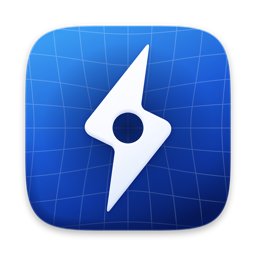
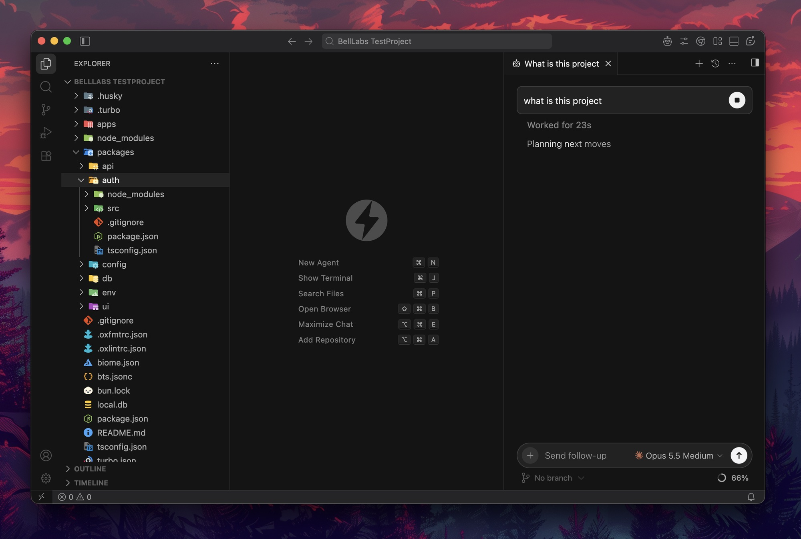
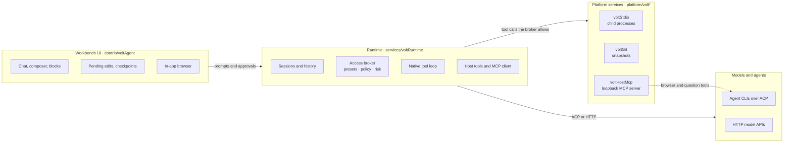

<div align="center">



# Volt

Volt is an Agentic Development Kit (ADK) that uses VS Code as its base, for developers to run, inspect, benchmark, and orchestrate coding agents.

[](LICENSE.txt)
[](#status)
[](https://github.com/microsoft/vscode)
[](.nvmrc)
[](CONTRIBUTING.md)

[Website](https://volt.leularia.com) · [Documentation](https://volt.leularia.com/docs) · [Contributing](CONTRIBUTING.md) · [Security](SECURITY.md)

<br />



</div>

<br />

Agents do the typing. You keep the judgment. Volt is an open-source workspace for working *with* coding agents instead of next to them. Chats, code, Git, a browser, and a terminal share one window, so nothing you need is a tab away.

It is built on the real VS Code core, not a lookalike. Your extensions, themes, keybindings, language servers, and debuggers come along. What Volt adds is the layer that makes agents a first-class part of the editor: a runtime that talks to any model or agent CLI, a permission system you control, and review tools that let you accept or undo exactly what an agent changed.

## Why Volt

| | |
| --- | --- |
| **Bring your own agent** | Volt doesn't sell tokens. Use the Claude Code, Codex, OpenCode, Cursor, Grok, Antigravity, or Kimi sign-in you already have, or point Volt straight at an API (OpenAI, Anthropic, Gemini, OpenRouter) or a local model (Ollama, LM Studio). You keep your plan and your keys. |
| **You set the leash** | Four access presets, from *Supervised* to *Full access*, decide what an agent may read, edit, run, fetch, or connect to. Risky commands are flagged before they run, and a hard-deny list for destructive commands and secret files holds even under Full access. |
| **Review before it lands** | Every agent edit is pending until you keep or undo it, per hunk. Each turn is checkpointed in Git, so you can preview, restore, or redo any point in a conversation without touching your own index. |
| **One window, no tab sprawl** | An in-app browser the agent can drive and you can annotate, a real editor, Git, and a terminal sit beside the conversation. Switch between *Agent* and *IDE* layouts with one command. |
| **Open all the way down** | MIT licensed, with extensions from [Open VSX](https://open-vsx.org). If we ever go the wrong way, everything you need to fork it is here. |

## What's inside

### Agents and models

- **Agent CLIs over ACP.** Claude Code, Codex, OpenCode, Cursor (early access), Grok (early access), Antigravity, Kimi, and any generic [Agent Client Protocol](https://agentclientprotocol.com) agent. Volt keeps warm sessions ready so a new chat doesn't pay a cold start.
- **Direct model access.** OpenAI, Anthropic, Gemini, OpenRouter, any OpenAI-compatible endpoint, Ollama, and LM Studio, driven by Volt's own native tool loop.
- **Five modes in one composer.** *Agent*, *Plan*, *Ask*, *Debug*, and *Multitask*. Plan and Ask can't edit files or run shell commands.
- **MCP.** Connect MCP servers (stdio or HTTP) from `.mcp.json`, `.cursor/mcp.json`, `.vscode/mcp.json`, or `.volt/mcp.json`. Agents call them like built-in tools, under the same permissions.
- **Project instructions.** `AGENTS.md`, `CLAUDE.md`, `.volt/AGENTS.md`, `.cursorrules`, and `.github/copilot-instructions.md` are picked up automatically.

### Control and review

- **Access presets.** *Supervised* (default), *Auto-accept edits*, *Auto*, and *Full access*, layered with project, agent, session, and mode rules. Allow-always decisions are remembered and visible.
- **Pending edits.** Keep or undo changes hunk by hunk against a baseline, with a compact diff card above the composer.
- **Checkpoints.** A Git snapshot before and after every turn, stored under a hidden ref (`refs/volt/*`), with preview, restore, and redo. Your index and branches stay untouched.
- **Per-chat worktrees.** Give a chat its own checkout so parallel agents don't trample each other.

### The workspace around the chat

- **Agent and IDE layouts.** One command toggles between a chat-first window and the full editor workbench.
- **Projects.** Add a project from This PC, a Git URL, or GitHub, right from the app. Switch between projects and chats from one sidebar.
- **In-app browser.** The agent can navigate, click, type, take screenshots, and read the console and network. You can inspect an element and pin a comment on it for the agent to act on.
- **Rich composer.** `@`-mention files, folders, terminals, other chats, branches, editor selections, browser elements, and images. Queue your next message while the agent works.
- **Questions, plans, and todos.** Agents can ask you a structured question, propose a plan you approve before it runs, and show their task list and sub-agents as they go.
- **Context and usage meters.** See how much of a model's context a chat is using, and what Claude, Codex, and Cursor usage costs, from local transcripts and account data.

### In the editor

- **Tab completion and next-edit prediction.** Inline suggestions from the model you choose, plus a one-shot **Volt: AI Edit** command for multi-file changes. Disabled for `.env*`, lockfiles, and secrets by default.
- **Everything VS Code.** Debugging, tasks, the extension host, remote development, and the full set of built-in language features.

## Architecture



The workbench never embeds a provider SDK. UI talks to a **runtime service**; the runtime decides which model or agent runs, asks the **access broker** before any tool touches your machine, and uses platform services for processes, Git, and the loopback MCP server that exposes Volt's browser and question tools to agents.

### Where things live

| Path | What it is |
| --- | --- |
| [`src/vs/workbench/services/voltRuntime`](src/vs/workbench/services/voltRuntime) | The runtime: providers, ACP bridges, the native loop, access broker, tools, history |
| [`src/vs/workbench/contrib/voltAgent`](src/vs/workbench/contrib/voltAgent) | The agent window: chat, composer, review, in-app browser, history |
| [`src/vs/workbench/contrib/voltProjects`](src/vs/workbench/contrib/voltProjects) | Project registry and the add-project flow |
| [`src/vs/workbench/contrib/voltSettings`](src/vs/workbench/contrib/voltSettings) | The Volt settings editor |
| [`src/vs/workbench/contrib/voltPrediction`](src/vs/workbench/contrib/voltPrediction) | Inline completions and one-shot AI edits |
| [`src/vs/platform`](src/vs/platform) `/voltStdio`, `/voltGit`, `/voltHostMcp`, `/voltUsage`, `/voltFsBrowse`, `/voltBrowser` | Host services for processes, Git snapshots, MCP, usage, folder browsing, and the browser session |
| [`apps/docs`](apps/docs) | The documentation site and landing page |
| [`brand`](brand) | Icon sources and generated assets |

Everything else is the VS Code core, kept as close to upstream as we can so that merging new releases stays tractable. See [VOLT-ARCHITECTURE-REVIEW.md](VOLT-ARCHITECTURE-REVIEW.md) for a candid engineering review and [VOLT-MULTI-PROJECT-AGENT-WORKSPACE-PLAN.md](VOLT-MULTI-PROJECT-AGENT-WORKSPACE-PLAN.md) for where the agent window is headed.

## Getting started

### Status

Volt is in **public beta** and moves fast. macOS is the platform we develop and test on. Windows and Linux inherit VS Code's cross-platform build but are not yet validated for Volt's agent window. Packaged installers for this VS Code-based build are not published yet, so for now you run Volt from source.

### Run from source

You need **Node.js 22.19** (the version in [`.nvmrc`](.nvmrc); 22.15.1 is the minimum), npm, Git, Python 3, and a C/C++ toolchain for native modules. On macOS that's the Xcode Command Line Tools. [CONTRIBUTING.md](CONTRIBUTING.md#set-up-your-machine) lists the Linux and Windows packages.

```bash
git clone https://github.com/LeulAria/VOLT.git
cd VOLT

nvm install                          # picks up Node from .nvmrc
npm install                          # installs dependencies, builds native modules
npm run electron                     # downloads the Electron runtime into .build/
node build/lib/builtInExtensions.js  # fetches the pinned built-in extensions

make start                           # compile, watch, and launch Volt
```

`make start` runs a file watcher and launches the app with hot reload: save a file and the window reloads. `make help` lists the rest (`make stop`, `make reload`, `make restart`).

The first compile takes a few minutes. After that, rebuilds are incremental.

### Connect an agent

Run **Volt Settings** from the command palette (<kbd>⇧</kbd><kbd>⌘</kbd><kbd>P</kbd>) and choose how you want to run agents:

1. **An agent CLI you already use.** Install it and sign in the way that tool documents. Volt finds it on your `PATH` (or launches a pinned adapter through `npx`) and leaves your plan and credentials with that tool. Volt does not store them.
2. **An API key.** Add a provider (OpenAI, Anthropic, Gemini, OpenRouter, or any OpenAI-compatible endpoint). Keys are stored in the editor's secret storage, not in settings files.
3. **A local model.** Point Volt at Ollama (`127.0.0.1:11434` by default) or LM Studio.

Then press <kbd>⌘</kbd><kbd>N</kbd> for a new agent chat.

### Package a macOS build

```bash
unset ELECTRON_RUN_AS_NODE
VOLT_BUILD_IGNORE_TYPE_ERRORS=1 \
  node --max-old-space-size=16384 ./node_modules/gulp/bin/gulp.js vscode-darwin-arm64-min
```

The unsigned app lands in `../VSCode-darwin-arm64/VOLT.app`. `VOLT_BUILD_IGNORE_TYPE_ERRORS=1` reports type errors but still packages, because the tree has known TypeScript 6 diagnostics; see [CONTRIBUTING.md](CONTRIBUTING.md#checks-before-you-push).

## Privacy and safety

Volt ships with no telemetry endpoint and no update server configured. What leaves your machine is what you choose to send: prompts, file contents, and tool results go to whichever model or agent you select, and tab prediction (on by default) sends the code around your cursor to the model you picked for it. Volt also makes requests to GitHub (when you add a project from GitHub), Open VSX (extensions), and the usage endpoints of the agents you've signed into.

Permissions are an approval policy, not a sandbox: an agent you allow to run shell commands runs them as you. Read [SECURITY.md](SECURITY.md) for the full trust model before you point Volt at code you don't trust.

## Documentation

- [volt.leularia.com/docs](https://volt.leularia.com/docs): the documentation site (source in [`apps/docs`](apps/docs))
- [CONTRIBUTING.md](CONTRIBUTING.md): set up, conventions, tests, and how to land a change
- [SECURITY.md](SECURITY.md): supported versions, the trust model, and how to report a vulnerability
- [VOLT-ARCHITECTURE-REVIEW.md](VOLT-ARCHITECTURE-REVIEW.md): engineering review of the runtime and UI
- [docs/](docs): design proposals for computer use and harness optimization

## Contributing

Volt is built in the open and we'd love your help. Bug reports with clear reproduction steps, focused fixes, and well-tested improvements are the fastest way to get something merged. For a larger feature, open an issue first so we can agree on the shape before you invest the time.

Read [CONTRIBUTING.md](CONTRIBUTING.md) and our [Code of Conduct](CODE_OF_CONDUCT.md) to get started. To report a security problem, **don't open a public issue**; follow [SECURITY.md](SECURITY.md).

## Acknowledgements

Volt stands on a lot of open work:

- [Visual Studio Code](https://github.com/microsoft/vscode) (Code - OSS) by Microsoft and its contributors, the foundation of this project
- [Open VSX](https://open-vsx.org) by the Eclipse Foundation, the extension registry
- [Agent Client Protocol](https://agentclientprotocol.com) and the [Model Context Protocol](https://modelcontextprotocol.io), the interfaces that let Volt work with many agents and tools
- The authors of every agent CLI Volt can drive, and of the third-party packages listed in [ThirdPartyNotices.txt](ThirdPartyNotices.txt)

Volt is an independent project. It is not affiliated with, endorsed by, or sponsored by Microsoft, Anthropic, OpenAI, Google, Cursor, or any other company named here. "Visual Studio Code" is a trademark of Microsoft Corporation, and all other product names and logos belong to their owners.

## License

Volt is released under the [MIT License](LICENSE.txt).

Copyright (c) 2026 - present Volt ADK. Portions copyright (c) 2015 - present Microsoft Corporation.
