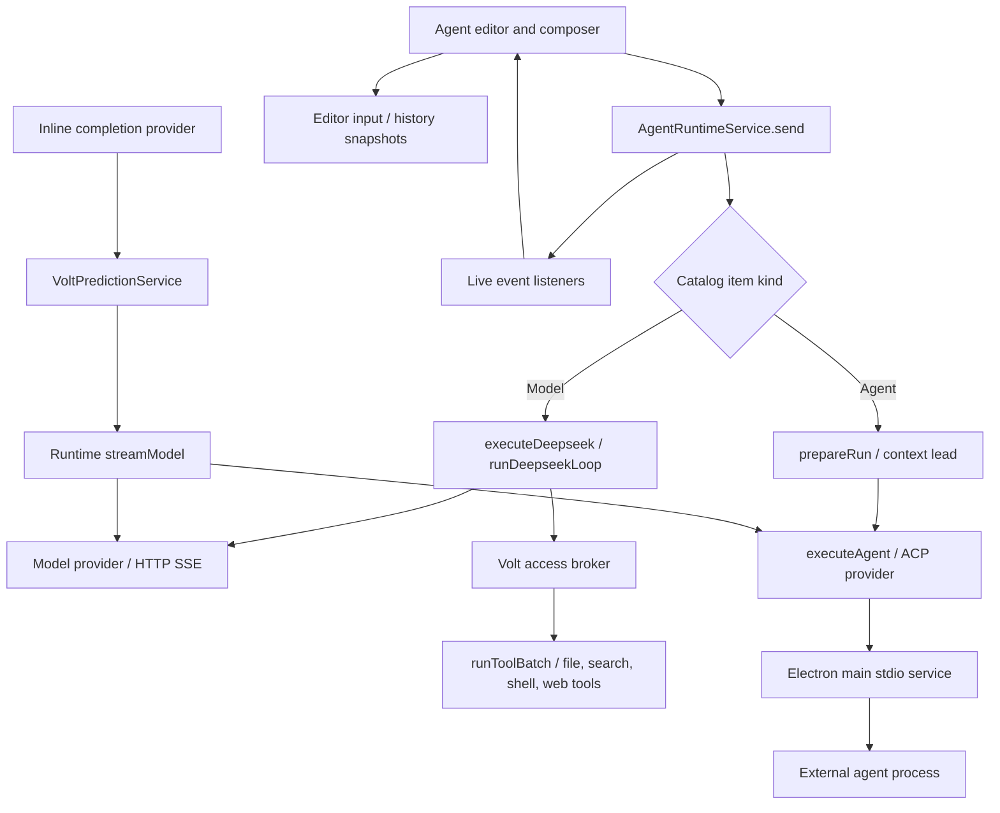
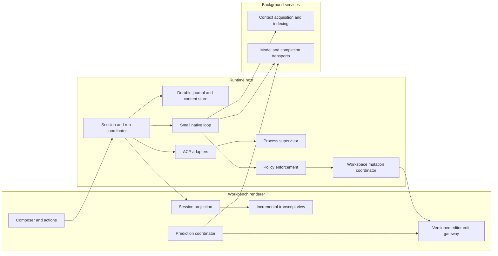

# Volt architecture review and improvement proposal

**Reviewed:** 26 September 2026  
**Repository:** `/Users/leularia/Desktop/VOLT/volt`  
**Baseline:** `ea101935`, including the working-tree changes present during review  
**Scope:** repository structure, `src/`, and the local reference projects in `.aInsp/`  
**Deliverable:** analysis and proposed changes; application source was not modified

## 1. Recommendation

**Keep the VS Code foundation. Concentrate the next development cycle on a small, dependable execution core, incremental conversation rendering, safe editor mutations, and a dedicated prediction path.**

Volt already has substantial product work: a native workbench integration, agent sessions, model and CLI providers, access decisions, history, diff review, browser preview, and inline predictions. The primary limitation is that these pieces do not yet share consistent lifecycle, persistence, cancellation, and edit-safety guarantees.

The most consequential architectural mismatch is between the extensive harness modules and the actual execution path. Native models currently run through the compact `common/deepseek/loop.ts` implementation. Many of the newer harness capabilities are tested as independent components but are not connected to that loop. Wiring all of them in indiscriminately would add complexity and latency. Extract the essential guarantees and prove them through the real service boundary.

Five problems were reproduced using isolated probes against the existing compiled code:

1. A history entry appended while an atomic save is pending can disappear from disk.
2. A later file edit can run concurrently with an operation designated exclusive.
3. A tool timeout can return an error while the underlying operation continues.
4. A multibyte UTF-8 character split across HTTP chunks becomes corrupted.
5. Cancelling an idle SSE iterator can leave its pending read unresolved.

These fixes should precede additional orchestration features. Separately, conversation streaming currently rebuilds the entire transcript DOM; this is the clearest source-level candidate for deteriorating responsiveness as sessions grow. Its actual frame-time cost still needs profiling.

### Recommended order

| Order | Change | Main benefit |
|---|---|---|
| 1 | Repair history write races and cancellation/transport defects | Prevent lost work and stuck operations |
| 2 | Establish workspace-wide mutation ordering and versioned edits | Prevent conflicting writes and unsafe undo |
| 3 | Replace full transcript rebuilding with keyed incremental updates | Keep typing, selection, and scrolling responsive |
| 4 | Make session state and persistence independent of editor views | Reliable background work, reopen, and recovery |
| 5 | Give Tab a dedicated stateless, bounded prediction path | Consistent editing latency and fewer stale suggestions |
| 6 | Connect context budgets, compaction, and evidence to the live loop | Reliable longer tasks |
| 7 | Build Volt-owned CI, profiling, release identity, and recovery tests | Repeatable professional releases |
| 8 | Add deeper retrieval and isolated background workers after the above | Higher task quality without destabilizing the editor |

## 2. Method and limits

This review traced registration, service calls, streaming, tools, history, prediction, review, and subprocess ownership. It also inspected concrete mechanisms in all 13 local `.aInsp` reference repositories, plus the existing Volt architecture plans. These are local snapshots, not claims about each project's latest release or overall quality.

Evidence labels used below:

- **Reproduced:** an isolated probe exercised the implementation and demonstrated the behavior.
- **Observed:** directly visible in source or command output.
- **Risk/inference:** a consequence suggested by the implementation that needs integration or performance testing.
- **Proposal:** a target design or acceptance criterion, not an existing capability or measured result.

Validation performed:

| Check | Result |
|---|---|
| `npm run compile-check-ts-native` | Failed: **45 TypeScript diagnostics**, 29 in Volt-named paths and 16 elsewhere |
| Runtime common tests through the repository Node runner | **556 passing, 2 failing** |
| Runtime tests repeated using pinned Node `22.19.0` | Same **556 passing, 2 failing** result |
| Five isolated transport, mutation, timeout, and history probes | All five failure cases reproduced, including on Node `22.19.0` |
| Runtime source/output timestamps | No runtime TypeScript source newer than its corresponding compiled JavaScript at inspection time |

The unit tests and probes used the existing `out/` tree. Timestamp checks reduce stale-output uncertainty but do not establish a clean reproducible build. The type check examined current source. The initially active shell used Node `25.1.0`; the repository pins `22.19.0`, which is why the tests and probes were repeated under that version.

No clean production build, Electron UI benchmark, browser automation suite, live paid provider request, packaging test, or cross-platform runtime test was performed. Findings must not be interpreted as measured startup times, memory figures, or a claim that every file in this large fork was audited. Existing uncommitted work was preserved; observed failures are not attributed to those edits without a baseline comparison.

## 3. Repository structure

### 3.1 The foundation is appropriate

This is a Code OSS fork, with package version `1.105.1` and Electron `37.6.0` declared locally. It is already an editor platform, rather than a chat application that needs an editor added later.

| Area | Role | Recommendation |
|---|---|---|
| `src/vs/base` | Lifecycle, events, cancellation, collections, browser primitives | Reuse rather than creating parallel primitives |
| `src/vs/platform` | Files, storage, requests, DI, policies, process services | Put durable host capabilities and cross-window ownership here |
| `src/vs/editor` | Monaco text models, completions, inline edits, diff and bulk-edit infrastructure | Preserve; use its versioning and undo mechanisms |
| `src/vs/workbench` | Desktop/workbench UI, contributions, application services | Keep Volt product integration here |
| `src/vs/code` | Electron application and desktop bootstrapping | Keep custom patches small and explicit |
| `src/vs/server`, `remote/` | Remote workspace execution and server infrastructure | Route future remote agent tools through this architecture |
| `extensions/` | Language, Git, debug and other built-in integrations | Preserve compatibility; avoid broad deletion for speculative speed gains |
| `cli/` | Rust CLI and remote/tunnel capabilities | Separate from the agent runtime hot path |
| `build/`, `scripts/`, `test/` | Build, packaging, unit/integration/smoke/performance infrastructure | Adapt these to Volt-owned infrastructure |
| `apps/docs/` | Independent documentation site | Keep isolated from desktop dependencies and startup |
| `.aInsp/` | Ignored reference repositories and design plans | Keep out of builds; move maintained decisions into tracked documentation |

The important boundary is `common` versus `browser` versus host-specific code. A `common` module should express a portable contract or deterministic operation. Filesystem ownership, process lifetimes, and durable persistence need actual host implementations. A data structure named `WorktreeAllocator` cannot itself establish filesystem isolation.

### 3.2 Size and concentration

Counts include TypeScript declarations/tests where applicable; line counts include comments and blanks and are not complexity measurements.

| Volt area | TypeScript files | Lines | Test files |
|---|---:|---:|---:|
| `services/voltRuntime` | 237 | 33,546 | 73 |
| `contrib/voltAgent` | 84 | 29,295 | 20 |
| `contrib/voltPrediction` | 3 | 482 | 0 |
| `contrib/voltSettings` | 3 | 964 | 0 |
| `platform/voltStdio` | 2 | 124 | 0 |
| **Total in these Volt areas** | **329** | **64,411** | **93** |

The broader `src/` tree contains 5,152 TypeScript files. Prediction does have pure helper coverage under the runtime tests; “0” above means no tests within that contribution directory, not no prediction testing anywhere.

The largest concentration points are:

| File | Lines | Architectural concern |
|---|---:|---|
| `agentEditor.ts` | 4,483 | View construction, composer, transcript state, event reduction, rendering, history, and interaction ownership |
| `voltRuntimeService.ts` | 1,677 | Sessions, execution, catalog, authentication access, policy, prediction transport, and provider health |
| `agentBlocks.ts` | 1,525 | Large presentation transformation surface |
| `browserEditor.ts` | 1,303 | Navigation, webview lifecycle, selection, capture, and agent integration |
| `agentMentions.ts` | 1,265 | Broad composer/context UI responsibilities |
| `agentBlockRenderers.ts` | 1,173 | Many rich render types and associated DOM work |

Split these by ownership and lifecycle, rather than pursuing an arbitrary line-count limit. Moving methods into files without changing ownership would leave the difficult behavior intact.

### 3.3 What already deserves preservation

- The UI uses a runtime service boundary instead of embedding provider SDKs throughout the workbench.
- Model providers and agent providers are distinct concepts.
- The editor uses upstream inline-completion and bulk-edit interfaces.
- File/search/request/secret storage services are reused.
- History has atomic writes, torn-record decoding, index rebuilding, and content-addressed attachments.
- Provider catalogs can populate incrementally as connections respond.
- The native loop already handles truncated tool calls, approvals, steering messages, and repeated-tool detection.
- There is meaningful pure-function test coverage for access, tool parsing, context, prediction helpers, and history codecs.
- The shared `AgentThreadView` can move between UI locations; this is useful groundwork for a single view model with multiple hosts.

## 4. Actual execution architecture

The main workbench entry point eagerly imports the Volt registrations, while the runtime singleton uses delayed instantiation. When instantiated, its constructor starts catalog and provider refreshes. Delayed construction does not make its entire import graph lazy. See [workbench registration](/Users/leularia/Desktop/VOLT/volt/src/vs/workbench/workbench.common.main.ts:213) and [runtime initialization](/Users/leularia/Desktop/VOLT/volt/src/vs/workbench/services/voltRuntime/browser/voltRuntimeService.ts:152).



### 4.1 The harness plans and runtime have diverged

There are **81 modules under `common/harness`**. `createRunHarness`, `bindLoopController`, `compactTurn`, and `runNativeLoop` have definitions and test use, but the production source search did not find live callers that connect them to the current native run path. `session.harness` is read in multiple places without being initialized in the reviewed runtime service.

Consequences:

| Feature | Current evidence | Assessment |
|---|---|---|
| Native tool loop | `executeDeepseek` invokes `runDeepseekLoop` | Connected |
| Native approvals | `authorizeDeepseek` calls the access broker before tool dispatch | Connected |
| Parallel tool execution | `runToolBatch` is called by the native host | Connected, with ordering defect described below |
| Context compaction | `compactTurn` and context engine exist | Not wired into current native loop |
| Durable execution events | `EventStore` contains an in-memory array | Not a disk-backed run journal |
| Evidence-based completion | Harness/controller/evidence helpers exist | Not enforced by current native loop |
| Mission orchestration | Planning/allocation/state helpers exist | End-to-end worker execution and recovery not established |
| Worktree isolation | Allocator returns paths and manages in-memory leases | No Git worktree creation in that allocator |
| History display | Editor snapshots persisted by `AgentHistoryService` | Connected, distinct from full execution replay |
| Resume | `seedSession` restores user/assistant text | Does not reconstruct native tool-call history or a durable run |

Sources: [native execution](/Users/leularia/Desktop/VOLT/volt/src/vs/workbench/services/voltRuntime/browser/voltRuntimeService.ts:1020), [harness construction](/Users/leularia/Desktop/VOLT/volt/src/vs/workbench/services/voltRuntime/common/harness/runHarness.ts:70), [event storage](/Users/leularia/Desktop/VOLT/volt/src/vs/workbench/services/voltRuntime/common/harness/eventStore.ts:48), [worktree allocation](/Users/leularia/Desktop/VOLT/volt/src/vs/workbench/services/voltRuntime/common/harness/worktree.ts:6).

**Decision:** keep the simple native loop as the initial execution kernel. Add persistence, cancellation, context preparation, and evidence through explicit interfaces. Reclassify unused orchestration code as experimental until a service-level test demonstrates it works through `send()`. Do not reintroduce every intent heuristic merely to make an older plan appear implemented.

## 5. Findings and concrete changes

Priority convention: **P0** means work-loss/execution-correctness issues that should block a dependable release; **P1** means core performance or reliability gaps; **P2** means important product and maintainability improvements.

### F01 — P0: history writes can drop concurrent entries

**Reproduced.** `rewrite()` captures the current transcript, serializes it, awaits directory creation and a file write, then replaces `entries` with the captured records and clears `pending`. `append()` can run during those awaits. The write queue serializes writes, but it does not serialize changes to the in-memory entry list.

The probe delayed the first session-file write, appended a second user turn, released the write, and flushed everything. The persisted log contained only the first turn.

```text
HISTORY_RACE second turn on disk: false
```

**Change:** give each entry a monotonically increasing revision. Capture an immutable batch and a cutoff revision. When the write completes, acknowledge only entries through that cutoff. Retain every later entry and schedule its flush. An alternative is to serialize both state mutations and writes through one actor, while keeping UI projection updates fast.

Do not clear a shared pending array after asynchronous I/O unless its exact generation is known. Preserve the existing atomic-file approach until storage-provider behavior is tested; replacing it with offset appends without verification would reintroduce the issue documented in the code comment.

**Acceptance:** delayed-write tests with append, finalization, truncate, draft save, close/reopen, write failure, and recovery. Every acknowledged user turn survives reopening.

Source: [history append](/Users/leularia/Desktop/VOLT/volt/src/vs/workbench/services/voltRuntime/browser/history/agentHistoryService.ts:213), [write batch and rewrite](/Users/leularia/Desktop/VOLT/volt/src/vs/workbench/services/voltRuntime/browser/history/agentHistoryService.ts:321).

### F02 — P0: exclusive tool ordering is broken, and locks are batch-local

**Reproduced.** In `runMutating`, a path operation waits on `paths.get(path) ?? exclusive`. If that path already has a promise, the operation does not also wait on a more recent exclusive barrier.

For `[edit A, shell, edit A]`, the fake-tool probe produced:

```text
start:edit1 → end:edit1 → start:edit2 → start:shell → end:edit2 → end:shell
```

The second edit overlapped the shell operation. In addition, each `runToolBatch` owns a separate lock map, so two sessions can mutate the same path independently. Path strings are slash-normalized but not canonicalized; aliases and symlinks can identify the same file with different keys.

**Change:** introduce a workspace-scoped mutation coordinator. A path mutation must wait on both its prior path operation and the latest exclusive barrier. An exclusive operation must wait on all earlier relevant operations and become a prerequisite for all later mutations. Canonicalize resource identity in the host/provider responsible for that resource. Include workspace URI/authority and case sensitivity in the identity.

Parallel reads should also respect explicit data dependencies; `parallelSafe` alone does not establish that a read is independent of an earlier write in the same batch.

**Acceptance:** deterministic ordering tests for path/exclusive/path, two sessions, alias paths, cancellation while queued, read-after-write, and independent-file parallelism.

Source: [mutation scheduler](/Users/leularia/Desktop/VOLT/volt/src/vs/workbench/services/voltRuntime/common/harness/toolRuntime.ts:103), [path classification](/Users/leularia/Desktop/VOLT/volt/src/vs/workbench/services/voltRuntime/common/harness/mutationQueue.ts:16).

### F03 — P0: timeout is not cancellation; retries can repeat side effects

**Reproduced for timeout.** `timeoutHook()` races the body against a timer but does not abort or join the operation. The probe returned a timeout error, then the fake mutation completed afterward.

**Observed retry risk.** `transientRetryHook()` retries based on error classification without requiring the tool to be read-only or idempotent. A shell command can perform a side effect before reporting a transient-looking failure. Repeating that command is not necessarily safe.

**Change:** pass a per-tool cancellation source/deadline through every host operation. Cancellation must stop dispatch of queued work and either terminate/join active work or explicitly report an uncertain outcome. Retry read-only operations by policy; retry mutations only with a supported idempotency key or proof that execution never began. Keep an operation in the mutation coordinator until it really settles.

For arbitrary shell commands, exactly-once execution cannot be guaranteed across a crash. Persist “started, outcome unknown,” reconcile the workspace/process state, and let the user decide whether repeating the operation is appropriate.

**Acceptance:** delayed writes cannot finish unnoticed after a timeout; a fake charge/append/deploy operation is never retried automatically after an ambiguous failure; cancel prevents all later queued mutations.

Source: [timeout and retry hooks](/Users/leularia/Desktop/VOLT/volt/src/vs/workbench/services/voltRuntime/common/harness/waterfall.ts:137).

### F04 — P0: model transport can corrupt text or hang on cancellation

**Reproduced.** `requestSseLines()` decodes each byte chunk independently using `chunk.toString()`. A Unicode character can span network chunks. The probe turned `é` into `��`.

The iterator waits on `notify` when there are no lines. `listenStream(..., token)` suppresses callbacks after cancellation, but the iterator has no cancellation subscription that resolves that wait. Cancelling and ending the fake stream left `next()` pending.

**Change:** use an incremental UTF-8 decoder, a bounded queue with a read cursor, explicit cancellation wake-up, and `try/finally` cleanup. Parse SSE event boundaries and multiline `data:` fields correctly. Bound an individual frame, queued bytes, error-body size, and idle time. Treat an EOF without a valid terminal marker according to the provider contract; do not silently turn a broken stream into successful completion.

**Acceptance:** fixtures split every byte position of Unicode text and tool arguments; CRLF and multiline SSE fixtures pass; cancellation before headers, between deltas, and after the last delta always settles; malformed and oversized frames fail predictably.

Source: [HTTP stream adapter](/Users/leularia/Desktop/VOLT/volt/src/vs/workbench/services/voltRuntime/browser/host/httpStream.ts:21), [upstream listener cancellation behavior](/Users/leularia/Desktop/VOLT/volt/src/vs/base/common/stream.ts:589).

### F05 — P0: agent edits and discard need version-aware editor transactions

**Observed.** Native tools read and write via `IFileService`. They do not use an editor-model version or an expected disk etag at commit time. `discardFile()` writes the captured original content back without comparing current content to the version produced by the agent.

**Risk:** a user types into a dirty buffer while an agent edits the disk; an external formatter or second agent modifies the file between read and write; discarding agent changes overwrites later human edits. The existing confirmation describes restoration but does not identify intervening changes.

**Change:** make all agent edits produce a proposal containing resource identity, base version/hash, ranges, replacement text, and run/tool provenance. For open buffers, apply through `IBulkEditService`/text models with version guards and an undo group. For unopened files, use expected etags or equivalent compare-and-swap behavior. Persist preimages before mutation.

Revert should be a three-way operation: base, agent result, current content. If current content differs from the agent result, preview the inverse patch or expose a conflict. Do not blindly restore whole-file snapshots. Preserve encoding, EOL style, file mode, and creation/deletion semantics.

**Acceptance:** dirty buffers, user typing during inference, format-on-save, rename, external modification, two agents, and undo/revert after a human edit all have deterministic outcomes without silent data loss.

Source: [native edit/write](/Users/leularia/Desktop/VOLT/volt/src/vs/workbench/services/voltRuntime/browser/tools/fileTools.ts:145), [discard behavior](/Users/leularia/Desktop/VOLT/volt/src/vs/workbench/contrib/voltAgent/browser/review/agentSessionChangesService.ts:204).

### F06 — P1: each streaming repaint reconstructs the entire transcript

**Observed.** `scheduleThreadRender()` batches work into `requestAnimationFrame`, which is useful, but `renderThread()` clears listeners, calls `replaceChildren()`, and renders every message again. It also republishes session changes and performs layout-related work.

**Performance inference:** per-frame cost grows with total transcript size rather than only the changed content. Rebuilding code blocks, tables, tool cards, and rich Markdown can disturb selection, focus, and scroll anchoring. `AgentThreadView.syncStuckTurns()` additionally measures all user turns during scrolling.

**Change:** use a keyed transcript projection with stable message/part IDs. Update only the active text or tool part. Cache finished Markdown/code blocks by content revision and theme. Schedule DOM reads and writes separately. Publish file-change projections only when file-change state changes.

Start with incremental rows, then virtualize long histories based on measured thresholds. Preserve a straightforward small-transcript route. Make copy, find, export, and accessibility read from the complete model rather than only mounted DOM rows.

**Acceptance:** a 1,000-turn transcript receives a token update without recreating old turns; selection and focus survive streaming; scrolling into history disables automatic following until explicitly re-enabled; heavy blocks do not monopolize a frame.

Source: [full transcript render](/Users/leularia/Desktop/VOLT/volt/src/vs/workbench/contrib/voltAgent/browser/editor/agentEditor.ts:1759), [frame scheduling](/Users/leularia/Desktop/VOLT/volt/src/vs/workbench/contrib/voltAgent/browser/editor/agentEditor.ts:4086), [scroll measurements](/Users/leularia/Desktop/VOLT/volt/src/vs/workbench/contrib/voltAgent/browser/editor/agentThreadView.ts:48).

### F07 — P1: transcript persistence is not durable execution persistence

**Observed.** The UI/input layer records assistant snapshots. `seedSession()` restores plain user/assistant messages. Native tool calls/results are retained in `session.deepseek.messages` in memory, and the separate `EventStore` is also in memory.

**Risk:** a renderer reload or loss of the active view can preserve a readable chat while losing execution state: pending tools, provider session identity, structured results, exact compaction state, and the distinction between “not run” and “ran but response lost.” Session/listener maps also need explicit eviction and provider disposal rather than accumulating until window teardown.

**Change:** the runtime owns session state, journal writes, provider identity, and terminal outcomes. Views subscribe to projections and may disappear without changing execution. Add `releaseSession`/subscription lifecycle management, bounded inactive-session caches, and host-owned process cleanup.

A new view receives a snapshot at revision N plus events after N, with buffering during the handoff. This avoids the race between reading a snapshot and subscribing to live updates.

**Acceptance:** close/reopen the agent view during a run; reload the renderer during a tool; resume a compacted session; reconnect with duplicated or missing event frames; recover without repeating a mutation.

Sources: [session restoration](/Users/leularia/Desktop/VOLT/volt/src/vs/workbench/services/voltRuntime/browser/voltRuntimeService.ts:187), [live event emission](/Users/leularia/Desktop/VOLT/volt/src/vs/workbench/services/voltRuntime/browser/voltRuntimeService.ts:1332), [editor history ownership](/Users/leularia/Desktop/VOLT/volt/src/vs/workbench/contrib/voltAgent/browser/editor/agentEditorInput.ts:207).

### F08 — P1: process hosting needs supervision and bounded output

**Observed:**

- The stdio service owns processes in Electron main.
- `spawn()` returns an ID before the child's asynchronous `spawn`/`error` result is settled; an error is logged but does not directly reject that returned handle or emit a terminal outcome.
- Standard error is logged and retained as a short tail, while `shellTool.collectOutput()` listens to stdout and discards the `stderr` property on exit.
- Shell output grows in an unbounded string until the command finishes; truncation happens afterward.
- Background collection stops after 800 ms, without a complete job-management tool surface in the inspected shell tool.
- `kill()` signals the immediate process; it does not establish cross-platform process-tree termination.
- Every non-Windows shell invocation assumes `/bin/zsh`, which is not guaranteed on Linux.

**Change:** build a host process supervisor with spawn acknowledgement, stream attachment/replay, separate stdout/stderr channels, bounded ring buffers plus optional spill files, job IDs, deadlines, process-tree termination, and terminal receipts. Use the configured platform shell. Provide status, read-output, write-input, and stop operations for long-running jobs.

Keep Electron main as a broker. Move high-volume stream parsing and process supervision into an existing compatible VS Code host abstraction or a utility process. IPC should carry bounded/coalesced data and lifecycle events, not one round trip per character. Electron's guidance also recommends keeping blocking work off the main and renderer threads. [Electron performance guidance](https://www.electronjs.org/docs/latest/tutorial/performance), [utility process API](https://www.electronjs.org/docs/latest/api/utility-process).

**Acceptance:** nonexistent executable, immediate exit, stderr-only command, 100 MB output, cancelled process with grandchildren, window close, background server, and Linux without zsh.

Source: [stdio host](/Users/leularia/Desktop/VOLT/volt/src/vs/platform/voltStdio/electron-main/voltStdioMainService.ts:31), [shell collection](/Users/leularia/Desktop/VOLT/volt/src/vs/workbench/services/voltRuntime/browser/tools/shellTool.ts:97).

### F09 — P1: native and ACP lifecycle semantics diverge

**Observed.** Native follow-ups enter a steering inbox. The ACP follow-up branch relies on `session.harness`, which is not initialized in the reviewed path. `pause()` changes local state, but the ACP send path does not consult it. A second ACP send can replace run state and cancel its token rather than following a clearly defined queued/steering transition. Retrying after an agent process dies resends the request after a restart.

**Risk:** the same UI action can mean different things for different providers, and automatic replay after a process dies can duplicate side effects if earlier work completed.

**Change:** a session actor serializes `send`, `steer`, `pause`, `resume`, `cancel`, `changeProvider`, and `close`. Capture an immutable run context and cancellation token when starting a run. Fence all late callbacks by run generation. Provider adapters advertise whether they support in-turn steering, pause, persisted sessions, and resumable turns.

When pause is unsupported, offer stop/queue behavior with truthful UI wording. Restart only automatically when there is evidence no side effect started; otherwise recover the transcript and reconcile the workspace before continuing.

**Acceptance:** identical command-sequence fixtures across native and ACP providers; rapid stop/send; late events from the old run; approval pending during follow-up; provider death after a successful edit.

Source: [send and follow-up branching](/Users/leularia/Desktop/VOLT/volt/src/vs/workbench/services/voltRuntime/browser/voltRuntimeService.ts:195), [pause/resume](/Users/leularia/Desktop/VOLT/volt/src/vs/workbench/services/voltRuntime/browser/voltRuntimeService.ts:327), [ACP restart path](/Users/leularia/Desktop/VOLT/volt/src/vs/workbench/services/voltRuntime/browser/voltRuntimeService.ts:1217).

### F10 — P1: Tab is coupled to a chat/agent path with unsuitable latency semantics

**Observed.** Prediction resolves through the runtime model access service. Agent references reuse an ACP ask session. The interface comment says “never ACP,” while the implementation explicitly supports ACP. Inline prediction waits for the entire response, with ceilings of 10 seconds for models and 30 seconds for agent-backed Tab. These are ceilings, not measured response times. Structured predictions can use the same shared `inFlight` slot and cancel another prediction operation.

**Change:** separate `ICompletionProvider` from conversational model/agent providers. Give it a bounded prefix/suffix request, small output budget, explicit stop rules, cancellation, and no tool capabilities. Configure a dedicated fast provider/model independently of composer selection. Keep slower generic/ACP fallback available only as an explicitly labeled option or manual action.

Use a priority scheduler: current-cursor completion > explicit AI edit > speculative next edit > background enrichment. A speculative NES request should not cancel an explicit user operation. Cache by model/configuration revision and relevant context, and support compatible prefix reuse when the user types part of a suggestion. Measure end-to-end latency, acceptance, and retained edits rather than merely whether a request returned text.

Cursor's public Tab description emphasizes edits and next-location prediction; this review makes no claim about its private architecture or latency internals. [Cursor Tab](https://cursor.com/tab).

Source: [prediction request path](/Users/leularia/Desktop/VOLT/volt/src/vs/workbench/services/voltRuntime/browser/prediction/voltPredictionService.ts:194), [ACP-backed prediction](/Users/leularia/Desktop/VOLT/volt/src/vs/workbench/services/voltRuntime/browser/voltRuntimeService.ts:560), [prediction contract](/Users/leularia/Desktop/VOLT/volt/src/vs/workbench/services/voltRuntime/common/prediction.ts).

### F11 — P1: next edits need base-version and path validation

**Observed.** The ghost-text branch checks the source model version after prediction. The explicit NES branch and asynchronous chain do not apply the same check. Queued edits validate range shape, not that the underlying text still matches. One-shot edits construct `ResourceTextEdit` without a model version. Model-returned paths are joined under the first workspace folder without an explicit post-normalization containment check.

**Change:** every predicted edit carries source document version/hash, expected old text, and validated target URI. Reject or safely rebase stale predictions; invalidate chains when intervening user edits touch their assumptions. Validate every target against the correct workspace authority/root and effective policy. Never treat model-supplied confidence as an edit-safety guarantee.

**Acceptance:** slow prediction followed by typing, target file rename, buffer close/reopen, `../` paths, absolute paths, remote URIs, multiple roots, and cross-file chain acceptance after intervening edits.

Source: [inline/NES branching](/Users/leularia/Desktop/VOLT/volt/src/vs/workbench/contrib/voltPrediction/browser/voltInlineCompletionsProvider.ts:117), [queue validation](/Users/leularia/Desktop/VOLT/volt/src/vs/workbench/contrib/voltPrediction/browser/voltInlineCompletionsProvider.ts:193), [path resolution](/Users/leularia/Desktop/VOLT/volt/src/vs/workbench/services/voltRuntime/browser/prediction/voltPredictionService.ts:176), [one-shot application](/Users/leularia/Desktop/VOLT/volt/src/vs/workbench/contrib/voltPrediction/browser/oneShotEdit.ts:89).

### F12 — P1: context work is not consistently bounded or invalidated

**Observed.** Prediction calls `model.getValue()` for the active file and sibling models before truncating excerpts. Native `read_file` loads the whole file and splits it before applying line/output limits. Project instructions and run-plan detection are cached for the runtime lifetime without file-change invalidation. Native loop messages grow across steps without calling the existing compactor. Web tools use `CancellationToken.None` and buffer responses before truncation; search tools do not pass the tool cancellation signal.

**Change:** apply limits at acquisition time, not only presentation time. Read bounded text-model ranges and reject huge/binary inputs before full processing where the provider permits it. Bridge tool cancellation into file/search/request operations. Add byte and deadline caps to network acquisition. Invalidate project instructions and context caches using file events and workspace identity.

Before each native model request, reserve room for output, system instructions, and tool schemas. Prune old tool payloads while retaining content references; summarize only when needed. Persist compaction boundaries and summaries, keep valid tool-call/result pairs, and include the user's current objective and constraints.

**Acceptance:** large/minified files do not cause full-file allocations on every prediction; a rules edit affects the next run; a 100-step session stays within its chosen model's context budget; cancel ends background search/fetch; Unicode byte limits are tested.

Sources: [prediction context](/Users/leularia/Desktop/VOLT/volt/src/vs/workbench/services/voltRuntime/browser/prediction/predictionContextBuilder.ts:23), [file acquisition](/Users/leularia/Desktop/VOLT/volt/src/vs/workbench/services/voltRuntime/browser/tools/fileTools.ts:94), [cached workspace inputs](/Users/leularia/Desktop/VOLT/volt/src/vs/workbench/services/voltRuntime/browser/voltRuntimeService.ts:1164), [web tools](/Users/leularia/Desktop/VOLT/volt/src/vs/workbench/services/voltRuntime/browser/tools/webTools.ts:54).

### F13 — P1: access policy needs an enforceable host boundary

**Observed.** Native shell execution uses a normal child process with inherited environment. `deepseekKnobs()` describes sandbox modes, but `authorizeDeepseek()` uses the approval behavior; the native spawn path does not consume the sandbox value. A lexical workspace-path check is not realpath/symlink containment. Most operations select workspace folder zero. Prediction also reads clipboard text automatically and includes it in context without a dedicated clipboard-context setting in the inspected prediction settings interface.

**Change:** distinguish approval policy from actual enforcement. Add a host execution policy with workspace roots, remote authority, network rules, allowed environment, and supported isolation level. Integrate workspace trust. Recheck canonical target resources at mutation time; for hostile workspaces, account for symlink races at the filesystem enforcement layer. Keep full-access behavior explicit and separate from sandboxed modes.

Provide an understandable context/privacy control: whether clipboard, sibling files, selected files, browser snapshots, and repository content may be sent to each provider. Disabled/excluded files must be filtered through all acquisition paths, not just the active-file completion trigger. Redact structured logs and raw error bodies as well as rendered tool results.

**Acceptance:** symlink escaping the workspace, multi-root edits, remote workspace commands, denied files reached through search/context, clipboard disabled, inherited environment secrets, and trust-disabled workspaces.

Sources: [native approval mapping](/Users/leularia/Desktop/VOLT/volt/src/vs/workbench/services/voltRuntime/browser/voltRuntimeService.ts:1105), [spawn environment](/Users/leularia/Desktop/VOLT/volt/src/vs/platform/voltStdio/electron-main/voltStdioMainService.ts:31), [lexical path check](/Users/leularia/Desktop/VOLT/volt/src/vs/workbench/services/voltRuntime/browser/tools/workspacePath.ts:10), [clipboard collection](/Users/leularia/Desktop/VOLT/volt/src/vs/workbench/contrib/voltPrediction/browser/voltInlineCompletionsProvider.ts:177).

### F14 — P1: preview browser defaults need tightening

**Observed.** The preview webview enables `allowpopups`, uses the persistent `volt-browser` partition, and requests `allowRunningInsecureContent`. Electron's guidance advises against permissive popup and mixed-content settings and calls for permission handling for every session that loads remote content. [Electron security guidance](https://www.electronjs.org/docs/latest/tutorial/security).

**Change:** remove these permissive defaults. Scope development exceptions to explicit local origins and sessions. Add permission, navigation, popup, download, certificate, and external-opening policies to the actual preview partition. Verify guest preferences when attached. Test the execution/capture bridge as a capability boundary. This observation is not proof that arbitrary pages currently have Node access; that requires a separate end-to-end assessment.

**Acceptance:** remote pages cannot open unrestricted windows or obtain permissions implicitly; local HTTP previews still work; guest content cannot access privileged workbench IPC; profile/session separation is intentional.

Source: [preview webview creation](/Users/leularia/Desktop/VOLT/volt/src/vs/workbench/contrib/voltAgent/browser/preview/browserEditor.ts:383).

### F15 — P1: builds and CI are not a dependable release gate yet

**Observed.** Type checking currently fails. The primary PR workflow uses Microsoft-specific self-hosted pool labels. The fast watch path transpiles separately from type checking, and the Makefile starts `watch-client` rather than the combined watch/types command. A development window can therefore run newly transpiled code while compile-time API errors remain. The current dev-reload contribution itself has file-watcher API errors in the type-check result.

**Change:** create a Volt-owned CI path on runners you control. Require type/layer checks, runtime service tests, browser tests for modified UI surfaces, and deterministic artifact builds. Keep fast transpilation, but surface a persistent type-check status locally and make it a merge/release gate. Adapt the inherited workflow rather than assuming those upstream runners are available.

The two failing runtime tests concern success-criterion explicitness and a `web_search` tool appearing in the fast-lane selection. Resolve the intended behavior first, then change either implementation or expectation; do not weaken tests simply to obtain a green result.

**Acceptance:** a clean checkout on supported CI can install, type-check, test, and package; a type error cannot silently pass the release job; fast-watch output and production output are both smoke-tested.

Sources: [workflow runners](/Users/leularia/Desktop/VOLT/volt/.github/workflows/pr.yml:23), [development launch](/Users/leularia/Desktop/VOLT/volt/Makefile), [reload watcher](/Users/leularia/Desktop/VOLT/volt/src/vs/workbench/contrib/voltAgent/electron-browser/voltDevReload.contribution.ts:44).

### F16 — P2: startup work, fork maintenance, and product identity need ownership

**Observed.** Runtime initialization refreshes providers/catalogs; all enabled profiles are queried concurrently. UI integration touches core layout/titlebar/window code. The checked-in product identity remains Code OSS in application names, bundle identifiers, data paths, URI scheme, and issue links, although the extension gallery is configured for Open VSX.

**Change:** render cached provider state first, prioritize the selected provider, bound discovery concurrency, and defer unrelated probes until idle or settings interaction. Split catalog/model access from agent execution so using Tab does not inherently require a large agent service. Verify startup improvements with profiles before pursuing bundle micro-optimizations.

Keep a small, reviewed list of core patches and an upstream integration cadence. Move repeated layout coordination into a dedicated service and upstream-compatible extension points where feasible. Create a complete Volt product configuration and test user-data migration deliberately. Adapt crash/support/update endpoints and sign/package the app for each supported platform.

**Acceptance:** cold/warm startup traces identify Volt overhead; disabled providers spawn nothing; switching layouts preserves editor/agent state; release artifacts use Volt identity and do not accidentally share Code OSS user data.

Sources: [catalog refresh](/Users/leularia/Desktop/VOLT/volt/src/vs/workbench/services/voltRuntime/browser/voltRuntimeService.ts:656), [product configuration](/Users/leularia/Desktop/VOLT/volt/product.json), [package scripts](/Users/leularia/Desktop/VOLT/volt/package.json).

## 6. What to learn from `.aInsp`

The useful unit of reuse is a mechanism and its tests. Replacing Volt's architecture with several different reference frameworks would create more integration work than it removes. The following links are to the exact local snapshots inspected.

| Reference and local commit | Concrete material | Apply to Volt | Avoid importing wholesale |
|---|---|---|---|
| T3Code `ad117235` | [event-store contract](/Users/leularia/Desktop/VOLT/volt/.aInsp/t3code/apps/server/src/persistence/Services/OrchestrationEventStore.ts), [projection pipeline](/Users/leularia/Desktop/VOLT/volt/.aInsp/t3code/apps/server/src/orchestration/Services/ProjectionPipeline.ts) | Separate durable sequence/replay from UI read models; snapshot plus cursor recovery | Effect/server/web stack solely to reproduce these contracts |
| DeepSeek harness `c291e79` | [JSONL persistence backend](/Users/leularia/Desktop/VOLT/volt/.aInsp/deepseek-harness/packages/session/session-persistence-jsonl/src/index.ts) | Explicit materialization, append batches, torn-tail recovery, revision-guarded caches and durable write semantics | Assuming Volt's short `deepseek/loop.ts` includes the reference backend's guarantees |
| Pi `71dca87` | [agent loop](/Users/leularia/Desktop/VOLT/volt/.aInsp/pi/packages/agent/src/agent-loop.ts) | Small loop with preparation hooks, steering and follow-up boundaries; reject truncated tool batches | TUI/session plumbing unrelated to workbench integration |
| Prime Agent `e311d64` | [file mutation queue](/Users/leularia/Desktop/VOLT/volt/.aInsp/prime-agent/packages/coding-agent/src/core/tools/file-mutation-queue.ts) | Canonical resource identity and shared per-file serialization | Synchronous realpath calls on Volt's renderer/main hot paths; move resolution into the host |
| OpenCode `4643e65` | [session compaction](/Users/leularia/Desktop/VOLT/volt/.aInsp/opencode/packages/opencode/src/session/compaction.ts) | Tool-aware pruning, preserved recent turns and explicit compaction boundaries | Fixed token thresholds copied without adapting to model windows and Volt workloads |
| Cline `8bbdde2` | [compaction coordinator](/Users/leularia/Desktop/VOLT/volt/.aInsp/cline/apps/vscode/src/sdk/sdk-compaction-coordinator.ts) | Treat compaction as a runtime operation; coordinate read/compact/persist with session replacement and follow-up | Sending a slash command as ordinary model prose and assuming state was compacted |
| Roo Code `b867ec9` | [shadow checkpoint service](/Users/leularia/Desktop/VOLT/volt/.aInsp/Roo-Code/src/services/checkpoints/ShadowCheckpointService.ts) | Isolated checkpoint storage and sanitized Git environment; preserve preimages | Whole-repository snapshots before every small action or replacing editor undo with Git reset |
| Zed `bc538de` | [FIM prediction](/Users/leularia/Desktop/VOLT/volt/.aInsp/zed/crates/edit_prediction/src/fim.rs), [buffer identity guard](/Users/leularia/Desktop/VOLT/volt/.aInsp/zed/crates/edit_prediction/src/data_collection.rs:160) | Dedicated bounded prediction inputs, background work, buffer snapshots and identity-aware caches | Rewriting the VS Code fork in Rust/GPUI to chase speed |
| Superset `3e11e8e86` | [main-process blocking ratchet](/Users/leularia/Desktop/VOLT/volt/.aInsp/superset/apps/desktop/src/no-main-process-blocking.test.ts) | Prevent new blocking main-process operations; progressively shrink existing exceptions | Its Electron/TRPC architecture where VS Code already provides a host service |
| Paseo `8cd9895` | [agent update subscriptions](/Users/leularia/Desktop/VOLT/volt/.aInsp/paseo/packages/server/src/server/session/agent-updates/agent-updates-service.ts) | Independent observers, bootstrap buffering, filtering and update sequencing | A remote daemon as a prerequisite for a local editor request |
| Synara `b58f273` | [transcript tests](/Users/leularia/Desktop/VOLT/volt/.aInsp/synara/apps/web/src/components/chat/MessagesTimeline.test.tsx:237), [timeline implementation](/Users/leularia/Desktop/VOLT/volt/.aInsp/synara/apps/web/src/components/chat/MessagesTimeline.tsx) | Stable rows; retain a simple route for small transcripts and virtualize when useful | React/LegendList solely to replace Volt's existing workbench DOM primitives |
| Zeron `6ecea05` | [transcript-follow tests](/Users/leularia/Desktop/VOLT/volt/.aInsp/zeron/apps/ios/ZeronTests/TranscriptFollowTests.swift) | Explicit follow/release/re-engage state and regression tests during stream growth and resize | Native mobile UI implementation details |
| Zenith `a8d9b57` | [task validation](/Users/leularia/Desktop/VOLT/volt/.aInsp/zenith/zenith/src/zenith_harness/task_validation.py), [artifact storage](/Users/leularia/Desktop/VOLT/volt/.aInsp/zenith/zenith/src/zenith_harness/storage.py) | Later: durable mission artifacts, dependency validation and separately specified verification tasks | Mission planning overhead on every edit or conversational question |

### Reconcile the existing Volt plans

The [runtime architecture plan](/Users/leularia/Desktop/VOLT/volt/.aInsp/VOLT-RUNTIME-ARCHITECTURE.md) and [harness V2 plan](/Users/leularia/Desktop/VOLT/volt/.aInsp/VOLT-HARNESS-V2-PLAN.md) contain valuable ideas, but should become a decision history rather than a statement of implemented behavior.

| Existing direction | Updated recommendation |
|---|---|
| Keep local UI/runtime interaction lightweight | Preserve local events/projections; use host IPC where lifetime, isolation or CPU work requires it |
| Put stdio in Electron main | Keep registration/brokering in main; move substantial supervision and parsing out of its event loop |
| Separate model and agent providers | Keep and extend with explicit capability/ownership contracts |
| Prediction is stateless and never ACP | Align implementation with that default; expose slower fallback intentionally |
| Durable run log drives replay | Implement this for real; existing UI JSONL and in-memory EventStore do not satisfy it |
| Many intelligent harness subsystems | Require a connected production use case and evaluation before activation |
| Multi-agent mission lane | Defer until durable runs, mutation coordination and real worktree hosting pass tests |

Because `.aInsp/` is ignored, copy the maintained architecture decisions and source-attribution notes into tracked `docs/architecture/` as follow-up work. Preserve references and review licenses before copying actual implementation code; this review recommends mechanisms rather than code transplantation.

## 7. Proposed architecture

### 7.1 Ownership boundaries



This is a destination ownership model, not a proposal for a large immediate process rewrite. First extract interfaces and repair correctness in place. Move host work once contracts are tested. Reuse VS Code's existing utility/shared/remote services when they fit. Electron utility processes provide an available process mechanism, but do not by themselves provide a shell sandbox. [Electron utility process API](https://www.electronjs.org/docs/latest/api/utility-process).

### 7.2 Suggested file organization

Paths below are proposed relative structure within the existing source roots; they do not exist yet unless already named elsewhere.

```text
src/vs/workbench/services/voltRuntime/
  common/
    contracts/          sessions, runs, events, content refs, capabilities
    execution/          native loop, outcomes, budgets, retry policy
    context/            token budgets, prompt assembly, compaction
    policy/             portable policy types and deterministic evaluation
    providers/          transport-independent model and agent contracts
  browser/
    runtimeFacade.ts    small UI-facing bridge/projection service
    editorEditGateway.ts
    workspaceContext.ts
  electron-browser/
    runtimeClient.ts    host connection and lifecycle integration
  test/
    common/             deterministic logic and model-based tests
    browser/            editor/version/dirty-buffer integration

src/vs/platform/voltAgentHost/
  common/               IPC contracts and workspace resource identities
  node/                 journal, content store, process supervision
  electron-utility/     desktop host composition
  test/node/            real storage/process recovery tests

src/vs/workbench/services/voltPrediction/
  common/               prediction request/edit/version contracts
  browser/              scheduling, bounded context, cache and acceptance

src/vs/workbench/contrib/voltAgent/browser/
  session/              controller and session view model
  transcript/           keyed rows, streaming parts, scroll state
  composer/             input, mentions, attachments and send queue
  review/               proposed changes, conflict-aware accept/revert
  chrome/               layout adapters and commands
  preview/              preview UI over a constrained browser host
```

Keep `IAgentRuntimeService` temporarily as a compatibility facade while extracting `ISessionService`, `IModelCatalogService`, `IProviderProfileService`, and `IAccessPolicyService`. Migrate consumers incrementally. Avoid a single all-at-once folder move: it makes behavior changes harder to review and increases conflicts with ongoing UI work.

### 7.3 Durable state contract

Use one canonical execution journal with schema version, session ID, run ID, event ID, monotonic sequence, timestamp, and provider metadata where needed. Preserve raw provider extensions as bounded optional data rather than forcing every provider into lossy text strings.

Persist semantic transitions:

- User message accepted; run created/started.
- Assistant message completed; tool call prepared/authorized/started/completed.
- File mutation proposal, preimage reference, commit result.
- Approval decision and scope, without secrets.
- Compaction boundary and summary reference.
- Run completed, failed, cancelled, budget-exhausted, or interrupted.

Token deltas can remain ephemeral. Periodic partial-message checkpoints can improve perceived recovery without fsync on every token. Acknowledging a user message and starting a mutation require stronger durability than a cosmetic status update. Define the acknowledgement boundary explicitly.

For the first migration, retain JSONL with a correct single writer and bounded segments. A host-owned SQLite implementation is a reasonable later option for transactions and indexed history; it should use one canonical write path, with a migration and rollback plan. Do not introduce two authoritative databases or store large file bodies repeatedly in event rows.

Large tool output, before/after file content, and screenshots should use a content store with references, size limits, retention policy, and garbage collection. Reuse the history attachment design where appropriate.

### 7.4 State machine and recovery rules

```text
created → running → completed
             ↕          
       waiting_approval  
             ↕           
          paused          
             ↓             
         cancelling → cancelled

Any active state → failed / interrupted / budget_exhausted
```

Implement transitions with an exhaustive reducer and serialize commands per session. A terminal event occurs once per run generation. Reject callbacks from older generations. “Completed” means the run reached its defined completion condition; budget exhaustion is its own outcome. The current native path emits a budget warning and then maps the outcome to `done`, which should be corrected.

Recovery replays semantic state and reconstructs projections. Pending local reads may be rerun. An uncertain mutation must be reconciled, not automatically repeated. ACP adapters should restore a provider session when supported or explicitly start a new session with validated context.

## 8. Performance plan

### 8.1 Measure the experience, not only model latency

Separate these spans:

1. Input action → local acknowledgement.
2. Context acquisition and policy resolution.
3. Request queued → request dispatched.
4. Provider request → first byte → first usable content.
5. Event received → content painted.
6. Tool dispatch → actual completion.
7. Cancel requested → dispatch stopped → processes settled.
8. History acknowledgement → durable commit.

Tag spans with session/run/request IDs, provider/model, byte/token counts and cache outcome. Do not log prompt bodies or secrets by default. Replace timing-independent heuristics with actual evidence when reporting what completed.

### 8.2 Initial performance budgets

These are **proposed engineering budgets**, not current measurements or promises. Establish a baseline on a fixed reference machine and publish environment, sample count, p50/p95/p99, cache state and provider conditions.

| User-visible path | Initial target | Measurement conditions |
|---|---|---|
| Local typing/input handler work | p95 under 8 ms; no Volt-owned task over 50 ms | Large file and streaming agent simultaneously |
| Transcript incremental update | p95 under 8 ms of renderer work | 1,000-turn fixture; mixed tools/code/tables |
| Tool/event receipt to visible update | p95 under 50 ms excluding provider/network | Replay a recorded stream at fixed rate |
| Prompt submit to visible acknowledgement | p95 under 100 ms | Local operation; no wait for provider discovery |
| Prediction context preparation | p95 under 5 ms | Bounded ranges, cached metadata |
| Cached completion | p95 under 30 ms after eligibility | Model/configuration/context cache hit |
| Remote completion | Working target p50 150 ms / p95 400 ms from eligibility | Dedicated suitable model, fixed region; measure typing debounce separately |
| Stop dispatching new tools | Under 50 ms from cancellation | Deterministic local fixture |
| Local process cancellation | Target under 1 s, then explicit escalation/outcome | Platform-specific process-tree fixture |
| Warm history open | p95 under 150 ms for initial visible page | 1,000-turn session, paged content |
| Startup overhead from Volt | Initial gate under 10% over comparable base build | Same machine/extensions/workspace, cold and warm separately |
| Idle memory | Bounded by configured caches, no growth with closed sessions | Repeated open/run/close cycles; establish baseline before absolute cap |

A general chat model or ACP CLI may not satisfy the completion target. The product should expose that limitation rather than displaying stale suggestions after several seconds. The first performance iteration should focus on F06 and F10–F12; changing Electron versions or compilers alone will not correct those hot paths.

### 8.3 Benchmark fixtures

Create deterministic fixtures for 10, 100, and 1,000 turns; 1,000 tool events; many collapsed and expanded code blocks; long tool output; Unicode; 1 MB and generated files; multiple visible editors; and 20 retained sessions.

Record renderer CPU profiles, long tasks, layout time, DOM nodes, heap after disposal, and event throughput. Use a fake provider so regressions are attributable to Volt. Then maintain a smaller live-provider latency smoke suite separately. Set a regression threshold relative to the previous baseline before trying to meet every absolute budget.

## 9. Repository understanding and agent quality

The existing context graph ranks supplied items and adds relationship edges. It is not, by itself, a persistent repository symbol index or semantic retrieval engine. The current search integration is a useful foundation.

Build context quality in stages:

| Stage | Implementation | Why this order |
|---|---|---|
| 1 | Selected text, active buffer, diagnostics, explicit mentions, recent changes, scoped rules | Cheap, high-signal, already available in the editor |
| 2 | Reuse workspace search and language features for definitions/references/symbols | Avoid duplicate scanners and retain remote/provider behavior |
| 3 | Incremental file/symbol/import index in background workers | Update changed files, handle rename/delete/branch switch |
| 4 | Hybrid lexical and semantic retrieval if evaluation demonstrates benefit | Adds cost and privacy/storage complexity; justify it with task quality |

Every retrieved item should include resource, content version/hash, origin, score, and token cost. Unsaved buffers override disk content. Workspace ignore rules and provider privacy settings apply to every source. Indexing should pause or reduce priority during interactive typing and should never perform a full repository scan before a first response.

Rules need scope and provenance: workspace rules, nested directory rules, file-specific rules, and explicit user overrides. Do not simply concatenate root files forever. Reload applicable rules when files change, and record which versions influenced a run.

Evaluate with a small, maintained set of real coding tasks: fix a failing test, rename across files, explain unfamiliar code, implement a feature with tests, recover from a tool error, obey read-only mode, continue after interruption, and answer a question without unnecessary tools. Track task success, human corrections, regressions, cost, time, and evidence quality. A test file named `worldClass` is not a product evaluation.

Verification should consume actual command/test receipts with exit code, workspace revision and timestamp. A passing test becomes stale after a relevant mutation. Let the model explain results, but construct claims such as “tests passed” from recorded evidence.

## 10. Professional product experience

The main product loops should be independently excellent:

| Loop | Required experience |
|---|---|
| Tab | Fast useful suggestions, instant dismissal, partial acceptance, stable cursor, safe next-location jumps |
| Inline AI edit | Selection-aware request, cancellable progress, preview, version-safe apply, one-step undo |
| Agent task | Clear progress, tool details on demand, working stop/steer controls, durable conversation |
| Change review | File/hunk accept and reject, conflicts explained, human changes preserved, verification evidence linked |
| Recovery | Interrupted state explained, provider state reconciled, retry without accidental duplication |
| Connections | Authentication status, capability/latency expectations, understandable failure recovery |

Follow the editor's existing keyboard and accessibility conventions. Cover keyboard-only navigation, screen-reader announcements, reduced motion, high contrast, focus restoration, IME composition, RTL/Unicode text, high-DPI scaling, narrow windows and multi-monitor changes. Announce meaningful state changes rather than every token.

Use one source of truth for session status and selection across the editor, side panel, dock, and history. The current shared transcript surface is a good starting point, but view relocation should not own execution or persistence.

Keep the layout patch surface small. Establish a single layout-mode service that maps product modes to workbench parts, persists the user's layout, and coordinates changes with editor restoration. Test editor/agent/split modes during resize, reload, full-screen, and switching workspaces.

Finish release identity and operational basics: Volt app IDs and URI scheme, icons, install/uninstall behavior, supported extension compatibility, settings migration, signed artifacts, update channels, crash diagnostics, and support links. Preserve upstream attribution separately from product branding.

## 11. Delivery plan

The sequence below is a proposed set of reviewable changes, not a commitment to calendar dates. Effort bands assume an engineer familiar with the fork and must be revised after the first fixes. Some work can proceed concurrently, but durable execution and edit ownership have dependencies.

| Change set | Scope | Suggested effort | Exit gate |
|---|---|---|---|
| A | Correct the 45 type diagnostics; clarify two failing test expectations; establish Volt CI | 2–5 engineer-days | Clean type/test baseline on owned runner |
| B | History revision/cutoff fix with delayed-I/O tests | 1–3 days | No missing entries under append/write/close races |
| C | Streaming decoder, cancellation, framing, limits | 2–4 days | Unicode/cancel/EOF/oversize fixtures pass |
| D | Mutation barrier and workspace-wide locking; cancellable execution and safe retry policy | 3–7 days | Concurrency and timeout fault tests pass |
| E | Version-aware editor edit gateway and conflict-aware revert | 5–10 days | Dirty-buffer/external-change/undo matrix passes |
| F | Extract transcript projection; keyed incremental rendering; long-history windowing | 5–10 days | Rendering/selection/scroll benchmarks pass |
| G | Runtime-owned journal, content references and view-independent session state | 8–15 days | Reload/replay/uncertain-mutation recovery passes |
| H | Dedicated prediction service, scheduler, version guards and bounded context | 5–10 days | Prediction latency and stale-edit gates pass |
| I | Process supervisor, real policy enforcement and remote/root identity | 8–15 days | Process-tree, permission and workspace matrix passes |
| J | Connect compaction/evidence; add task evaluation and product polish | 5–10 days | Long-task evals and user-visible state claims agree |
| K | Incremental retrieval, isolated worktrees and background agents | Separate milestone | Demonstrated quality gain without violating prior gates |

B and C are good first behavior changes once the failing baseline is understood. E depends on D's ownership decisions. G should define the event contracts before moving the runtime to another process. H can begin with version safety and a dedicated provider interface before the full host migration.

For a solo developer, narrow the initial supported matrix: one desktop platform, one native provider path and one ACP path, while keeping the abstraction compatible with expansion. A dependable narrow release provides more value than many adapters with inconsistent semantics.

### First ten concrete tickets

1. **History generation safety:** preserve entries appended while `rewrite()` awaits I/O.
2. **HTTP stream correctness:** incremental decoder and cancellation wake-up.
3. **Mutation barrier:** path operations await the latest exclusive operation.
4. **Timeout ownership:** abort/join real operations and disable ambiguous mutation retries.
5. **Session actor:** serialize lifecycle commands and fence late callbacks.
6. **Safe edit gateway:** model/etag preconditions, preimages and undo grouping.
7. **Incremental transcript:** keep old row DOM stable during deltas.
8. **Prediction safety:** versions on NES chains and one-shot edits; validate all paths.
9. **Prediction latency:** separate completion provider and bounded context acquisition.
10. **Release gate:** owned CI, connected service-level tests and performance baselines.

## 12. Validation strategy

Keep the fast pure tests, then add tests at boundaries that the current helper-heavy suite does not establish.

| Test layer | Important cases |
|---|---|
| Pure contracts | Exhaustive state transitions, valid event ordering, context budgeting, path identities, retry classification |
| Runtime service | Invoke actual `send()` using fake providers/tools; approvals, follow-up, pause/cancel, budget outcome, provider change |
| Storage integration | Append during I/O, torn tail, disk full, failure retry, shutdown flush, migration, duplicate events, concurrent windows |
| Process integration | Spawn failure, early output/exit, stderr, output flood, stalled CLI, process descendants, background jobs |
| Editor integration | Dirty buffers, stale ranges, IME, rename, EOL/encoding, undo, cross-file preview and conflict-aware revert |
| UI regression | Selection while streaming, focus, history scrolling, dock movement, narrow layouts, accessibility |
| Performance | Recorded event replay, long transcript, large file, idle-memory plateau, startup delta |
| Product evaluation | Real coding tasks with acceptance criteria, traceable checks, cost and human corrections |

Avoid merely asserting that a helper returns a desired enum. The most valuable tests cross the boundary where one subsystem hands ownership to another: stream → loop, loop → tool, tool → filesystem, runtime → journal, journal → restored session, projection → DOM.

### Reproduction commands and observed failures

From the repository root:

```sh
npm run compile-check-ts-native

/Users/leularia/.nvm/versions/node/v22.19.0/bin/node \
  test/unit/node/index.js \
  --runGlob 'vs/workbench/services/voltRuntime/test/common/**/*.test.js'
```

The failing tests were:

```text
Volt task intelligence
  reads the project checks named in the request as success criteria
  Assertion: intel.successCriteria.every(criterion => criterion.explicit)

Volt capability groups
  fast lane sees edit but not shell
  Actual selected tools additionally included web_search
```

Representative type-check failures include outdated file-watcher API use in `voltDevReload.contribution.ts`, incorrect renderer element types, possibly undefined Mermaid edge fields, argument-count mismatches in file-change preview, and incompatible harness/test types. There are also non-Volt diagnostics, including TypeScript namespace syntax and upstream test/service interfaces. Do not classify all 45 as a single root cause.

The isolated probes used fake tool bodies, fake streams and an in-memory file service; they did not execute actual model-selected shell commands or modify user files. Their setup was:

| Probe | Setup | Observed |
|---|---|---|
| Mutation order | `runToolBatch`: edit `a.ts` for 10 ms; exclusive fake shell for 40 ms; edit `a.ts` for 1 ms | Second edit started before shell completed |
| Timeout | `ToolPipeline` with 5 ms timeout; fake body completes at 30 ms | Error returned, then body completed |
| UTF-8 | `requestSseLines`, split `data: {"text":"é"}` between the character's two bytes | `é` became `��` |
| Cancellation | Begin `next()` on empty stream, cancel token, end stream | Promise remained pending after the probe window |
| History | Hold first `writeFile`, append second user turn, release write and flush | Second turn absent from persisted JSONL |

These isolated reproducers should be converted into permanent regression tests in the appropriate layer before fixing the implementations.

## 13. Decisions to make explicit

1. **Preserve the editor foundation.** A framework or language rewrite is not justified by the inspected bottlenecks.
2. **Use one small native execution kernel.** Essential hooks are persistence, policy, context preparation, cancellation and evidence. More heuristics require evaluation.
3. **Separate completion from conversation.** Share transport utilities where useful, not mutable sessions or scheduling priorities.
4. **Make the runtime own durable state.** UI objects render and interact; they do not determine whether work survives.
5. **Treat edits as transactions against a known version.** This applies to native tools, inline edits, review/revert, and cooperating ACP hosts.
6. **Make permissions truthful.** An approval mode, a Git worktree and an OS sandbox provide different guarantees.
7. **Optimize measured hot paths.** Begin with transcript rendering, bounded context acquisition and completion scheduling.
8. **Keep upstream compatibility affordable.** Small core patches, tracked decisions, owned CI and regular integration checks.
9. **Promote features only when their live path is tested.** A helper implementation or architecture plan is not a shipped capability.
10. **Gate background agents on recovery and isolation.** Add them after the single-agent experience is dependable.

The immediate milestone should be a Volt build that passes its checks, preserves every accepted message, stops reliably, protects user edits, and remains responsive during a long session. That creates the foundation on which better predictions, deeper repository understanding and more capable agents can produce a professional Cursor-like experience.
