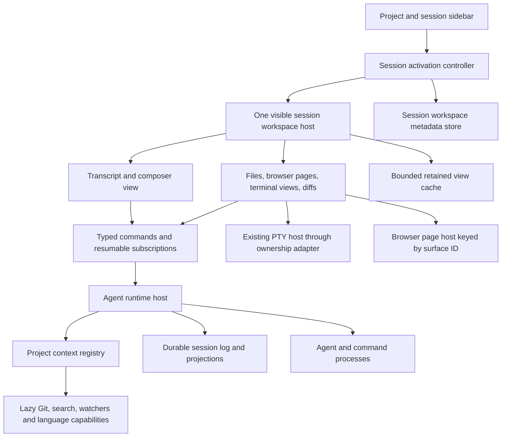

# Volt: instant multi-project agent workspaces

Date: 2026-09-27. Source baseline: `e5610eb1`, including the current local edits and untracked `browser/workspace` prototype.

This is a source-based architecture and implementation plan for the agent window. It follows [the broader architecture review](VOLT-ARCHITECTURE-REVIEW.md), but rechecks the switching implementation now present in the working tree. No application code was changed for this investigation. No running-app latency, memory, or CPU measurements were taken; all performance numbers below are proposed acceptance targets.

## 1. The decision

**Make the agent window a persistent shell. Selecting a project or chat must select application state, not open a VS Code workspace. Each chat owns a session workspace; project services and running processes live independently of its visible panel.**

Your desired product is achievable without rewriting the entire editor. The important change is the unit of ownership:

- **Project:** repository identity, root, settings, trust, shared Git/search resources.
- **Agent session:** conversation, execution context, drafts, approvals, run state, and its workspace layout.
- **Session surface:** one file view, terminal attachment, browser page, diff, or other tool view inside that session.
- **Agent window:** one navigation sidebar and exactly one active session workspace.

There can be many projects, many sessions, and several running jobs. Only one session workspace is visible in the main panel. Files, browsers, and terminals are tabs or splits *inside that workspace*, not peers of other agent chats in a global editor tab strip.

```text
┌──────────────────────┬─────────────────────────────────────────────┐
│ Projects / chats     │ Project A · Fix checkout                    │
│                      ├─────────────────────────────────────────────┤
│ Project A            │ Conversation       │ Session surface tabs   │
│   Fix checkout   ●   │                    │ cart.ts | Browser | PTY│
│   Update docs        │ Messages           │                        │
│                      │                    │ Active file/browser/   │
│ Project B            │                    │ terminal view          │
│   Run tests      ●   │ Composer           │                        │
└──────────────────────┴────────────────────┴────────────────────────┘
```

Clicking `Project B → Run tests` swaps this whole session workspace. A project row can expand its chats; an explicit project selection can restore its last active chat or show a project landing view. Importing a project registers it immediately. None of these actions should change the shell's VS Code workspace.

**Keep the full VS Code workspace path as an explicit Code mode compatibility path.** Complete extension, debugger, task, remote, and workspace behavior cannot be made independent per project merely by changing one root variable. Separate the fast agent workflow from that compatibility requirement, and expand integrated editor capabilities deliberately.

## 2. What the current code actually does

### 2.1 Project selection still invokes the native workspace lifecycle

Both navigation paths ultimately request a native workspace open:

| Source | Verified behavior | Consequence |
|---|---|---|
| `src/vs/workbench/contrib/voltAgent/browser/home/agentHomePane.ts`, `addProject`, `openFolder` around lines 300–383 | Import stores the project, refreshes the list, then opens it with `hostService.openWindow(..., { parkAndSwitch: true })` | Registering a project also starts expensive workspace activation |
| `src/vs/workbench/contrib/voltAgent/browser/home/agentLandingChrome.ts`, `openProject` around 183–190 | Project picker uses the same native open path | Changing navigation is coupled to workbench lifecycle |
| `src/vs/platform/workspace/common/workspace.ts`, `shouldParkWorkspaceSession` around 233 | Returns false if the source has no `openedWorkspace` | An empty initial window is excluded from parking and can enter the normal reuse/load path |
| `src/vs/platform/windows/electron-main/windowsMainService.ts`, `doOpenFolderOrWorkspace` around 793 | Different non-empty workspaces can create another `CodeWindow` session | First visit still initializes another workbench |
| Same file, `doOpenInBrowserWindow` around 1700 | Registers workspace backups/profile and calls `window.load(configuration)` | Cold selection still has workspace startup work |

The empty-window condition is a concrete code explanation for a first-open refresh path. It is not proof that every refresh you observe has this cause: developer reload, crash recovery, or other navigation entry points need a runtime trace to distinguish them.

### 2.2 You already have workbench parking, but it is an expensive cache

The current implementation is more advanced than ordinary “open folder, reload window” behavior:

- `windowImpl.ts:737–766` joins an existing `BrowserWindow` when `hostWindow` is supplied, and creates a separate `WebContentsView` for the new `CodeWindow` session.
- `windowsMainService.ts:1610–1620` passes `switchFrom` as that host and begins the transition.
- `beginWorkspaceSwitch` around 1764 waits for `whenRestored()` and a paint handshake, racing a **10-second** fallback. The paint handshake has a **300 ms** fallback.
- `switchWorkspaceSession` around 1788 backgrounds sibling sessions and brings the target view forward.
- `windowImpl.ts:865–905` backgrounds a view by changing its bounds/visibility. It does not unload the workbench or free its service graph.

This is **multiple workbench WebContents inside one native window**, not one independent operating-system window per project. The comment on `shouldParkWorkspaceSession` still describes separate BrowserWindows and no longer accurately describes this implementation.

Parking is useful for compatibility and returning to a resident project. It does not eliminate cold startup, and hiding a renderer does not establish a CPU or memory budget. Each retained workbench can retain its own extensions, watchers, service instances, editor models, and renderer state, depending on what activated there.

The 10-second fallback is a ceiling on this wait, not a deliberate 10-second delay on every switch. Reducing it would expose an unfinished workbench earlier; it would not remove startup work. Likewise, two animation frames are not a guarantee that language services or the entire restored workspace are ready. Background views start at zero size, so visible-layout behavior also needs measurement.

### 2.3 The per-agent workspace service is a useful start, not full state ownership

`src/vs/workbench/contrib/voltAgent/browser/workspace/agentWorkspace.ts` explicitly calls itself a blueprint. It already models layout, files, terminals, browsers, and scratch memory. Keep this direction, but complete its contract.

Current gaps:

1. `IAgentWorkspaceState` has a `sessionId`, but no `projectId`, root binding, or runtime authority.
2. The production consumer found in this investigation is `agentPanels.ts`, which calls `activate`. No production calls wiring the file/browser/terminal slots through this service were found.
3. Storage is `StorageScope.WORKSPACE`. Each parked VS Code workspace gets its own state bucket; that is not a cross-project session registry.
4. Save serializes the entire map. Revival drops entries older than 30 days and retains at most 200. That can be a cache policy, but must not become the only durable copy of a user's session layout.
5. `memory: Record<string, unknown>` has no enforced size or serialization boundary. It must not accumulate transcript bodies, terminal output, binary data, or runtime handles.

### 2.4 Keeping editor inputs is not the same as keeping session workspaces

`agentPanels.ts` reuses `AgentEditorInput` instances, opens them pinned in editor groups, and releases older non-streaming inputs beyond a count threshold of eight background agents.

However, `src/vs/workbench/browser/parts/editor/editorPanes.ts:395–405` caches an `EditorPane` by its descriptor within a group. Opening another input of the same editor type can reuse that pane. `doSetInput` clears its old input and calls `setInput` for the new one.

Consequently, nine retained `AgentEditorInput`s do not mean nine retained DOM trees or nine independently retained sets of browser/terminal surfaces.

`agentEditor.ts` makes the rebuild visible:

- `setInput` around 4247 awaits history and calls `restoreInputState`.
- `restoreInputState` around 1208 resets `stickToBottom = true` and calls `renderThread(true)`.
- `renderThread` around 1766 clears listeners, calls `replaceChildren()`, and loops through every message.

Long conversation switching therefore includes transcript rebuild work, and the restore path explicitly follows the bottom rather than preserving an arbitrary reading position. This is a source-confirmed cost and behavior, not a measured latency number.

### 2.5 Project context is still attached to the window

`src/vs/workbench/services/voltRuntime/browser/voltRuntimeService.ts` reads the first global workspace folder for:

- built-in file/search tool roots (`workspaceTools`, around 1016);
- native-loop cwd (`executeDeepseek`, around 1040);
- environment facts and project instructions (around 1181–1192);
- external agent startup (`executeAgent`, around 1243).

Its `runPlan` and `projectInstructions` fields are single service-level caches. `acpProvider.ts` also contains workspace fallbacks for cwd. `agentEditor.ts:2877–2962` resolves clicked file paths and chooses file editor groups through global workbench services.

That is workable when one runtime service belongs to one parked project workbench. It becomes unsafe if we simply place all projects in one renderer and change navigation. A background run must not start reading Project B because the user clicked B while Project A was running.

**Explicit session context is a prerequisite for removing workspace switching, not a cleanup task for later.**

### 2.6 Running work and its UI are still too closely connected

`agentEditor.ts:3473` disposes the previous runtime event subscription when rebinding the pane. `voltRuntimeService.ts:443` registers live listeners without an event cursor; `emit` around 1344 forwards to current listeners and optionally appends to a harness store.

This is not a complete snapshot-and-replay contract. Native execution retains some conversation state, but that does not guarantee every tool card, approval, partial output, and history update will be reconstructed when the UI returns. Treat offscreen event recovery as an explicit correctness requirement; do not assume keeping an input alive solves it.

History already has valuable durable building blocks: per-session logs, drafts, and a compact index. But `browser/history/agentHistoryService.ts:404–413` captures `currentWorkspace` from the window, and separate instances read/write the same user-data index. The per-instance write queue does not by itself coordinate multiple parked renderers. Concurrent index overwrite/stale sidebar behavior is an architectural risk to test, not a reproduced data-loss claim from this investigation.

### 2.7 Browser and terminal ownership do not yet match your product

- `preview/browserEditorInput.ts` stores a browser resource, URL, and title. It has no owning agent session.
- `browserEditor.ts:1141` calls `navigate(input.url)` on input changes; the pane holds a webview and loads the target URL. Reusing the pane is not preserving a separate live page for every browser input.
- Browser persistence currently records URL/title, not page JavaScript, DOM, navigation state, or form state. `persist:volt-browser` is a shared browser storage partition, not a page snapshot.
- `browserDock.ts:393–407` can construct a hidden `AgentEditor` and a new `AgentEditorInput`. A dock should bind to the owning session controller instead of needing another editor to manufacture agent behavior.
- `composer/agentComposerChips.ts` selects terminals from the window's `terminalService.instances`; clicking the terminal chip can focus the first running terminal rather than a terminal owned by that agent.
- Tool-output terminal cards are not the same thing as a live interactive PTY. The new ownership model must distinguish them.

## 3. Architecture options

| Option | What improves | Remaining cost/problem | Decision |
|---|---|---|---|
| Keep one parked full workbench per project | Warm project return; broad workspace compatibility | Cold boot remains; resident project cost grows; session surfaces still need work | Retain temporarily and for Code mode |
| Add every project to a synthetic multi-root workspace | Avoid some native folder opens | Blends workspace settings/extensions/search/trust; does not isolate sessions or solve lifecycle | Do not make this the agent product model |
| Persistent agent shell + project-scoped services + session-owned surfaces | Navigation becomes local state selection; resources can be lazy and bounded | Requires explicit ownership and adapters for editor services | **Recommended** |
| Replace Code OSS with an entirely new desktop stack now | Maximum architectural freedom | Large rewrite, lost editor investment, delayed fixes | Unnecessary for this goal |

Implement the recommended option inside the existing fork first. Later, a lighter dedicated bootstrap can improve application launch if measurements justify it. Do not make a new frontend framework, a new language, or a new renderer bundle prerequisite to fixing project navigation.

## 4. Target structure and ownership



The runtime host and PTY host are logical ownership boundaries, not one process per session. Use a shared supervised host initially, with bounded workers where needed. Do not launch ten utility processes just because ten chats exist.

Suggested source organization follows the existing `vs/platform` versus `vs/workbench` split:

```text
src/vs/platform/voltAgentHost/
  common/
    projectContext.ts              # serializable identities and execution bindings
    agentHostProtocol.ts           # commands, events, validation, versions
    sessionSnapshot.ts             # snapshot/replay contracts
  electron-main/
    agentHostMainService.ts        # host supervision and IPC registration
  node/
    agentHost.ts                   # session/run owner, no workbench DOM services
    projectRuntimeRegistry.ts      # acquire/release project capabilities
    sessionRepository.ts           # sole durable writer, snapshots and index

src/vs/workbench/services/voltProjects/
  common/voltProjects.ts           # registered projects, no workbench switch
  browser/voltProjectsService.ts   # renderer facade and sidebar projections

src/vs/workbench/services/voltRuntime/
  common/sessionContext.ts         # explicit context required at session creation
  browser/voltRuntimeService.ts    # migrate toward host client facade
  ...                             # reuse provider/tool implementations via adapters

src/vs/workbench/contrib/voltAgent/browser/workspace/
  agentWorkspace.ts               # evolve existing typed state contract
  agentWorkspaceHost.ts           # one mounted main-panel host
  agentWorkspaceController.ts     # activation, focus, cancellation generations
  agentWorkspaceRepository.ts     # durable metadata facade
  agentSurfaceRegistry.ts         # session ownership and surface lookup
  agentSurfaceBudget.ts           # view/resource budgets and leases
  surfaces/
    agentFileSurface.ts
    agentTerminalSurface.ts
    agentBrowserSurface.ts

src/vs/workbench/contrib/voltAgent/browser/editor/
  agentSessionController.ts       # view-independent transcript/queue state
  agentTranscriptView.ts          # incremental, eventually virtualized rendering
  agentEditor.ts                  # existing compatibility adapter during migration
```

Names above are proposed, not existing files unless called out. Do not create all abstractions empty. Introduce each boundary with its first real consumer and lifecycle test.

### Identity contract

Use stable IDs rather than display names or cwd as primary keys. A project owns a canonical root URI plus authority; a session owns an execution binding. A worktree is an explicit alternate execution root, not a mutation of an in-flight session's cwd.

```ts
// Illustrative API, not a drop-in patch.
interface ProjectRecord {
  id: ProjectId;
  root: UriComponents;
  authority: string;               // local now; remote authority later
  displayName: string;
  profileId: string;
}

interface SessionBinding {
  sessionId: SessionId;
  projectId: ProjectId;
  executionRoot: UriComponents;
  authority: string;
  contextRevision: number;
}

interface SessionWorkspace {
  version: 1;
  binding: SessionBinding;
  revision: number;
  surfaces: SurfaceDescriptor[];   // discriminated file/terminal/browser/diff union
  layout: SplitLayout;
  activeSurfaceId?: SurfaceId;
  chatView: {
    anchorMessageId?: string;
    anchorOffset?: number;
    followTail: boolean;
  };
  lastFocusedRegion: 'chat' | 'surface';
}
```

Maintain live handles separately from these serializable records. Do not put DOM nodes, xterm instances, WebContents, tokens, complete file contents, or process objects in `SessionWorkspace`.

Every execution request carries a session ID and run ID. The host resolves and validates the binding; the UI cannot silently supply a different project root. Capture policy/settings/instructions revisions for a run. Cache instructions and run plans by project and revision, and invalidate on relevant file changes.

Audit all root-sensitive operations: native tools, ACP startup and host callbacks, previews, terminal cwd, search, Git, environment facts, instructions, approvals, history creation, file-link resolution, and completion context. Removing `folders[0]` in one method is insufficient.

## 5. The instant-switch path

### Import a project

1. Validate the selected root and register a project record. Deduplicate by canonical identity while preserving the displayed URI and host semantics.
2. Add the row immediately; create no editor workbench or agent process.
3. Show a project landing view or create a chat with that binding.
4. Schedule cheap metadata discovery after first paint: repository presence, cached branch, basic project facts.
5. Start search/watchers/provider processes only when a capability is requested. Do not recursively scan all imported projects.

Opening a large monorepo must cost roughly the same navigation work as opening a small project. Repository size should affect later search/index operations, not selecting the project row.

### Activate a session

1. Increment a window-level activation generation.
2. Capture outgoing lightweight view state in memory; enqueue persistence without waiting for disk.
3. Remove focus and input ownership from outgoing views. Cancel obsolete *view hydration*, not background runs.
4. Select the target session and restore its layout from the in-memory projection.
5. Attach its retained view if resident. Otherwise render a lightweight shell and cached transcript tail immediately.
6. On the next frame, restore only visible surfaces and subscribe from the last applied event cursor.
7. Load older transcript pages and optional project services at lower priority.
8. Apply every asynchronous result only if its session/surface identity and activation generation still match.

The hot path must not await full history, Git status, repository indexing, provider discovery, extension activation, network calls, browser navigation, or disk writes.

```ts
async function activateSession(id: SessionId) {
  const generation = ++activationGeneration;
  outgoingView?.captureToMemory();
  outgoingView?.detachPresentation();

  const state = sessionProjection.peek(id);
  host.select(id, state); // synchronous selection and immediate useful shell
  persistence.scheduleViewStateFlush();

  const view = await viewCache.acquire(id);
  if (generation !== activationGeneration) {
    view.releasePresentationLease();
    return;
  }

  host.attach(view);
  view.restoreVisibleState();
  void hydrateWithGenerationGuard(id, generation);
}
```

This sketch omits error handling and leases that production code needs. Its important property is that selection is independent of runtime readiness. If the target metadata is not cached, show its known sidebar identity and fetch a bounded snapshot; never accidentally display the previous project's writable editor under the new project's title.

Selecting A → B → C rapidly must leave C visible even if B finishes loading last. A delayed preview from a background run should create a surface in its owning session and update that session's badge, not steal the foreground.

### First application launch

The shell itself still has a cold startup cost. Optimize separately:

1. Restore window chrome, project summaries, and the last active session identity.
2. Paint a useful composer/layout before hydrating the entire conversation.
3. Connect to the runtime host and restore the last visible surface.
4. Reconcile running jobs and persisted status with host authority.
5. Restore other session metadata lazily; do not launch every prior browser page or language server.

Audit workbench contribution phases and static imports in agent mode. Moving a constructor later does not save parse/evaluation cost if a large module is still eagerly imported. Measure the built app, since development startup is not a reliable production baseline.

Electron's [performance guidance](https://www.electronjs.org/docs/latest/tutorial/performance) supports deferring unused work and profiling main/renderer blocking. The thresholds and scheduling policy here are Volt proposals, not guarantees supplied by Electron.

## 6. Preserve state by separating data from presentation

### Conversation and composer

Move transcript reduction, queue progression, status, and persistence into a controller that exists independently of `AgentEditor`. The host is the authority for run state; the renderer has a projection for fast display.

- Every run event is scoped by session/run and sequenced by the host.
- A subscription returns a consistent snapshot at cursor N plus events after N, or a resume stream from an existing cursor.
- Subscribe/buffer before capturing a snapshot, or implement an atomic snapshot-and-stream operation. A separate “fetch then listen” pair can miss intervening events.
- Deduplicate by epoch/cursor and resync on a gap. Include a host epoch so reconnecting after a host restart is not confused with continuing the old sequence.
- Persist prompts and tool lifecycle boundaries durably; batch frequent text deltas. Define a bounded partial-output loss window rather than claiming every token is fsynced.
- Preserve `anchorMessageId + offset`, follow-tail choice, expanded cards, composer draft, mentions, queue, and focus target per session.
- Render keyed message updates. Retain a small number of recent transcript views; virtualize long histories and load older pages on demand.
- Offscreen sessions still reduce/persist execution events but do not rebuild markdown DOM or animate activity indicators.

The existing append log can remain initially. This change is about one writer and replayable state, not about requiring an event-sourcing framework or immediately replacing persistence with SQLite.

### Files

Use a shared document/model registry keyed by canonical resource URI and authority. Two chats editing the same file should see one underlying dirty buffer, with separate cursor/scroll/folding/selection state in each session's file surface.

Do not duplicate a file's document model just to make tabs appear isolated: that creates conflicting unsaved versions. If users need independent code changes, offer explicitly separate Git worktrees and bind sessions to those roots.

Keep dirty working copies and their backup/recovery records independent of visible editor widgets. Evict clean unused models under budget; detach/reuse expensive widgets where possible. Unsaved files are not LRU garbage.

Start with the existing text model, file service, working-copy, and editor capabilities through a scoped file-surface adapter. Resolve all session-relative links against the session execution root. Define handling for untitled files, large files, deleted/renamed files, and external edits before releasing model leases.

Native resource URIs can represent files outside the shell's VS Code workspace. That does not automatically give them correct project-specific extension settings or language-service routing; those are separate capabilities described below.

### Terminals and background commands

Reuse VS Code's existing PTY infrastructure first. `src/vs/platform/terminal/common/terminal.ts:303–318` already exposes process creation, attachment, and detachment with workspace identity. Add a session-ownership adapter and test its actual renderer-disconnect behavior before building another PTY daemon.

The ownership chain should be:

```text
sessionId → terminalSurfaceId → terminalSessionId → host process handle
                               ↑
                     optional visible xterm attachment
```

- Switching sessions detaches or hides the xterm presentation; it does not terminate the PTY.
- The host continues consuming output even with no visible renderer. Bound scrollback and output queues so a noisy hidden process cannot grow RAM indefinitely or block on an undrained pipe.
- Reattach with a screen snapshot plus sequence-ordered output, preserving alternate-screen/TUI state where supported. Test resize and attach races; appending raw recent text alone does not reconstruct a terminal screen.
- Only the visible attachment determines size unless an explicit headless policy is active. Never resize a hidden terminal to zero columns because its panel has zero width.
- Treat interactive terminals and noninteractive tool commands as different jobs. Tool cancellation must stop the intended process tree; switching UI must stop neither.
- Close surface, stop process, close session, archive session, and quit app need distinct semantics.
- Background approvals and run completion should update badges and notifications without mounting the full session view.

A renderer reload can preserve processes only if their owning host remains alive and reconnect works. Surviving a complete app quit requires a deliberately independent daemon and a shutdown policy; this is a later product choice, not an automatic property of `detach`.

### Browsers

Create a browser page identity per surface, with an explicit owning session. Keep that page's live guest associated with the identity; attaching it to the visible workspace must not call `loadURL` merely because navigation changed sessions.

For the first implementation, fixing ownership and preserving existing guests is more valuable than migrating all browser code at once. Longer term, a main-process page registry using `WebContentsView` is worth evaluating because Volt already uses that primitive. Electron documents it as a view containing WebContents; it still has real page resource and lifecycle costs. See the [official API](https://www.electronjs.org/docs/latest/api/web-contents-view).

Choose cookie/storage scope independently: shared login state per profile can be intentional; private per-project partitions can be an option. Neither choice preserves a page's live DOM by itself.

**There is an unavoidable limit:** arbitrary browser JavaScript heaps, unsent forms, WebSockets, media, and in-page state cannot all be serialized and restored exactly after destroying the page. Therefore:

- Retained live pages preserve state during normal switching, within process/page behavior constraints.
- A pinned page is not automatically discarded to meet the disposable cache budget.
- A suspended page restores URL and supported navigation/view metadata, and may reload. Expose this state honestly.
- Unknown pages may contain meaningful state even if they look idle. Use explicit user control or a clearly documented suspension policy; do not promise lossless eviction based on a heuristic.

You cannot simultaneously promise unlimited live browser pages, constant memory use, and exact instantaneous restoration of every page. The implementation should preserve correctness and make that tradeoff controllable.

## 7. Efficient project services and VS Code compatibility

### Project runtimes are lazy service records

Registering a project should allocate a small record. Acquire expensive capabilities with leases:

| Capability | Start when | Share across | Release/degrade when |
|---|---|---|---|
| Basic project metadata | Selected or cheap background refresh | Sessions of the project | Keep a compact cached record |
| Git status | Git view/changes summary needs it | Same repository/worktree | Back off hidden refresh; invalidate on relevant changes |
| File search | Explicit search/context request | Same execution root | Stop idle jobs; cap indexes and workers |
| File watchers | Active edits, runs, or services require them | Same root and configuration | Release when leases expire; retain dirty-file monitoring |
| Agent provider process | First run requiring that provider | As supported by adapter/session isolation | Keep running work; retire idle compatible resources |
| Language service | First file needing that language/project | As supported by server workspace model | Idle timeout only when no work requires it |
| Browser page | Opened/requested preview | Normally one surface identity | Retain/pin or explicit suspension policy |

Index incrementally, honor ignore/exclude rules, cap file sizes and queues, and support on-demand search before indexing completes. Background work needs bounded concurrency and cancellation; “run everything in the background” can still saturate disk and starve input.

Prefetch only likely next metadata/transcript tails or a recently used view, at low priority. Avoid speculative extension hosts, complete repository scans, or many browser navigations.

### Do not pretend a child DI container provides full project isolation

VS Code's workspace, settings, search, terminal, extension host, task, debug, and trust services have assumptions that extend beyond `IWorkspaceContextService`. Overriding that one service in a session container does not automatically retarget existing singletons or extension API state.

Recommended capability levels:

1. **Agent shell baseline:** chat, explicit-root file tools/search, file editing, diffs, terminals, and browser previews. No native workspace switch.
2. **Scoped language support:** route document and configuration operations to project-aware language services where feasible. Reuse a server's multi-workspace support only if its protocol and semantics support it.
3. **Full Code mode:** lazily open/restore the project's full workbench for arbitrary extensions, debugger/task integration, or other capabilities that need workspace fidelity.

A full workbench cannot simply become a headless extension backend by hiding it. If you later want complete extension integration inside the fast shell, treat extraction/routing as its own architectural project: extension API context, resource settings, trust, commands, diagnostics, tasks, and UI contributions all need contracts.

Agent mode should explain capability readiness in the affected surface. A cold language service can show text immediately and enable richer features when ready. An unavailable remote project can keep its chat readable while disabling affected execution; never fall back silently to the local/current project.

## 8. Memory and CPU policy

Use resource budgets and liveness leases, not just “eight background tabs.” A count says little when one tab is a tiny chat and another is a complex browser app.

| Tier | Retained | Expected switch behavior |
|---|---|---|
| Active | One visible workspace, visible editor widgets, foreground updates | Immediate interaction |
| Hot | A small recent set of retained view objects/DOM; selected live surfaces | Attach and restore without reconstruction |
| Warm | Session projection/layout, drafts, document references, process IDs; expensive view widgets released | Immediate layout/tail, deferred surface attachment |
| Cold | Durable session data and indexed summary | Immediate shell, bounded snapshot/tail read |

Tiers apply **per resource**, not all-or-nothing per session. A cold transcript can still have a running terminal. A hot chat can have a deliberately suspended browser page.

An initial tunable policy could retain the active workspace plus two recently used transcript views and one speculative hydration task. Validate actual memory before setting byte budgets. Browser guests and running tools must be accounted for separately from renderer heap.

Eviction order:

1. Stop hidden animations, layout work, repeated markdown rendering, and unnecessary subscriptions.
2. Drop reconstructible render caches and clean inactive widgets.
3. Release idle project services and clean document models without leases.
4. Compact/release old transcript projections while preserving durable history and summaries.
5. Suspend eligible browser pages according to the explicit policy.

Never use memory pressure as permission to kill a running agent, active PTY command, dirty document, pending approval, or pinned live page. If protected work exceeds the target budget, report the resource use and limit new expensive work rather than silently discarding it. Budgets are hard limits for disposable caches, not guarantees that user-created processes can consume no more memory.

Track total process-tree private memory/RSS as well as renderer heap, listener counts, WebContents count, document models, PTYs, watchers, and host queues. A low renderer heap can hide a large language server or browser guest footprint.

Moving orchestration to a utility process can keep it independent of UI mounting; Electron exposes a [utility-process API](https://www.electronjs.org/docs/latest/api/utility-process), and Volt already has `src/vs/platform/utilityProcess/electron-main/utilityProcess.ts`. Reuse that infrastructure. A utility process is a failure/lifecycle boundary, not a substitute for tool permissions or a complete sandbox.

## 9. Persistence, recovery, and concurrency

### Storage ownership

Keep the project registry and session metadata under profile-scoped user data, accessible through one host-owned repository. Keep only small window-local selection/preferences in ordinary UI storage.

Use existing logs initially; add typed, versioned workspace snapshots beside session history. Avoid a giant JSON blob of all projects' complete view state. Persist changed session metadata independently and maintain a compact list projection.

The host must serialize writes for a session and coordinate the shared index. If two windows can show the same session, define either a single active presentation lease or multi-view revision semantics. Two windows must not overwrite each other's snapshots with stale whole-record saves.

### Migration from today's data

1. Read legacy `volt.agent.projects` records and history workspace metadata.
2. Derive project mappings from existing workspace identity/root metadata. Store explicit mapping records rather than guessing on every open.
3. Preserve unresolved sessions as recoverable entries if roots are missing or ambiguous. Never attach them to whatever project is active.
4. Import `volt.agent.workspaces` layout records from legacy workspace scopes, lazily when the old scope is available if necessary. Do not attempt a destructive sweep of every VS Code database.
5. Write versioned new records atomically and record completed migration IDs.
6. Preserve old records during the rollback window. Once a session transfers to the new host, ensure the legacy editor is no longer another writer for that session.

LRU and TTL apply to memory/cache records. They must not delete the only durable copy of layout, drafts, or history. Disk retention and explicit user deletion are separate policies.

### Recovery contract

| Event | Required behavior |
|---|---|
| Switch session | Runtime continues; exact supported view state restored |
| Renderer crashes/reloads | Reconnect to host, fetch snapshot/replay, recover dirty documents through existing backup mechanisms |
| Runtime host crashes | Mark affected runs interrupted, restore durable state, reconcile surviving child processes; do not duplicate side effects automatically |
| App restarts | Restore session identity/layout/drafts/history; reconnect only to processes whose persistence is supported |
| Disk write fails | Keep unsaved state visible, report persistence failure, retry; do not pretend it is durable |
| Root moves/disappears | Show unavailable project and a relink operation; preserve session history |

Do not automatically rerun a shell command or tool call after an uncertain host failure. A tool may already have changed the filesystem even if its completion event was lost.

## 10. Implementation sequence

These are dependency-ordered changes with reviewable outcomes. Calendar estimates would be unreliable before the shell/editor integration spike and baseline profiling.

### Phase 0 — Measure the existing behavior and stabilize the bridge

**Files:** native window switching, `agentHomePane.ts`, `agentLandingChrome.ts`, `agentEditor.ts`.

- Add correlated marks for navigation click, native open, renderer creation, workbench ready/restored, selected panel paint, transcript ready, and surface ready.
- Record whether each switch reuses a parked session, creates a renderer, or reloads one.
- Exercise empty → A, A → B, B → A, and rapid A → B → C. Confirm the empty-source fallback and alternative entry points in a built app.
- As a temporary improvement, allow the agent-mode empty shell to remain resident when parking its first project, guarded from extension-development/test paths. Verify shared-window focus, close, reload, and restore semantics before shipping.
- Show target navigation feedback immediately and avoid a window-wide blank transition.
- Do not lower the timeout and call that a speed fix. Do not evict old workbenches until their jobs/documents have an independent owner.

**Exit:** reproducible baseline traces, correctly classified refresh paths, no stale-target focus in rapid switching. This improves the bridge; it does not finish the product architecture.

### Phase 1 — Introduce explicit project/session identity

**Files:** new project registry, `agentWorkspace.ts`, runtime contracts, `voltRuntimeService.ts`, ACP/provider/tool adapters, history creation.

- Require project binding when creating a session.
- Bind imported/history sessions to explicit roots and authorities.
- Replace implicit workspace-root lookups on agent execution paths with binding/context arguments.
- Scope run-plan, instruction, permission, and project settings caches correctly.
- Change new-chat commands to accept the intended project ID. Ensure selecting a saved chat uses its saved binding.
- Keep the existing UI while these contracts are verified.

**Exit:** simultaneous A/B sessions with identical relative filenames execute against the correct roots while navigation changes. Native and external-provider paths both pass.

### Phase 2 — Detach execution state and persistence from the pane

**Files:** runtime service, history service, new session controller/repository, `agentEditor.ts`.

- Move event reduction, durable history updates, queue progression, and approvals out of pane listeners.
- Add snapshot/cursor subscriptions, host epoch, deduplication, and gap recovery.
- Keep the renderer facade stable while relocating the owner to the supervised host. Adapt DOM/workbench-dependent services explicitly; do not import the entire workbench into Node.
- Establish one writer for each session and shared index.
- Make closing/releasing an editor input independent of cancelling a run.

**Exit:** start work, unmount its view, let it finish, reopen it, and see complete output/tool state/history with no duplicate command execution. Crash only the renderer and recover correctly.

### Phase 3 — Ship the persistent shell behind an agent-mode flag

**Files:** `agentHomePane.ts`, `agentLandingChrome.ts`, `agentPanels.ts`, new workspace host/controller.

- Replace sidebar project/chat native opens with project/session selection.
- Keep one main-panel host. Use internal session surface navigation, not global agent editor tabs.
- Route keyboard shortcuts, history selection, browser handoff, drag/drop, restore, and commands through the same activation controller.
- Restore lightweight layout and transcript tail immediately; add generations and cancellation for hydration.
- Add a small retained view cache. Keep the older workbench path available as Code mode.

**Exit:** importing or selecting an agent project creates no new full workbench renderer and calls no native workspace load. Navigation during background runs is immediate and correct.

### Phase 4 — Wire session-owned files, terminals, and browsers

**Files:** new surface registry/adapters, `browserEditor*`, `browserDock.ts`, composer terminal chips, file-opening code.

- Persist ordered surface descriptors, active surface, splits, and focus per session.
- Use shared file models with per-session editor view state and dirty-buffer protection.
- Attach PTYs by stable session ownership; detach presentation without killing processes; implement output catch-up.
- Give browser surfaces persistent live guest identity. Remove navigation-as-restore for retained pages.
- Bind browser docks to the canonical session controller rather than creating hidden agent editors.
- Scope terminal chips, preview opens, changes views, and focus commands to the owner.

**Exit:** the exact user scenario works: A has file + browser + terminal; B has different surfaces; switching back restores A's layout, draft, file position, terminal session, and retained browser page.

### Phase 5 — Bound resources and optimize the remaining hot spots

- Replace full transcript rebuilds with incremental keyed rendering and virtualization where useful.
- Apply leases and resource budgets; cap output buffers and speculative work.
- Lazily start Git/watchers/search/language resources; pause unnecessary hidden-view activity.
- Implement versioned metadata migration and restart recovery.
- Add per-project and per-session diagnostics for resources and hydration times.

**Exit:** stress tests plateau for disposable caches; background output does not degrade switching; durable state survives eviction and restart.

### Phase 6 — Expand editor fidelity and retire legacy agent navigation

- Add project-aware language capabilities according to demand and measured complexity.
- Validate the full Code-mode handoff and return path, including unsaved files and ownership.
- Remove the legacy `parkAndSwitch` route from normal agent navigation after the new path passes release gates.
- Retain or simplify parking for explicit Code mode only if it remains valuable.

Do not combine this with a wholesale runtime-framework rewrite. The first useful vertical slice is **two projects, two chats, one persistent shell, and one session-owned file view**, backed by correct execution context and offscreen event persistence.

## 11. Performance acceptance targets

These are starting targets for a release build on an agreed reference machine, not observed results. Record CPU/RAM, disk, repository sizes, extension set, power mode, and warm/cold status with results.

| Interaction | Initial proposed target | Measurement boundary |
|---|---|---|
| Hot session switch | p95 ≤ 50 ms; p99 ≤ 100 ms | Click/shortcut to target workspace painted and accepting input |
| Warm session switch | p95 ≤ 100 ms to useful layout/tail | Cached state selection to useful target view; report surface readiness separately |
| Cold session selection | p95 ≤ 100 ms to shell; ≤ 300 ms to local cached tail | Navigation feedback is separate from loaded content |
| Import local project | UI feedback ≤ 100 ms after folder selection | Registry insertion/selection; not recursive indexing |
| Foreground editor input | No project-switch-related main-thread task > 50 ms | Renderer performance trace under concurrent background runs |
| Browser return, retained page | No navigation/reload caused by session switch | Guest identity and navigation event count |
| Terminal return | Same live process identity; bounded ordered catch-up | PTY identity, snapshot/output cursor, visible readiness |
| Idle inactive views | No periodic transcript render/animation work | Counters plus CPU trace; host jobs measured separately |
| Disposable cache growth | Stable plateau after repeated visits | Memory and object counts after 100+ switches and eviction cycles |

Do not present “instant” placeholders as proof that content is fast. Report both useful-view paint and interactive-surface readiness. Application launch, provider startup, network page loads, and language-server initialization each need separate latency histograms.

Benchmark at least: 20 registered projects; several large repositories; 100 saved sessions; a long transcript; multiple running commands; and a few substantial browser pages. Repeat idle and output-heavy cases. Project count alone should not determine how many renderers or extension hosts run.

## 12. Correctness and release tests

| Scenario | Required invariant |
|---|---|
| A and B both contain `src/index.ts` | Every file tool, link, search, terminal cwd, and approval uses its owning project |
| Switch while an agent emits text/tool events | Offscreen state and history remain complete; foreground receives no foreign-session updates |
| A → B → C with delayed B hydration | C stays active; B can update its cache without taking focus |
| Same file in two chats | Shared dirty document, independent cursor/scroll state |
| Dirty file then eviction | Content remains in working-copy owner/backup; no silent save or discard |
| Terminal output floods while hidden | Process remains alive, buffers remain bounded, output catch-up is ordered |
| Full-screen terminal app | Alternate screen, dimensions, and input remain correct across detach/attach |
| Retained browser with form/JS counter | Same page survives ordinary switching without navigation |
| Explicit browser suspension | Reload behavior is visible and does not claim exact page-state recovery |
| Background task starts preview | Surface belongs to originating session; foreground is not stolen |
| Renderer crash during a tool call | Reconnect shows authoritative state; tool is not executed twice |
| Host crash / torn final log write | Recover valid durable prefix; unresolved work becomes interrupted |
| Multiple windows | Single-writer/revision rules prevent stale snapshot or index overwrites |
| Missing/renamed project root | Readable history; explicit unavailable/relink state; no root fallback |
| Permission/trust differs between A and B | Cached authorization does not leak across bindings |
| Close surface/session/project/window/app | Documented distinct lifecycle behavior, no accidental background-job termination |
| Restore legacy history and layouts | Stable project mapping, idempotent migration, recoverable unknown entries |

Unit tests are appropriate for activation generations, identity validation, reducers, ownership, migration, and eviction decisions. Integration tests need real PTYs and host IPC. Electron end-to-end tests need actual file/browser/terminal surfaces; metadata-only tests cannot establish no-reload or state preservation.

## 13. What to borrow from `.aInsp`

These are local source patterns inspected for this proposal, not claims about the latest upstream versions or their measured performance.

| Reference | Relevant mechanism | Application to Volt |
|---|---|---|
| `.aInsp/superset/apps/desktop/src/main/lib/workspace-runtime/types.ts` | Capability boundary for create/attach, write, resize, detach and lifecycle operations | A session-owned terminal adapter with explicit persistence capabilities |
| `.aInsp/superset/apps/desktop/src/main/lib/workspace-runtime/registry.ts` | Process-scoped runtime registry, lazy local backend | Reuse stable host services; note that this snapshot currently returns one local runtime, not fully independent per-project backends |
| `.aInsp/superset/apps/desktop/src/main/terminal-host/session.ts`, around 230 and 855 | Headless terminal state independent of clients; attach flushes to a snapshot boundary | Do not stop draining/processing a terminal when its UI disappears; make reattachment race-safe |
| `.aInsp/t3code/apps/web/src/terminalUiStateStore.ts` | Terminal UI state keyed by scoped thread identity, including groups and active terminal | Persist layout per agent session rather than relying on the global terminal panel |
| `.aInsp/t3code/apps/web/src/components/preview/usePreviewSession.ts` | Scoped thread events, epoch reconciliation, cached state visible during authoritative refresh | Keep useful browser state visible while reconnecting; detect stale server state |

Borrow the boundaries and lifecycle ideas. Volt already has a PTY host, file models, working-copy backups, IPC, and utility-process infrastructure. Replacing them with copied foreign stacks would create duplicate ownership and increase integration cost. Source reuse also needs the relevant repository's license review.

## 14. Highest-value changes first

1. **Stop treating agent navigation as native workspace navigation**, after explicit project context and offscreen state ownership are correct.
2. **Make every run permanently bound to its session's project/root**, regardless of what the user is looking at.
3. **Give the main panel one session workspace host**, with files, terminals, and browsers owned beneath that session.
4. **Keep running processes and durable state independent of view lifetime.** Cache/evict presentation without losing work.
5. **Remove transcript rebuild and browser renavigation from hot switches.** Measure useful content and interaction, not only a loading frame.

The existing parked-workbench work is a useful bridge. The existing `agentWorkspace.ts` is the right starting vocabulary. Completing the ownership boundaries between them is the path to the fast, professional multi-project agent experience you described.
