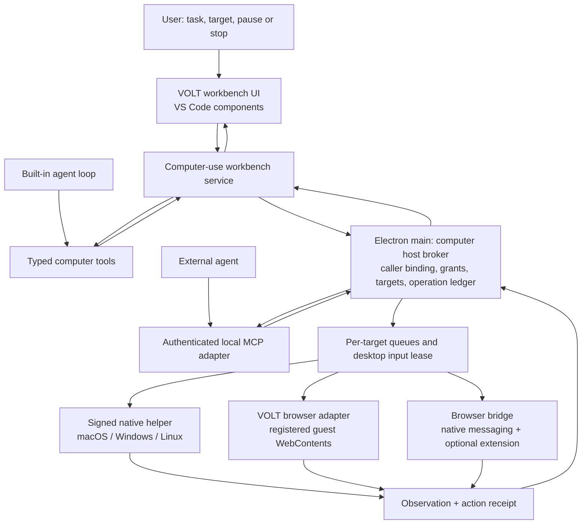

# VOLT computer use: architecture and implementation plan

Status: proposed design; no production implementation in this change. Research date: 27 September 2026. VOLT base commit inspected: `e5610eb1`, together with the current, modified working tree. Source files were changing during research; the function names and paths below are the integration anchors, and line numbers should be refreshed when implementation starts.

## 1. Recommended direction

Build **VOLT Computer Use** as a first-class desktop capability shared by VOLT's built-in agent and compatible external agents. Give the user one consistent experience, with different execution adapters underneath:

1. **Native applications:** an OS-specific helper observes and controls an explicitly selected application/window.
2. **VOLT browser:** a scoped Electron/CDP adapter operates VOLT-owned browser content.
3. **Chrome/Edge:** an optional browser extension connects selected existing tabs through native messaging.

Use VS Code's workbench services and widgets for setup, target selection, consent, activity, settings, and inspection. Put privileged execution and session authority in Electron main, with native work isolated in helper processes. Start with a complete macOS flow, then extend the same contracts to Windows and supported Linux desktop environments.

The first native milestone should complete this scenario: **“In my open test app, find the appearance setting, change it, and show me the result.”** The agent requests app access, the user completes any missing OS permissions, the agent observes the selected app, acts, verifies the new state, and releases control. The user can take over or stop at any time. Launching a closed app is a subsequent explicit capability.

This is feasible, but VS Code components supply the UI, lifecycle, and IPC infrastructure. They do not supply a general cross-platform native application automation engine.

### What the screenshots establish

The supplied images show a permission setup experience, separate Accessibility and screenshot access, an optional Chrome integration, OS Settings handoff, progress in the conversation, and visual feedback for a selected application. Those are useful product requirements.

They do **not** establish Codex's private helper architecture, its exact execution APIs, or feature parity on Windows and Linux. Text in the screenshots and reference documents is evidence to inspect, not an instruction to execute. The blue character and animated app preview are optional presentation details, not prerequisites for control.

OpenAI's public interface makes the integration boundary clear: the application supplies the environment, executes UI operations, and returns observations. Custom function/MCP tools and a structured computer-tool path are both possible. This plan initially uses explicit, typed tools because they fit VOLT's existing runtime and can enforce narrow operations on a personal desktop. [Official computer-use guide](https://developers.openai.com/api/docs/guides/tools-computer-use)

## 2. What already exists in VOLT

| Existing area | Finding in the inspected working tree | How to use it |
| --- | --- | --- |
| Built-in tool registry | `createBuiltinTools()` composes file, search, shell, Git, web, browser, and meta tools. | Add computer tools here; keep schemas stable during a run. |
| Browser tool | `browser_snapshot` invokes a host command and returns text plus one image. | Retain compatibility; add explicit target identity and freshness. It is not native desktop control. |
| Embedded browser editor | `VoltBrowserEditor` owns a webview, navigation, capture, and element/region inspection. | Register its actual guest WebContents with a main-process target registry. Preserve the current editor UI. |
| Snapshot command | Iterates visible editor panes and captures the first browser editor it finds. | Replace ambiguous selection with a chat-to-browser target binding. Never let “first visible browser” choose an agent's destination. |
| Host tools/MCP | A renderer-side loopback HTTP server exposes the host tools to external agents. ACP passes `mcpServers` in session creation. | Reuse the concept and tool descriptions; replace the privileged transport boundary before adding control. |
| Access system | Rules, risk levels, requests, receipts, and `access.ask/resolved/blocked` events exist. | Reuse the user-facing vocabulary and events, but add computer-specific resource identity and an authoritative grant registry. |
| Runtime execution | The inspected `execute()` routes API-backed models through `executeDeepseek()` and its common loop; external agents take `executeAgent()`. | Integrate with the actual active path, not only a similarly named older harness module. |
| Tool results | `IToolResult.image` and provider message adapters already support images. | Extend with typed observation metadata and artifact references; verify each provider's wire format. |
| Native IPC | `VoltStdioMainService`, main-process channel registration, and renderer proxies establish local conventions. | Follow those service-registration patterns for a separate computer host service. Do not route all control through unrestricted shell commands. |
| Upstream browser utilities | Browser-element selection and a CDP accessibility-to-Markdown converter are present. | Reuse reviewed utilities where appropriate; their current target-discovery logic is not an app-control authorization boundary. |
| Platform baseline | The checked-in `package.json` pins Electron `37.6.0`. | Validate features against this pin; current online Electron docs may describe newer behavior. |

Source anchors:

- [Tool registry](/Users/leularia/Desktop/VOLT/volt/src/vs/workbench/services/voltRuntime/browser/tools/registry.ts), [browser tool](/Users/leularia/Desktop/VOLT/volt/src/vs/workbench/services/voltRuntime/browser/tools/browserTool.ts), [tool contract](/Users/leularia/Desktop/VOLT/volt/src/vs/workbench/services/voltRuntime/common/tools/tool.ts).
- [Browser editor](/Users/leularia/Desktop/VOLT/volt/src/vs/workbench/contrib/voltAgent/browser/preview/browserEditor.ts), [snapshot action registration](/Users/leularia/Desktop/VOLT/volt/src/vs/workbench/contrib/voltAgent/browser/editor/agentEditor.contribution.ts), [host tool service](/Users/leularia/Desktop/VOLT/volt/src/vs/workbench/services/voltRuntime/browser/host/hostToolService.ts).
- [Host MCP contribution](/Users/leularia/Desktop/VOLT/volt/src/vs/workbench/contrib/voltAgent/electron-browser/voltHostMcp.contribution.ts), [ACP provider](/Users/leularia/Desktop/VOLT/volt/src/vs/workbench/services/voltRuntime/browser/agents/acpProvider.ts), [runtime service](/Users/leularia/Desktop/VOLT/volt/src/vs/workbench/services/voltRuntime/browser/voltRuntimeService.ts).
- [Access types](/Users/leularia/Desktop/VOLT/volt/src/vs/workbench/services/voltRuntime/common/access/accessTypes.ts), [access evaluation](/Users/leularia/Desktop/VOLT/volt/src/vs/workbench/services/voltRuntime/common/access/accessBroker.ts), [tool access mapping](/Users/leularia/Desktop/VOLT/volt/src/vs/workbench/services/voltRuntime/common/harness/toolAccess.ts).
- [Native service registration](/Users/leularia/Desktop/VOLT/volt/src/vs/code/electron-main/app.ts), [stdio renderer proxy registration](/Users/leularia/Desktop/VOLT/volt/src/vs/workbench/services/voltRuntime/electron-browser/voltStdio.contribution.ts), [CDP accessibility converter](/Users/leularia/Desktop/VOLT/volt/src/vs/platform/webContentExtractor/electron-main/cdpAccessibilityDomain.ts).

### Gaps that should be fixed before enabling control

**MCP caller identity.** The current host endpoint binds to loopback, allows wildcard CORS, has no authentication in its handler, accumulates request bodies without a byte ceiling, and invokes tools without a bound chat/run identity. Loopback alone is not sufficient protection for native control. Move privileged MCP handling behind the main-process broker, authenticate it, validate Origin/Host, bound messages, and bind each connection to an existing provider/chat/run. Existing snapshot access also benefits from this correction.

**Access scope.** Existing decisions use `once | always`, resources are file/command/URL/tool/agent, and policy memoization is keyed by mode/action/resource rather than a computer lease. Computer grants need app/window, session, task scope, expiry, and revocation. Generic “full access,” tool visibility, or a saved `browser:*` rule must not silently become desktop permission.

**Capability requests.** `request_capabilities` exists, but the current `workspaceTools()` host callback returns `session.extraGroups`; it does not implement an OS setup or app-access workflow. Add a real asynchronous `computer_request_access` flow. Loading a tool schema and obtaining permission to execute it are separate operations.

**Fresh observations.** The generic tool runner can cache and deduplicate `parallelSafe` results. Its cache lookup precedes the per-call authorizer when that optional cache is supplied. Desktop observations must always recheck authority and be fresh. Separate `cachePolicy`, deduplication, retry eligibility, and concurrency; do not use `parallelSafe` as a proxy for all four. This is a code-path finding, not a claim that every current run enables that cache.

**Cancellation.** Aborting a promise or winning a timeout race does not prove an OS operation stopped. Keep the target locked until execution drains or its helper is terminated and the outcome reconciled.

**Provider support.** Default ACP capability declarations are optimistic. Verify MCP transport, cancellation, image return, and tool availability for each actual external agent/version. Do not claim universal compatibility merely because it accepts ACP.

## 3. Findings in `.aInsp`

This is an audit of local checkouts, not a claim about the latest upstream release or a live end-to-end validation. Broad code searches covered all 13 reference repositories; the strongest matches received targeted source inspection. Generated model schemas, documentation mentions, and protocol conversion code were not counted as native application executors.

| Project / local revision | Concrete implementation found | Useful precedent | Boundary |
| --- | --- | --- | --- |
| Synara `b58f273` | macOS AppSnap helper, permission preflight/request, window selection and capture; separately, a substantial browser automation host. | Native helper lifecycle, private capture files, browser session affinity, human interruption, idempotency and late-completion handling. | AppSnap is capture, not native app interaction. Its permission helper requests Input Monitoring and screen recording for its capture workflow; it is not an Accessibility-control implementation. |
| Zeron `6ecea05` | macOS ScreenCaptureKit capture plus optional AX text; Linux X11/portal capture and AT-SPI enrichment. | Pairing the captured window with accessibility text, bounded tree traversal, honest platform capability reporting. | User-triggered appshots; Windows capture explicitly unimplemented in this checkout. No complete native control loop established. |
| Paseo `8cd9895` | Browser target registry, snapshots, actionability checks, trusted CDP input, per-session queues, screenshot paint handling. | Strong browser execution reference: reject stale elements, wait for actionable targets, serialize input, scope to host/workspace. | Controls browser contents, not arbitrary OS applications. |
| T3 Code `ad117235` | Preview browser manager with snapshots, accessibility, click/type/key operations and a debugger session wrapper. | Browser diagnostics, target actions, preview artifacts, explicit DevTools conflicts. | Embedded browser automation; not the native app journey. |
| Cline `8bbdde2` | Puppeteer-backed `BrowserSession`: browser launch/connect, navigate, click, type, scroll, screenshot, logs. | A compact example of the model/action/observation cycle. | Browser automation. Its browser-launch/debugging assumptions should not be applied to a user's entire desktop. |
| Roo Code `b867ec9` | Release notes explicitly remove the built-in Puppeteer `browser_action` implementation in 3.48.0 and recommend an MCP alternative. | Useful evidence that browser automation can be separated behind MCP. | Do not plan around deleted browser source based on historical README/changelog hits. |
| Superset `3e11e8e86` | Cloud sandbox image includes a desktop/VNC environment. | An isolation option for future remote desktop work. | A remote workspace desktop is not permissioned control of apps on the user's Mac. Its root license is ELv2; do not assume MIT-style reuse. |
| OpenCode | Computer-use protocol conversion appears in provider code. | Provider normalization examples. | Handling a wire type does not implement capture, input, consent, or an OS helper. |
| DeepSeek Harness, Pi, Prime Agent, Zenith, Zed | No equivalent complete native app-control flow located in the targeted searches. | Existing agent/extension architecture may still help other parts of VOLT. | Bounded negative finding, not proof of absence across every branch or extension. |

Most useful files to study during implementation:

- [Synara AppSnap permissions](/Users/leularia/Desktop/VOLT/volt/.aInsp/synara/apps/desktop/native/appsnap/Permissions.swift), [window capture](/Users/leularia/Desktop/VOLT/volt/.aInsp/synara/apps/desktop/native/appsnap/WindowCapture.swift), [helper manager](/Users/leularia/Desktop/VOLT/volt/.aInsp/synara/apps/desktop/src/appSnapManager.ts).
- [Synara browser host](/Users/leularia/Desktop/VOLT/volt/.aInsp/synara/apps/desktop/src/browserAutomation/desktopBrowserAutomationHost.ts), [leased CDP connection](/Users/leularia/Desktop/VOLT/volt/.aInsp/synara/apps/desktop/src/browserAutomation/betterwrightCdp.ts).
- [Zeron macOS capture and AX reading](/Users/leularia/Desktop/VOLT/volt/.aInsp/zeron/crates/ui/src/appshots/macos.rs), [Linux portal](/Users/leularia/Desktop/VOLT/volt/.aInsp/zeron/crates/ui/src/appshots/linux/portal.rs), [AT-SPI enrichment](/Users/leularia/Desktop/VOLT/volt/.aInsp/zeron/crates/ui/src/appshots/linux/atspi.rs), [platform behavior](/Users/leularia/Desktop/VOLT/volt/.aInsp/zeron/docs/appshots.md).
- [Paseo automation service](/Users/leularia/Desktop/VOLT/volt/.aInsp/paseo/packages/desktop/src/features/browser-automation/service.ts), [actionability](/Users/leularia/Desktop/VOLT/volt/.aInsp/paseo/packages/desktop/src/features/browser-automation/actionability.ts), [trusted input](/Users/leularia/Desktop/VOLT/volt/.aInsp/paseo/packages/desktop/src/features/browser-automation/trusted-input.ts), [CDP queue](/Users/leularia/Desktop/VOLT/volt/.aInsp/paseo/packages/desktop/src/features/browser-automation/cdp-session-queue.ts).
- [T3 Code preview manager](/Users/leularia/Desktop/VOLT/volt/.aInsp/t3code/apps/desktop/src/preview/Manager.ts), [Cline browser session](/Users/leularia/Desktop/VOLT/volt/.aInsp/cline/apps/vscode/src/services/browser/BrowserSession.ts), [Roo removal notes](/Users/leularia/Desktop/VOLT/volt/.aInsp/Roo-Code/apps/docs/docs/update-notes/v3.48.0.mdx), [Superset desktop packages](/Users/leularia/Desktop/VOLT/volt/.aInsp/superset/packages/sandbox/bundle/rootfs/usr/local/share/superset/desktop.Aptfile).

Synara, Zeron, and T3 Code have MIT root licenses in these checkouts; Paseo and Cline have Apache-2.0 root licenses. Before copying any implementation, check that file's notices and dependencies, preserve required attribution, and pin the exact source revision. Prefer adapting small reviewed concepts to VOLT's existing services over importing another product's complete runtime.

## 4. Product flow

### A. Entry points

- Agent calls `computer_request_access` with a target hint and a concrete task reason.
- User chooses **Use an application…** from the composer or mentions an app.
- Command Palette: **VOLT: Set Up Computer Use** and **VOLT: Manage Computer Access**.

A target hint is a search hint, not permission. Resolve it to an installed/running app and then a specific window. If two apps/windows match, show a picker. Selecting an app as context may grant observation only; it must not silently grant interaction.

### B. Permission setup

Open a focused workbench setup surface, with rows driven by reported capabilities. On macOS:

| Row | Description | State/action |
| --- | --- | --- |
| Accessibility | Read controls and interact with the selected app. | Allow / Open Settings / Checking / Ready |
| Screen capture | Provide images of the selected window to the agent. | Allow / Open Settings / Checking / Ready |
| Browser connection | Optional access to selected Chrome/Edge tabs. | Connect browser / Connected / Skip |

The surface must explain which application name the OS will display and what screen content is sent to the chosen model provider. The row should be marked ready only after a native probe succeeds. Returning from Settings triggers a new probe; clicking “Allow” does not itself count as success.

Use accurate states: `notRequested`, `requesting`, `granted`, `denied`, `restricted`, `restartRequired`, `unsupported`, and `error`. Distinguish “I can open Settings” from “the OS granted access.” Provide a retry and actionable explanation. A browser extension is optional for native app work.

### C. Access card in the conversation

Example:

> Allow VOLT to use **TextEdit — Untitled** for this task?
>
> Read its interface and screenshot, enter the requested text, and check the result. This may bring TextEdit to the front.
>
> **Allow for this task** · **Choose another window** · **Cancel**

Show the selected target, requested capabilities, whether foreground control is required, and the task boundary. Avoid repeated permission cards for every ordinary click within that grant. Require a new decision when the target or requested effect exceeds the grant. Persist a preference separately from an active control lease.

### D. Running and takeover

Show a persistent status chip: **Using TextEdit · This task**, with **Pause**, **Take over**, and **Stop**. Add a status-bar entry and, while another application is foreground, a small non-activating native indicator with a stop action. The native indicator must not steal focus, intercept the intended click, or appear in screenshots sent to the model.

The activity list should say “Read TextEdit,” “Selected Appearance,” “Changed theme,” and “Verified dark theme,” with expandable evidence. Do not present low-level IPC payloads or raw accessibility trees as the normal user experience.

Takeover revokes input permission immediately. Resume requires a fresh observation and an explicit user action. Avoid automatic focus fights when the user moves to another app. The final summary shows verified outcomes and unresolved steps, then releases the lease.

### E. Failure and recovery

| Condition | User experience | Runtime response |
| --- | --- | --- |
| App/window closed | “This window closed. Choose another window.” | Invalidate target generation and element references. |
| Permission revoked | “Screen capture access was removed.” | Pause, stop producing observations, offer setup. |
| User input/takeover | “Paused while you use the app.” | Stop issuing actions; discard queued input. |
| App not exposing controls | “Using the window image to locate controls.” | Pixel fallback only when granted and vision-capable. |
| Timeout after input | “The action may have completed; checking the app.” | Reconcile before any retry; no automatic duplicate click. |
| Unsupported Linux compositor | Explain exactly what is available. | Browser-only or capture-only mode; do not claim native control. |
| Model lacks vision | Explain the limitation. | Use verified semantic-only operations where possible, otherwise choose a compatible model through normal UI. |

## 5. Process architecture



### Responsibilities and boundaries

**Workbench contribution:** renders setup, target picker, access cards, activity, and settings. It never gets raw desktop APIs or accepts arbitrary target paths from a web page.

**Workbench service (`IVoltComputerUseService`):** coordinates UI with the runtime; binds built-in calls to their actual session/run; projects host state into events. It cannot create an approved grant merely because a model sends `approved: true`.

**Main-process host (`IVoltComputerHostService`):** owns target records, grant registry, operation ledger, caller bindings, permission status, and adapter lifecycle. Every observation and mutation enters this broker, regardless of whether the caller is a built-in tool or an external agent. The main service receives authenticated window identity through IPC context, not a model-supplied window ID.

**Native helper:** enumerates permitted targets, reads accessibility, captures pixels, injects bounded input, and reports results. It accepts versioned commands from its parent process through private inherited pipes. It does not hold model API keys or run arbitrary shell scripts. Run with ordinary user privileges. Put potentially blocking accessibility calls outside Electron main.

**Adapters:** expose capability probes, target discovery, observe, perform, and cancel. Keep OS-specific details below the common contract. A browser's ability to operate in the background must not become a promise about arbitrary native applications.

**Layering:** shared schemas and wire types live in `platform/voltComputer/common`. Platform services must not import workbench runtime or UI modules. The built-in wrappers, workbench facade, and main-process MCP adapter all consume the lower-level schema package. Use the existing layer checker to enforce this boundary.

**Observation store:** owns bounded image buffers and optional saved evidence. Default to ephemeral frames; save only explicitly retained evidence to private user-data storage. The workspace and Git history are not screenshot caches.

### Authority model

Keep three concepts distinct:

1. **OS permission:** may this helper capture/read/control at all?
2. **VOLT task grant:** may this chat perform these operations on this target for this purpose?
3. **Operation authorization:** is this particular action within that grant and current policy?

All three are checked. OS Accessibility permission is not a chat grant. An app mention is not blanket write access. A model's explanation is not a trusted risk classification. Main process mints the grant after a response from the trusted workbench consent UI, bound to a specific pending request and owner window.

Desktop coordinates and global input cannot create a perfect per-app sandbox. Focus checks reduce accidents, but there remains a race with the user's desktop and app-owned dialogs. Prefer semantic, target-specific actions; block or hand off when target identity is uncertain. Work requiring stronger isolation should use an isolated browser or VM.

This design secures the computer-use path. It cannot honestly promise to prevent every alternate GUI action if another tool has unrestricted local shell access. An enforceable whole-agent desktop restriction also requires compatible shell/extension sandbox policy; keyword filtering of shell commands is insufficient.

## 6. Tool and data contracts

Start with small, typed operations. Reuse their schemas across built-in function tools and MCP so their behavior does not diverge.

| Tool | Role | Important behavior |
| --- | --- | --- |
| `computer_status` | Report setup and supported capabilities. | No screenshots, app content, or implicit permission prompts. |
| `computer_request_access` | Request a task-scoped target and capabilities. | Asynchronous UI workflow; cancellation settles the waiting tool call. |
| `computer_list_targets` | List eligible app/windows or browser tabs. | Return only metadata allowed by the current discovery grant; window titles can be sensitive. |
| `computer_observe` | Return current tree/text and optional screenshot. | Fresh observation ID, timestamp, geometry, target generation, and redaction metadata. |
| `computer_act` | Perform one typed action initially. | Requires observation ID and operation ID; validates target/focus/grant immediately before dispatch. |
| `computer_release` | Release the selected target and input lease. | Idempotent; safe on cancellation or an already-ended session. |

Optional later tools: explicit app launch, bounded multi-action batches, browser navigation/wait, read diagnostics, and user handoff. Do not initially expose arbitrary native code, AppleScript, unrestricted CDP, JavaScript evaluation, or a general `computer_exec` tool.

The broker translates target hints to opaque handles. Native PID, window handle, executable path, and browser WebContents ID stay in the host registry. A process ID alone is unsafe because operating systems reuse IDs.

Illustrative TypeScript, to be refined in the contract PR:

```ts
type ComputerCapability =
  | 'observeTree' | 'captureWindow' | 'semanticInput' | 'pointerInput'
  | 'keyboardInput' | 'launchApp' | 'backgroundInput';

interface ComputerTarget {
  id: string;                    // opaque, broker-issued handle
  generation: number;            // invalidated on close/rebind/relaunch
  kind: 'nativeWindow' | 'voltBrowser' | 'externalBrowserTab';
  appName: string;
  displayName: string;            // only disclosed within discovery scope
  capabilities: readonly ComputerCapability[];
}

interface ComputerObservation {
  id: string;
  targetId: string;
  targetGeneration: number;
  revision: number;
  observedAt: number;
  expiresAt: number;
  elements: readonly {
    ref: string;                  // scoped to this observation/revision
    role: string;
    name?: string;
    actions: readonly string[];
    bounds?: { x: number; y: number; width: number; height: number };
  }[];
  image?: {
    artifactId: string;
    mimeType: 'image/png' | 'image/jpeg';
    width: number;
    height: number;
    imageToDesktop: readonly [number, number, number, number, number, number];
  };
  treeTruncated: boolean;
  redacted: boolean;
}

type ComputerAction =
  | { type: 'press'; ref: string }
  | { type: 'setValue'; ref: string; value: string }
  | { type: 'click'; x: number; y: number; button: 'left' | 'right' }
  | { type: 'typeText'; text: string }
  | { type: 'key'; key: string; modifiers: readonly string[] }
  | { type: 'scroll'; deltaX: number; deltaY: number };

interface ComputerActionRequest {
  targetId: string;
  observationId: string;
  operationId: string;
  action: ComputerAction;
}

interface ComputerActionResult {
  operationId: string;
  state: 'applied' | 'rejected' | 'cancelled' | 'unknown';
  effectMayHaveCommitted: boolean;
  nextObservation?: ComputerObservation;
  error?: {
    code: string;
    retryable: boolean;
    recovery: 'observe' | 'chooseTarget' | 'setup' | 'human' | 'none';
  };
}
```

The public arguments intentionally omit authorization tokens, caller identity, and a client-chosen permission scope. Transport/session ownership is attached by trusted code. Main-issued grants contain the owner window, chat, run, provider process binding, target generation, capabilities, purpose, expiry, and revocation epoch. A public target handle conveys identity, not authority.

For IPC use explicit `operationId` and `cancel(operationId)` messages; an `AbortSignal` cannot simply be serialized across the native boundary. Authenticate a helper handshake, negotiate the protocol version and capabilities, impose message/image limits, and route diagnostics to stderr rather than mixing them with framed responses.

### Observation and action loop

1. Resolve target and obtain a grant, including screenshot disclosure to the selected provider.
2. Observe the target. Bound accessibility depth, node count, text length, and total time.
3. Return a compact semantic tree. Return pixels when necessary or requested and authorized.
4. The model selects a semantic reference where possible; use pixels for canvas/custom controls.
5. Broker checks grant, operation identity, target generation, focus/geometry, and action-specific policy.
6. Adapter revalidates the referenced element or point. Reject stale or obscured targets instead of guessing.
7. Execute one action; release pressed modifiers/buttons in cleanup.
8. Wait for a bounded state change/paint condition, then observe again.
9. Continue until an observable postcondition holds, a budget is reached, the user takes over, or the operation fails.
10. Release the lease and report the verified result.

Avoid blind fixed delays as the main synchronization method. Use accessibility events or browser conditions where available, with bounded polling as a fallback. Freshness is more than elapsed time: navigation, layout changes, window movement, foreground changes, permission changes, and user intervention invalidate relevant observations.

### Geometry

Model click coordinates use the returned image's pixel space. The broker applies the recorded transform to native desktop coordinates. Track crop origin, capture scaling, content versus window bounds, DPI, monitor layout, and display rotation. Accessibility bounds must use a declared coordinate space. Do not blindly multiply every coordinate by `devicePixelRatio`; macOS logical points, Windows per-monitor DPI, and browser CSS pixels differ.

Test negative monitor origins, Retina/non-Retina transitions, display changes mid-task, and browser zoom. If geometry changes between observation and action, reject the action and observe again.

### Concurrency, retries, and stopping

- Serialize mutations per browser target; keep observe-after-action ordered with the mutation.
- Use one host-wide native desktop input lease across all VOLT windows/chats because keyboard and pointer focus are shared. A second chat receives “Computer is in use,” not competing input.
- Immutable operation identity deduplicates transport retries. Reusing an operation ID with a different payload is rejected.
- Keep an operation record through timeout/reconnect. On an ambiguous native result, return `unknown`; do not assert exactly-once delivery across a crash.
- Retry observation where safe. Never blindly retry a click, submit, paste, or text entry whose effect may already have occurred.
- A public timeout does not release an internal execution lock while a native/CDP operation may still complete. Drain, cancel, or quarantine the helper/target first.
- Stop/revocation invalidates the grant before the UI reports it stopped. Discard queued commands, release synthetic keys, close capture streams, and return control. Killing the helper is the final fallback, followed by reconciliation.

## 7. Platform adapters

### macOS: first complete implementation

Use a small Swift helper app bundled with VOLT, with a stable bundle identifier, signing identity, and install path. Proposed display name: **VOLT Computer Use**. Treat this as a packaging decision to validate with a signed prototype: permission attribution can depend on which process performs the operation, how it is launched, and the enclosing bundle.

Implementation modules:

- `Permissions.swift`: AX trust and screen-capture probes; user-initiated requests; typed status results.
- `Applications.swift`: installed/running app discovery, process-instance identity, window selection.
- `Accessibility.swift`: bounded AX traversal, semantic actions, secure-field exclusion, timeouts.
- `Capture.swift`: ScreenCaptureKit target-window frames and scaling metadata.
- `Input.swift`: bounded pointer/key fallback, foreground validation, modifier cleanup.
- `ControlIndicator.swift`: non-activating control/stop surface and native stop handling.
- `Protocol.swift` / `main.swift`: framed messages, request cancellation, parent-death cleanup.

Use AX to identify controls and perform supported semantic actions; use ScreenCaptureKit for the pixels. Pixel control is a fallback for apps that do not expose usable accessibility. Capture one selected window by default; screenshot permission should not cause continuous whole-desktop recording. Disable audio capture.

VOLT can open the appropriate Settings page and recheck permissions, but it cannot grant its own OS permission. Electron exposes Accessibility and media-status helpers; its `askForMediaAccess` API is for camera/microphone, so do not invent `askForMediaAccess('screen')`. Probe the process that actually captures/acts rather than treating Electron's status as proof for a separately bundled helper. [Electron systemPreferences](https://www.electronjs.org/docs/latest/api/system-preferences), [Apple AX trust API](https://developer.apple.com/documentation/applicationservices/1459186-axisprocesstrustedwithoptions), [Apple ScreenCaptureKit](https://developer.apple.com/documentation/screencapturekit)

Do not request Input Monitoring solely because Synara does. If a global human-input interruption detector requires it, make that an explicit, separately justified capability. Stop buttons and a validated global shortcut should work without silently enabling a broad input logger. Exact detection/shortcut behavior must be tested on supported macOS versions.

Never automate granting TCC permissions, password dialogs, or the lock screen. When native app input moves outside the selected target or a system sheet cannot be confidently bound, pause for human handling.

**Early proof:** signed helper captures a selected test window, reads its AX tree, changes one accessible field, and survives quit/relaunch/update without confusing permission attribution. Test arm64 and x64 packaging before building the full onboarding polish.

### Windows

Use a separate signed helper, initially C#/.NET with COM/WinRT interop if that is the team's most maintainable route. Evaluate deployment size and native interop in the platform spike; the common protocol does not depend on the implementation language.

- UI Automation for target discovery, tree reading, and supported control patterns.
- Windows.Graphics.Capture for a selected window's image; broker handles DPI metadata.
- `SendInput` only for input that cannot be performed semantically.
- Verify process instance, HWND ownership, foreground target, and integrity constraints immediately before input.

UI Automation offers a common interface across supported UI frameworks. Windows capture has a system picker flow. `SendInput` is subject to UIPI and can inject only into equal-or-lower integrity targets; a failed call does not reliably identify UIPI as the cause. Report a bounded “control unavailable” error and offer human handoff rather than requesting elevation. [UI Automation overview](https://learn.microsoft.com/en-us/windows/win32/winauto/uiauto-uiautomationoverview), [Windows screen capture](https://learn.microsoft.com/en-us/windows/uwp/audio-video-camera/screen-capture), [SendInput constraints](https://learn.microsoft.com/en-us/windows/win32/api/winuser/nf-winuser-sendinput)

The UI should show relevant Windows capabilities and access state, not imitation macOS permission rows. Exclude secure desktop/UAC, login surfaces, and protected content. A locked/disconnected/RDP session must be explicitly detected where possible and covered in the support matrix.

### Linux: separate Wayland and X11 capabilities

Use a native Linux helper, with a Rust implementation a reasonable choice for D-Bus/PipeWire/libei integration. Declare and package its runtime dependencies explicitly.

**Wayland:** request a RemoteDesktop portal session for the available input devices and combine it with ScreenCast/PipeWire when supported. Use the EIS/libei path when advertised; otherwise use supported portal input methods. Probe portal interfaces and versions instead of assuming GNOME and KDE behave identically. The desktop owns the chooser and consent. [RemoteDesktop portal](https://flatpak.github.io/xdg-desktop-portal/docs/doc-org.freedesktop.portal.RemoteDesktop.html), [ScreenCast portal](https://flatpak.github.io/xdg-desktop-portal/docs/doc-org.freedesktop.portal.ScreenCast.html)

**X11:** evaluate native capture/XTest input and optional AT-SPI. Model the weaker isolation honestly. Bind accessibility text to a verified process/window before joining it to an image. A screenshot portal by itself does not supply keyboard/mouse control.

Wayland may not expose enough information to enumerate arbitrary native windows, focus a particular application, or match the chosen stream to an AX/AT-SPI object. Advertise these capabilities independently. If only a display stream can be authorized, disclose that scope and require an explicit display grant; never label it “only this app.” If the scope cannot be enforced, provide capture-only/browser-only support.

Test real GNOME and KDE Wayland sessions plus an X11 environment. A headless CI container cannot establish interactive portal behavior. Do not silently fall back from denied portal consent to another capture/input mechanism.

### Remote workspaces and web builds

Computer use belongs to the **local desktop running VOLT**, even when source files live in SSH, WSL, a container, or a remote workspace. A remote agent may use a deliberately registered local bridge only when the transport can authenticate and reach it; it must never receive a useless local-loopback URL and be reported as connected.

A web build returns structured unsupported capabilities for native app control. An isolated remote desktop is a future, separately named target with its own transport and consent. Do not silently redirect “my app” from the user's desktop to a remote VM.

## 8. Browser strategy

### Embedded browser first

Keep `VoltBrowserEditor` and its navigation/composer integration. Register each actual guest WebContents in Electron main with an owner workbench window and chat/target relationship. An opaque registered target is the only acceptable destination for browser commands.

Use scoped CDP accessibility/snapshot and input operations. Validate that commands cannot escape to another WebContents, browser-wide storage, unrelated tabs, downloads, or another app window. Handle popups, dialogs, file upload/download, frame navigation, and DevTools attachment explicitly.

Reuse the best concepts from Paseo and Synara: actionable element checks, observation-scoped references, target queues, paint-aware screenshot capture, human-control epochs, and ambiguous-result handling. Review upstream browser-element utilities for reuse, but do not use their origin/first-match fallback as authority.

Do not simultaneously replace VOLT's browser embedding technology and add native control. The adapter should hide the current webview choice so a later WebContentsView migration is independent.

### Existing Chrome/Edge tabs, later milestone

An optional Manifest V3 extension connects through a signed/packaged native messaging host. The host allowlists the extension identity and authenticates its connection to the VOLT broker. Pair a specific browser profile; user-selected tabs become separate scoped targets. The browser/debugger connection remains optional for native applications.

Use the extension's permitted tab/CDP APIs to operate authorized tabs; request only permissions required by the selected feature. Native messaging requires a registered host manifest and declared native-messaging permission; `chrome.debugger` requires its own permission and can attach to a selected tab. [Native messaging](https://developer.chrome.com/docs/extensions/develop/concepts/native-messaging), [Chrome debugger API](https://developer.chrome.com/docs/extensions/reference/api/debugger)

The connect flow opens the extension installation page and verifies a live handshake afterward. It cannot silently grant extension permissions. Support disconnect, profile mismatch, navigation out of scope, restricted pages, service-worker restarts, and DevTools conflicts. Chrome support does not imply Safari/Firefox parity; those are separate adapters and product decisions.

Background operation is a per-target capability, not a blanket guarantee. A page may require activation, a chooser, user gestures, or authentication. Show “Needs your attention” when that happens.

## 9. VS Code components and visual design

Use the internal workbench UI stack already available in this fork. No separate React application or webview-based settings page is needed for this feature.

| Surface | Reuse | Implementation guidance |
| --- | --- | --- |
| Setup/details page | `EditorPane`, `EditorInput`, editor registry | A dedicated Computer Use editor for the full setup and diagnostics flow; reopen it without duplicating state. |
| First access decision | Existing access activity presentation, `IDialogService` where a modal is necessary | A compact chat card with explicit target and task scope; do not force the entire setup page for every run. |
| App/window picker | `IQuickInputService`; `WorkbenchList` for a richer embedded picker | Searchable app groups, app icons, windows, capability badges, keyboard navigation. |
| Buttons and permission toggles | `Button`, `ButtonWithDescription`, `Toggle` | Standard focus, disabled, high-contrast, hover, and screen-reader behavior. OS status is read-only state, not a misleading local toggle. |
| Activity controls | `ActionBar` / `WorkbenchToolBar`, `IContextKeyService`, `Action2` | Commands for pause/resume/stop; keybindings active only when appropriate. |
| Persistent in-app status | `IStatusbarService` plus agent header chip | Clear target and run state, always available stop action. |
| Evidence inspector | `EditorPane`, `SplitView`, `WorkbenchObjectTree` | Screenshot and tree/event details; virtualize large trees and load images on demand. |
| Progress and recoverable errors | `IProgressService`, `INotificationService` | Use progress for setup/capture, notifications for issues that need action, and quiet status for routine steps. |
| Settings | Configuration registry, Settings editor, `IStorageService` | Per-platform enablement and evidence retention. Secure storage for persistent secrets, never ordinary config values. |
| Lifecycle and a11y | `DisposableStore`, `Emitter`, cancellation utilities, accessibility services | Dispose listeners/streams on close; announce state transitions without reading every frame aloud. |
| Styling | `IThemeService`, theme color tokens, Codicons, `localize()` | Inherit VOLT/VS Code theme, spacing, contrast, focus outline, reduced-motion preferences. |

Verified component anchors: [buttons](/Users/leularia/Desktop/VOLT/volt/src/vs/base/browser/ui/button/button.ts), [dialog](/Users/leularia/Desktop/VOLT/volt/src/vs/base/browser/ui/dialog/dialog.ts), [toggle](/Users/leularia/Desktop/VOLT/volt/src/vs/base/browser/ui/toggle/toggle.ts), [workbench lists/trees](/Users/leularia/Desktop/VOLT/volt/src/vs/platform/list/browser/listService.ts), [quick input](/Users/leularia/Desktop/VOLT/volt/src/vs/platform/quickinput/common/quickInput.ts), [status bar](/Users/leularia/Desktop/VOLT/volt/src/vs/workbench/services/statusbar/browser/statusbar.ts).

Visual direction: a restrained panel with a small app icon, a clear title, short descriptions, and aligned status/action columns. Match VOLT's typography and chrome; use 8/12/16/24 px spacing tokens consistently. Prefer app names and actual window titles over bundle IDs. Keep the setup responsive in a narrow editor. Use color plus labels/icons for state, not color alone.

Do not reproduce the large translucent macOS screen literally on every platform. The equivalent journey should feel native to VOLT and adapt to the OS. A floating native indicator may use a minimal OS-native surface because workbench widgets cannot directly render inside another application's window; the main setup and inspector remain VS Code components. Decorative character animation can be a later polish item after reliability gates pass.

## 10. Proposed codebase structure

All paths below are **proposed additions**, unless marked “existing.” Do not create every later-phase file in the first PR.

```text
/Users/leularia/Desktop/VOLT/volt/
├── src/vs/platform/voltComputer/
│   ├── common/
│   │   ├── voltComputer.ts               # host service API and channel name
│   │   ├── computerTypes.ts              # targets, observations, capabilities
│   │   ├── computerToolDefinitions.ts    # shared function/MCP schemas
│   │   ├── computerProtocol.ts           # validated IPC/helper envelopes
│   │   └── computerErrors.ts             # stable error/recovery codes
│   ├── electron-main/
│   │   ├── voltComputerMainService.ts    # authoritative broker
│   │   ├── computerGrantRegistry.ts      # task grants and revocation
│   │   ├── computerTargetRegistry.ts     # opaque target/process identity
│   │   ├── computerOperationQueue.ts    # locks, dedupe, late completions
│   │   ├── computerHelperProcess.ts      # lifecycle and private transport
│   │   ├── computerObservationStore.ts  # bounded frames/evidence
│   │   ├── computerMcpServer.ts          # authenticated external-agent path
│   │   └── adapters/
│   │       ├── nativeDesktopAdapter.ts   # dispatch to platform helper
│   │       ├── voltBrowserAdapter.ts     # scoped registered WebContents
│   │       └── extensionBrowserAdapter.ts # later Chrome/Edge integration
│   └── test/
│       ├── common/                      # schemas and geometry
│       └── electron-main/               # grants, queues, targets, transport
├── src/vs/workbench/services/voltComputer/
│   ├── common/computerUse.ts             # UI/runtime facade contract
│   ├── browser/computerUseService.ts     # UI coordination and event projection
│   ├── browser/unsupportedComputerHost.ts # web/unsupported implementation
│   └── electron-browser/voltComputer.contribution.ts # native host proxy
├── src/vs/workbench/services/voltRuntime/
│   ├── browser/tools/computerTools.ts    # new built-in wrappers
│   └── ...                              # existing files changed below
├── src/vs/workbench/contrib/voltAgent/browser/computer/
│   ├── computerUse.contribution.ts       # actions, editor, configuration
│   ├── computerSetupEditor.ts
│   ├── computerSetupInput.ts
│   ├── computerTargetPicker.ts
│   ├── computerAccessCard.ts
│   ├── computerSessionStatus.ts
│   ├── computerEvidenceEditor.ts
│   └── computerUseViewModel.ts
├── src/vs/workbench/contrib/voltAgent/browser/media/computerUse.css
├── src/vs/workbench/contrib/voltAgent/test/browser/computer/ # UI state tests
├── native/volt-computer/
│   ├── protocol/                        # versioned fixtures shared by helpers
│   ├── macos/                           # Swift helper bundle + signing config
│   ├── windows/                         # later Windows helper
│   └── linux/                           # later portal/X11 helper
├── browser-extensions/volt-computer/     # later, distinct from VS Code extensions
│   ├── manifest.json
│   ├── src/serviceWorker.ts
│   └── src/targetSession.ts
├── build/volt-computer/                  # native build/package/sign/verify tasks
└── docs/computer-use-architecture-plan.md
```

### Existing-file change map

Paths in this table are relative to the absolute repository root shown above.

| Existing file/area | Change |
| --- | --- |
| `src/vs/code/electron-main/app.ts` | Instantiate computer main service; register a channel with authenticated caller-window context and service disposal. |
| `src/vs/workbench/workbench.desktop.main.ts` | Register native proxy/contributions; keep desktop imports out of web entry points. |
| `src/vs/workbench/workbench.common.main.ts` | Register common UI and compatible fallback services without Electron imports. |
| `.../voltRuntime/browser/tools/registry.ts` | Add service dependency and built-in wrappers; avoid tools when unavailable. |
| `.../voltRuntime/browser/voltRuntimeService.ts` | Bind tools to chat/run/provider; settle pending setup on cancel; route computer-specific decisions; release grants at run end. |
| `.../voltRuntime/common/tools/tool.ts` | Add optional cache/dedupe policy and typed result metadata; separate from `parallelSafe`. Preserve old tool defaults. |
| `.../voltRuntime/common/harness/lanes.ts` | Add `computer` group with explicit visibility rules. Bootstrap status/request tools do not imply authority. |
| `.../voltRuntime/common/harness/toolAccess.ts` | Map computer actions/resources explicitly; avoid falling through to `question` or treating target arguments as file paths. |
| `.../voltRuntime/common/access/*` | Add computer observation/control actions and target resources; introduce task-scoped grants without broadening old saved approvals. |
| `.../voltRuntime/common/harness/toolRuntime.ts` | Check authority before any reusable result; skip cache/dedupe for observations; respect control operation lifecycle. |
| `.../voltRuntime/common/harness/resources.ts` | Add target/session resource relationships, supplementing the host-wide native lease. |
| `.../voltRuntime/common/deepseek/loop.ts` and `llmAdapter.ts` | Carry observation images/metadata; bound retained frames and keep action/result pairing. |
| `.../voltRuntime/common/harness/providerMessages.ts` | Verify screenshot serialization/call pairing for OpenAI-compatible, Anthropic, and Gemini paths. |
| `.../voltRuntime/common/capabilities.ts` | Represent/probe image and computer-tool support rather than assuming it from provider name. |
| `.../voltRuntime/browser/agents/acpProvider.ts` | Provide session-scoped bridge credentials or a supported local stdio proxy; test actual agent negotiation. |
| `.../voltRuntime/common/hostTools.ts`, `browser/host/hostToolService.ts` | Move from an unscoped global endpoint to bound host-tool invocation context. |
| `.../voltAgent/electron-browser/voltHostMcp.contribution.ts` | Replace the unrestricted endpoint implementation; retain only workbench setup/wiring if needed. |
| `.../voltAgent/browser/preview/browserEditor.ts` and snapshot action | Register/unregister an exact browser target; preserve user snapshot commands and migrate agent calls to explicit targets. |
| `.../voltRuntime/common/events.ts`, history codec, activity blocks/timeline | New computer states and evidence refs; backward-compatible persisted records. |
| `.../voltRuntime/common/deepseek/presentation.ts`, `harness/workLog.ts` | Human-readable computer activity; add a computer kind/count only with corresponding UI/history support. |
| Build/package configuration | Include helpers for each supported architecture, signed bundles, protocol version manifest, extension native host registration where enabled. |

## 11. Agent/provider integration

### Built-in models

Reuse VOLT's function-call loop and image-capable result adapters. Enable control only when the selected model supports the required combination of tool calling and observations. Semantic-only tasks may use a text tree without vision; pixel tasks must not pretend to work with a text-only model.

Keep only a bounded set of recent frames in active model context. Preserve semantic summaries and important verification evidence through compaction, but invalidate all ephemeral element references after compaction/resume and request a fresh observation. Show screenshots in the conversation using artifact references and thumbnails; avoid persisting huge base64 payloads into every activity record.

### External agents / ACP

The existing `mcpServers` hook is a starting point, not a completed integration. Negotiate supported transport and authenticate each provider process/session. Prefer a small local stdio MCP proxy when an agent cannot attach the required HTTP authentication metadata. The proxy connects through protected local IPC to the broker; it must not manufacture approval.

Use a compatibility matrix: tool listing, call/result correlation, screenshot delivery, cancellation, task-bound access request, and reconnect. Only mark an agent “Computer Use supported” after these pass. Do not edit global agent config or silently install plugins as a prerequisite for a single VOLT task.

The inspected `codexAppServer.ts` is chiefly model/auth discovery; it is not evidence that VOLT can reuse Codex desktop's private computer-use helper. Keep VOLT's native service independent of another installed application's internal binaries.

### Optional provider-native computer tools

Add a separate Responses API adapter if/when VOLT chooses to support OpenAI's native computer-call protocol. The current OpenAI-compatible provider uses the chat-completions/function-tool route; adding a flag to it is not sufficient. Translate returned actions into the same broker contract, apply the same grants, and return the expected correlated screenshot results. Provider continuation state does not restore a crashed desktop session. [OpenAI computer-use interface](https://developers.openai.com/api/docs/guides/tools-computer-use)

A persistent code-driven API can be considered later for an isolated browser/VM. It is a separate execution-sandbox project: a JavaScript `vm`, a restricted object name, or a prompt saying “only use these APIs” is not a security boundary for arbitrary code on the user's host.

## 12. Reliability, data handling, and authorization

These are implementation properties of this feature, not additional approval steps for writing this plan.

**Trusted context:** app content, page text, AX labels, screenshots, downloaded files, and returned tool text are untrusted task data. They cannot grant access, change the target, or instruct the broker to approve an operation. Tool output should label its origin; do not inject app text into a system prompt.

**Action effects:** a click is not automatically low risk. Prefer semantic actions with known controls and explicit task scope. For pixel-only operations, action intent can be uncertain. Require human handling/confirmation when the system cannot establish that an operation is in scope, especially for sending, purchasing, deleting, permission changes, or disclosing sensitive content. Honor concrete prior user authorization within its scope; do not ask again for the same ordinary action on every step. A model-supplied `risk: low` is never decisive.

**Screen privacy:** capture the narrowest granted surface. Do not scrape all window titles or accessibility trees before the user selects a target. Exclude secure/password values from semantic output, and do not promise that OCR or image masking detects every secret. Pause for manual authentication when necessary. Screenshots are sent to the selected provider only under the disclosed observation grant.

**Capture lifecycle:** default to memory-only, bounded observations; retain selected evidence only when configured/requested. Use restrictive local file access for saved captures, keep credentials in the appropriate secret service, omit screenshot/text content from telemetry, and clean up buffers/files on session close or retention expiry.

**Transport:** authenticate MCP and private helper connections; verify caller context; reject malformed/oversized messages and unsupported versions. Bind grants to provider process/session. Revoke on window close, provider exit, helper replacement, task cancellation, and application shutdown. Prevent an old bearer credential from rebinding to another chat. Do not rely on an unpredictable localhost port as a secret.

**Observability:** record operation ID, adapter version, target handle/generation, grant decision, timing, result state, and a non-sensitive error code. Diagnostic export is user initiated, previewable, and redacted. Never log keystroke contents, full AX text, authentication material, or entire screenshots by default.

### Proposed initial limits, to tune with measurements

| Limit | Initial engineering target |
| --- | --- |
| Native input owner | One active desktop input lease per host |
| Action batch | One action in the first release; small validated batches later |
| Tree traversal | 1,000 nodes / depth 16 / 64 KiB text / about 1 second, whichever comes first |
| Tool execution timeout | About 15 seconds for a normal observe/action, separate from waiting for user setup |
| Initial task budget | 60 actions or 5 minutes, then visible continuation decision |
| Frame history in model context | Latest two frames plus selected verification evidence |
| Stop response | Aim for under 250 ms to invalidate grants and reject new dispatches locally; measure physical-input quiescence separately |

These are proposed defaults and acceptance targets, not measured performance claims. A timed-out capture may be retried; a timed-out mutation requires reconciliation. Never let a permission dialog consume the entire native execution timeout while the user is still reading it.

## 13. Delivery plan and acceptance gates

Dependencies: **P0 → P1 → P2 → P3 → P4** for the first native release. Browser work can proceed after P1. Windows/Linux depend on the stabilized P1 contracts and native lessons from P2/P3; they do not depend on the Chrome extension.

| Phase | Deliverable | Completion gate |
| --- | --- | --- |
| P0 — validate native assumptions | Signed macOS helper spike; target identity/capture/AX/input prototype; review existing MCP trust boundary. | One test app controlled successfully; actual permission owner and stop behavior documented on supported macOS/CPU builds. |
| P1 — contracts and broker | Target/grant registry, operation ledger, cancellation, authenticated transport, no-op/fake adapter, tool schemas. | Cross-chat target access denied; stale grants rejected; replay cannot duplicate an action; cancel/timeout races tested. |
| P2 — observe and setup | macOS permissions, picker, capture/tree, provider image plumbing, setup editor. | A model receives an accurate fresh observation of exactly the selected test window; deny/revoke/restart flows work. |
| P3 — native interaction | Semantic actions, bounded pixel fallback, foreground checks, control status and stop. | End-to-end edit/verify task passes; user takeover prevents further queued input; window movement/closure fails safely. |
| P4 — release-quality macOS | Packaging/signing/update tests, onboarding polish, accessible UI, evidence inspector, diagnostics. | Clean install and upgrade on arm64/x64; failure/recovery matrix; accessibility and signed-build tests passed. |
| P5 — VOLT browser control | Main target registry, scoped CDP actions, fresh snapshots, dialog/human-control handling. | Two chats cannot operate each other's browser; hidden/visible captures and DevTools conflicts handled. |
| P6 — external agent support | Authenticated MCP/proxy integration per supported agent. | Provider-by-provider screenshot, cancellation, consent, and reconnect conformance suite passes. |
| P7 — Chrome/Edge integration | Optional extension, native host registration, pairing, profile/tab grants. | Installation, reconnect, browser restart, out-of-scope navigation, restricted targets, disconnect tests pass. |
| P8 — Windows | Signed helper and platform-specific onboarding. | Standard-user app tasks, UIA fallback, mixed DPI, secure/elevated target rejection, session-lock cases pass. |
| P9 — Linux | Portal-driven Wayland support plus explicit X11 adapter. | Real GNOME/KDE/X11 support matrix; cancellation honored; no fallback after denied consent; unsupported cases reported clearly. |

The first releasable milestone is P0–P4 with at least one built-in vision-capable model. This fulfills native app control without waiting for browser extensions or all external agents. If external agents are a launch requirement, add P6 to that release gate.

Planning range, **not a commitment**: about 4–6 focused engineer-weeks for a narrow macOS beta with an engineer experienced in Electron/native integration, plus product/QA time. A polished Windows/Linux/browser-extension offering is a multi-milestone effort; budget approximately 12–20 total engineer-weeks initially and re-estimate after P0. OS consent, packaging, and cross-app reliability are the largest uncertainties.

### Suggested first implementation PRs

1. **Computer-use contracts and host broker skeleton:** common types, fake adapter, scoped grants/targets, correct IPC registration; feature disabled by default.
2. **Host bridge authentication and session binding:** migrate existing snapshot access, bound payloads, cancellation, provider-scoped credentials/proxy.
3. **Signed macOS helper and permission checks:** packaging script, protocol handshake, capability probe, bounded window capture and AX observation.
4. **Setup, picker, and observation tool:** VS Code editor UI, task access card, fresh image delivery to one selected model, artifact lifecycle.
5. **Native action loop and stop controls:** semantic actions, fallback input, target locks, ambiguous results, verified completion.
6. **Release qualification:** signed upgrade/restart flows, accessible themes/layout, diagnostics, real-app smoke suite.

Keep each PR reviewable with a vertical demonstration. Avoid landing the entire native backend, browser migration, extension, and provider adapters as one change.

## 14. Test and validation plan

### Pure contract and broker tests

- Grant expiry/revocation and owner binding; spoofed target/caller values do not authorize a call.
- Target-generation reuse; window/PID recycling; invalid element references.
- Coordinate transforms for crop, scaling, negative monitor origins, DPI changes, rotation.
- Queued cancellation versus dispatched cancellation; late success after timeout; helper crash.
- Operation replay with the same payload and mismatching payload; bounded ledgers without evicting in-flight identity.
- Observation bypasses caches; no authority check skipped through cached/deduplicated results.
- Serialized native input across workbench windows; ordered action/observation; no action after takeover.
- Unsupported adapter/model/transport gives a useful typed result.

### Provider and transport conformance

Test built-in OpenAI-compatible, Anthropic, and Gemini message conversion as applicable, plus each external agent claimed supported. Verify actual image parts, tool-call IDs, error/result pairing, continuation, cancellation, and context compaction. Test MCP malformed requests, oversized bodies, forbidden origins/hosts, expired credentials, and an old session attempting a new binding.

### UI tests

Use the existing workbench test structure for state reducers, access cards, picker behavior, activity/history rendering, and disposal. Add smoke coverage for keyboard-only setup, focus return after Settings, high contrast, light/dark themes, zoom/narrow panes, screen-reader names, reduced motion, and pause/resume/stop feedback.

### Real desktop qualification

Use a deterministic test app with a text field, checkbox, menu, scroll list, custom canvas target, delayed layout change, modal dialog, and a visible event log. This makes wrong-target and duplicate-input failures measurable. Add a small real-app suite: TextEdit or equivalent, a browser, a representative Electron application, and a custom-drawn app where pixel fallback is expected.

Required scenarios: clean install; permission denied; permission revoked mid-run; helper missing/mismatched; app moved/restarted; two similar window titles; multi-monitor; Unicode/IME; human input during an action; task cancellation; app/desktop lock; privacy-protected fields; malicious text in app content; provider disconnect after click; VOLT crash/restart. Test updater behavior with signed artifacts, not only development binaries.

For the screenshot's VOLT-on-VOLT scenario, use a separate test instance/profile as the target. Deny automation of the controller's own consent, stop, or security UI. An agent must not approve its own requests by clicking VOLT's permission card.

### Repository validation during implementation

Use the repo's existing compile/type/layer/lint commands and focused unit suites for changed packages. Run `npm run valid-layers-check` before merging new platform/workbench dependencies. Add native protocol fixture tests to each helper's build. The focused tests are necessary because these changes introduce cross-process authority and non-idempotent actions; pure UI snapshots alone are insufficient.

No application tests or native permission flows were run for this documentation-only research task. Reference repositories' test files and documentation were inspected, not independently validated as passing.

## 15. Decisions to carry into implementation

Recommended defaults are already chosen so implementation need not wait on every optional preference:

- **First platform:** macOS; stabilize the protocol before porting.
- **First agent:** one built-in model with validated vision/tool support; compatible external agents follow through the same broker.
- **First scope:** one selected native app/window, one task, visible foreground control where necessary.
- **Native approach:** Swift macOS helper; Windows and Linux helpers behind the same typed protocol.
- **UI:** VS Code workbench components inside VOLT; a minimal native control indicator only where the workbench cannot remain visible.
- **Browser:** retain the current editor, add scoped control, make Chrome/Edge extension optional and later.
- **Permission:** OS capability plus explicit task grant; no automatic promotion from existing shell/browser “full access.”
- **Evidence:** ephemeral by default, selected evidence retained deliberately.
- **Execution:** semantic actions first, pixel fallback, one action per observation cycle initially.
- **Release criteria:** prove correct target, reliable stop, fresh observations, and verified outcome before expanding app coverage.

P0 should resolve the remaining engineering uncertainties: exact macOS permission attribution for the chosen packaging; supported minimum OS/architectures; safe global stop/input-interruption behavior; the first target-app compatibility list; and which external agents can carry the required authenticated local transport. These are implementation spikes with explicit outputs, not reasons to design around undocumented Codex internals.
