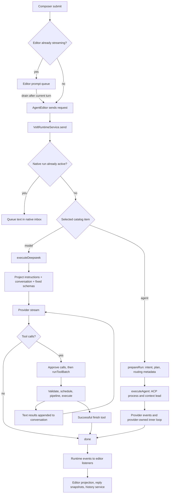
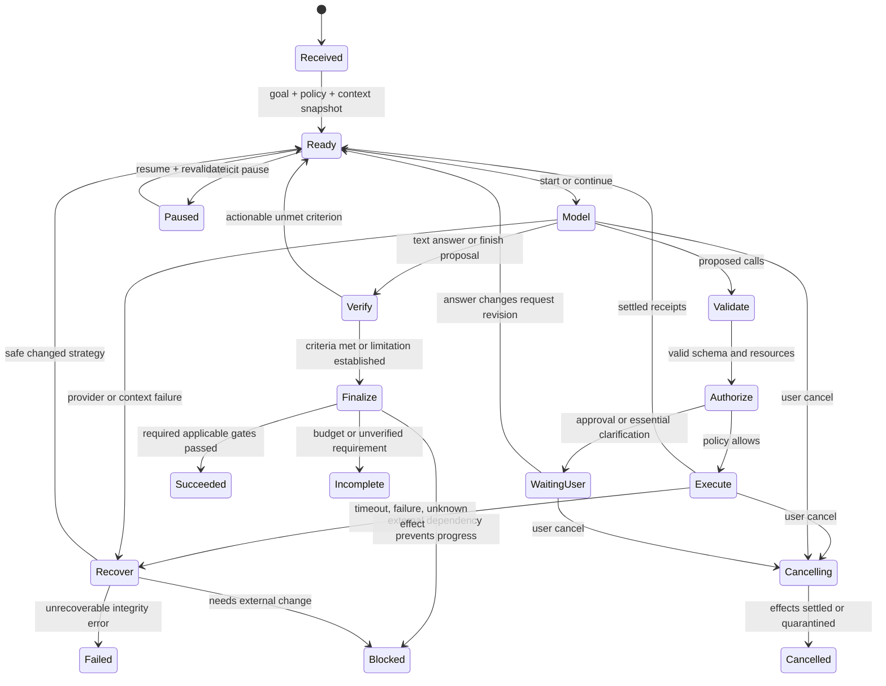

# Volt agent harness: diagnosis and optimization strategy

**Review date:** 26 September 2026  
**Source snapshot:** HEAD `48ac356c`, plus the working-tree changes present during inspection  
**Scope:** the live Volt request path, its Code OSS integration, and selected mechanisms in the local `.aInsp/` snapshots  
**Priority order:** quality, speed, reliability, then efficiency in tokens, compute, and elapsed time  
**Status:** proposed architecture only; this document does not implement the roadmap

## 1. Executive diagnosis

**Keep the compact native loop, but give it an authoritative run controller, trustworthy tool results, and durable state. Make depth adaptive; keep correctness guarantees constant.**

The shortest path to a professional coding agent is not to activate every module in `common/harness`. Several useful modules are currently disconnected from actual execution. Connecting all of them would introduce overlapping decisions, more state, and potentially more latency. Extract the contracts needed by the live loop, connect them incrementally, and validate each change at the service boundary.

This document builds on the [broader architecture review][previous], but re-traces the current working tree. **Observed** means a source path was traced; **historical reproduction** refers to the earlier review's probes; **proposal** means an unimplemented design. Performance predictions are hypotheses, not measurements. Confidence below concerns the diagnosis, not the size of the eventual speedup.

### The five most consequential problems

| Rank | Diagnosis and consequence | Code evidence | Confidence |
|---|---|---|---|
| 1 | **Completion is a model decision rather than an evidence decision.** A fluent answer can end an incomplete edit. Exhausting the native budget is subsequently marked completed. | `runDeepseekLoop` returns done on text without tool calls and on a successful `finish` result. `runFinish` serializes the model's claims. `executeDeepseek` maps outcomes other than abort/fail—including budget—to done. `checkCompletion` exists, but this path never calls it. [Loop][loop], [meta tools][meta], [runtime][native], [completion][completion]. | High: directly traced. |
| 2 | **Execution boundaries cannot consistently prove what happened.** Timeouts can leave operations running; ordering can break across mutations; output and images lose information. These defects undermine both speed and verification. | `timeoutHook` races a promise without aborting its body. `runMutating` can reuse a path's earlier promise instead of waiting for the latest exclusive barrier; its locks are batch-local. Shell output omits exit-event stderr. The native loop appends only `result.text`, discarding screenshot image content. [Pipeline][waterfall], [batch executor][tool-runtime], [shell][shell], [stdio][stdio], [loop][loop], [message conversion][messages]. | High for source behavior; timeout/ordering were also reproduced in the earlier snapshot. |
| 3 | **Long-task continuity lacks one owner.** Native context grows without the existing compactor; durable history is a UI-facing transcript, not a resumable execution journal. | Native requests bypass `prepareRun`, construct no `IRunHarness`, and do not call `compactTurn`. `SessionHandle.rewrite` snapshots records, awaits a write, then clears pending records—including appends that may have arrived during the await. Editor code initiates reply history snapshots. [Intake][intake], [native path][native], [harness factory][run-harness], [history][history], [editor persistence][editor-persist]. | High for wiring and race mechanism; data loss reproduced previously, not re-probed in this documentation pass. |
| 4 | **Tool exposure is fixed, incomplete, and sometimes misleading.** The model cannot discover all tools already supplied by the editor platform. More schemas alone would not solve this. | `createBuiltinTools` supplies 16 definitions; native agent mode removes `request_capabilities`, leaving 15. The selected registry is captured once for the run. There is no Volt adapter to `ILanguageModelToolsService` or `IMcpService`. `git_diff` returns a stat, not patch contents. [Registry][registry], [prompt selection][prompt], [native path][native], [platform tools][lm-tools], [MCP][mcp], [Git tools][git-tools]. | High for static inventory and absent integration in the traced code. Extension/server availability at runtime remains unknown. |
| 5 | **There is no measured feedback loop for quality versus latency.** Model routing and evaluation helpers cannot currently substantiate an adaptive policy. Full transcript rendering can amplify perceived latency. | `prepareRun` computes routing for the ACP branch, but dispatch selects the session's catalog item rather than consuming `prepared.routing.ref`. No production `evalLedger.record` call was found. `Observability.metrics` sums span durations, which is not wall time under overlap. `scoreSample` uses a heuristic recovery score. `renderThread` replaces transcript children. [Dispatch][dispatch], [pipeline][pipeline], [metrics][metrics], [evaluation][eval], [rendering][editor-render]. | High for implementation; actual latency impact unknown until profiling. |

The native loop already has useful properties: immediate streaming, a small control surface, queued follow-ups, mode filtering, approval decisions, tool validation, bounded parallel reads, a repeated-batch detector, and hard call ceilings. Preserve those strengths. Improve the contracts underneath them.

## 2. Current architecture

### 2.1 Actual request lifecycle



This diagram describes reachable paths, not the aspirational harness. The standard editor composer queues submissions while streaming; the runtime also has an inbox path for callers that send during an active native run. Those are different behaviors: the existence of the runtime inbox does not prove immediate composer steering. ACP agents own their internal planning and tooling; Volt cannot assume their internal actions satisfy Volt's native verification contracts.

### 2.2 Component and capability map

For proposed paths later in this document, **R** means `src/vs/workbench/services/voltRuntime`, **A** means `src/vs/workbench/contrib/voltAgent`, and **P** means `src/vs/platform`. Links below point to actual files and useful starting lines; symbols are more stable than line numbers as the working tree changes.

| Stage | Actual component / symbol | Status and limits |
|---|---|---|
| Intake and UI | `AgentEditor.send`, `runtime.send`, `applyEvent` [editor][editor-send] | Implemented. UI sends, renders, and participates in history persistence. Streaming presentation is coupled to transcript state. |
| Intent and planning | `prepareRun`, `nativeModelTurn` [pipeline][pipeline], [prompt][prompt] | Partial across backends. Native explicitly returns `classified:false`, `runPlan:false`, empty prefetch. ACP receives preparation and context lead. A `todo` call changes presentation; it is not durable task scheduling. |
| Model selection | `execute`, `defaultRef`, `route` in [router][router] | Catalog/default selection is live. Native does not use the preparation router. Dispatch can silently fall back to the first enabled item if the selected item is unavailable. |
| Prompts and context | `buildDeepseekSystemPrompt`, `workspaceProjectInstructions`, `nativeToModelMessages` [prompt][prompt], [runtime][instructions], [conversion][messages] | Implemented basic prompt and conversation. Instructions/run plan are memoized promises without content-based invalidation here. Advanced ranking, context graph, memory, and packing are not connected to native turns. |
| Context pressure | `contextEngine`, `compactTurn` [engine][context], [harness][run-harness] | Helpers implemented and unit-tested; not active in native execution. `compactTurn` uses cumulative governor spend as a measurement input, which must not be confused with current prompt occupancy. |
| Discovery | `createBuiltinTools`, `IVoltHostToolService` [registry][registry], [host contract][host-tools] | Fixed builtin set. Host registry currently contains only `browser_snapshot`. No live progressive inventory spanning platform tools and MCP. |
| Permissions | `authorizeDeepseek`, `evaluateAccessRequest`, `resolveApproval` [authorization][authorize] | Live outer authorization occurs before batch dispatch. The batch's allow callback does **not** mean the live path skips permission checks. Validation follows outer approval, an ordering worth fixing. Approval does not provide an OS sandbox. |
| Execution | `runToolBatch`, `ToolPipeline`, `VoltStdioMainService` [executor][tool-runtime], [pipeline][waterfall], [host][stdio] | Live. Parallel-safe calls are run before mutating calls, rather than preserving arbitrary data dependencies. Process ownership is not a durable job service. |
| Progress / stopping | `runDeepseekLoop`, `recordToolBatch` [loop][loop] | Live call ceilings and identical-batch detector. No task-level evidence progress, semantic cycle detection, or durable completion criteria. |
| Cancellation / steering | `cancel`, `pause`, `resume`, native inbox [controls][controls]; `doSend/enqueuePrompt` [editor][editor-send] | Implemented controls. Pause takes effect at loop boundaries. The composer normally queues another prompt; direct runtime follow-ups are claimed before another model turn, not continuously through an in-flight tool batch. Transport cancellation has an unresolved-wait risk. |
| Recovery | `executeAgent`, pipeline retry [ACP][acp], [pipeline][waterfall] | ACP can restart and resend once after a restartable error. Generic transient tool retry does not encode idempotence. No shared recovery record proves a previous side effect did not occur. |
| Verification | `EvidenceStore`, `planGates`, `checkCompletion`, `HarnessController` [evidence][evidence], [verification][verification] | Substantial helpers exist; native completion bypasses them. Evidence classification uses command/result interpretation, not a complete version-bound execution receipt. |
| Persistence | `SessionHandle`, `EventStore`, `emit` [history][history], [emission][emit] | Transcript storage is live. In-memory harness event storage is conditional on an absent native harness. There is no demonstrated crash-safe native execution resume. |
| Delegation | `orchestrate`, `TaskScheduler`, `WorktreeAllocator` [orchestration][orchestrator], [scheduler][scheduler] | Plans/data structures exist. The native path does not spawn workers or allocate actual worktrees through them. Do not advertise a working swarm. |
| Telemetry | Provider usage events, `Observability`, `EvalLedger` [usage][usage], [metrics][metrics], [eval][eval] | Partial. Token parsing is live infrastructure; cost, task quality, recovery rate, and latency breakdown are not established product baselines. |

### 2.3 The tool inventory that exists today

| Source | Definitions / service surface | Reachable by the native model today? |
|---|---|---|
| File builtins | `read_file`, `list_dir`, `edit_file`, `write_file` | Yes, subject to mode and approval. Edits use file service reads/writes; no editor-model version precondition. |
| Search builtins | `grep`, `glob` | Yes. No dedicated definition/reference/symbol tool in this registry. |
| Process builtin | `shell`, with optional background flag | Yes where mode permits. Background launch returns an ID, but this registry has no matching job wait/output/stop tools. |
| Git builtins | `git_status`, `git_diff`, `git_branch` | Yes in agent mode. All are read operations, yet the group filter hides Git together with writes in read-only modes. `git_diff` executes `git diff --stat HEAD`. |
| Web builtins | `web_fetch`, `web_search` | Yes, within mode/policy. |
| Browser builtin | `browser_snapshot` | Invocation exists. Image is returned by the host, but the native conversation receives text only. This is not browser navigation, DOM interaction, or an assertion runner. |
| Meta builtins | `request_capabilities`, `todo`, `finish` | Last two exposed. First is filtered out; the runtime grant callback returns existing groups without adding requested groups. |
| Code OSS language model tools | `ILanguageModelToolsService.getTools/invokeTool`; terminal tools include run/output/task operations [terminal registration][terminal-tools] | No Volt adapter found. Actual installed/enabled inventory requires runtime enumeration. Some implementations need valid chat invocation context. |
| Code OSS MCP | `IMcpService.servers`, lazy collections, `IMcpTool.callWithProgress` [MCP service][mcp], [tool contract][mcp-tool] | No Volt adapter found. Registered source does not prove connected/trusted/started servers. |
| Volt host MCP bridge | `VoltHostMcpContribution` [bridge][host-mcp] | Contribution code exists, but no import of the contribution was found in `src/`. Treat activation as unproven. Its HTTP handler has wildcard CORS, no authentication, and ignores cancellation. Do not wire more capabilities into this handler as-is. |

“Every capability” should mean every registered, authorized, invocable tool, with its availability known. It should not mean exposing every arbitrary workbench command as an unrestricted execution API.

## 3. Baselines and measurement design

### 3.1 What is known

The current static baseline is a maximum of **15 native builtin schemas in agent mode**, a default ceiling of **80 model calls / 200 executed tool calls**, a default batch read concurrency of **8**, a default shell timeout of **60 seconds**, and a pipeline timeout of **180 seconds**. These are implementation settings, not demonstrated performance.

The earlier [review][previous] recorded 45 type-check diagnostics and 556 passing / 2 failing runtime common tests against the then-existing build output, including a repeat under the pinned Node version. It also reproduced five transport/execution/history defects. **Those are historical validation results from the earlier snapshot, not a fresh baseline for this changed working tree.** This pass does not run paid model requests, Electron performance benchmarks, or a fresh build/test suite.

| Metric | Baseline now | Exact measurement |
|---|---|---|
| Task success | Unknown | Independent acceptance checks satisfied / eligible tasks. A model saying done is not the numerator. Count incomplete tasks separately. |
| Verified quality | Unknown | Accepted tasks with fresh required receipts; also report regression rate, missed requirements, unauthorized changes, and false verification claims individually. |
| Time to first useful action | Unknown | Monotonic duration from accepted submission to the first task-relevant tool dispatch or substantive answer. Also record first relevant result and first usable edit. Generic status text is excluded. |
| End-to-end latency | Unknown | Acceptance to durable terminal outcome. Report total wall time and active time excluding explicitly attributed user waits. Include p50/p95 and incomplete-task censoring. |
| Model latency | Unknown | Queue, request start, first byte, first visible token, final token, and usage receipt, partitioned by provider/model and warm/cold state. |
| Context cost | Unknown | Serialized prompt tokens by channel, schema tokens, output/reasoning tokens where reported, cached-input tokens, and retrieval/compaction calls. |
| Dollar cost | Unknown | Versioned provider price table × documented usage categories, including retry, compaction and worker usage. Missing price/usage remains null, not zero. No prices are assumed here. |
| Tool failures | Unknown | Failure count / dispatches, broken down into invalid input, policy denial, timeout, cancellation, stale state, infrastructure, and domain failure. Denial is not infrastructure unreliability. |
| Recovery rate | Unknown | Eligible injected/observed faults recovered to independently accepted completion / eligible faults; also report recovery overhead and duplicate effects. |
| Long-task completion | Unknown | Acceptance rate by required steps, files, prompt pressure and interruption count. Measure recovery after closing the editor or restarting the runtime. |
| Tool discoverability | Unknown | Inventory coverage, gold-tool recall at k, discovery turns, selection accuracy, schema validation success, and final task success. |
| UI responsiveness | Unknown | Input-to-paint, frame durations, long tasks, DOM node count and memory at 10/100/1,000 turns; streaming and background verification included. |

### 3.2 Instrument the live boundary first

Add a common event envelope containing `workspaceId, sessionId, runId, requestRevision, attemptId, eventId, seq, traceId, parentSpanId, backend, policyVersion`. Use monotonic clocks for durations and wall time only for cross-process correlation/display. Events include request accepted, context assembled, route decided, model start/first-token/end, tool planned/validated/approved/started/settled, checkpoint durable, verification assessed, recovery chosen, and run terminal.

Measure **wall time from root timestamps**; overlapping span durations are resource consumption, not elapsed time. Replace the current heuristic recovery score with the eligible-fault measure above. Record attempted, dispatched, cancelled and completed calls independently; the current budget counts only calls returned by execution.

Persist decision records with inputs and reasons: why a model changed, context was retrieved, a check was selected/skipped, or a retry was judged safe. Store full output as bounded local artifacts and only references/hashes in telemetry. Do not record secrets, raw environment variables, or full repository contents in default analytics. Distinguish user-approved diagnostic capture from ordinary counters.

Instrument `send`, the provider adapter, `runToolBatch`, the process owner and finalization rather than only helper classes. Build one local trace viewer/replay command before a remote dashboard. A deterministic replay must disable external effects; it reuses recorded results, not re-executes commands.

**Initial engineering targets, subject to measurement:** local routing/context assembly p95 below 50 ms for a warm, bounded small request; cancellation observed by the local scheduler within 250 ms; no unchanged transcript-row reconstruction while streaming. These exclude provider and process termination latency, which must be reported separately.

## 4. Prioritized improvements

Ratings are expected impact, not measured gains. Q = quality, S = speed, R = reliability. Cost denotes ongoing inference/compute direction. Effort is relative: S = focused patch, M = several interfaces, L = structural migration.

### 4.1 Quick wins

| ID | Change | Q / S / R; cost | Effort | Risk / prerequisite | Exact code areas | Acceptance criterion |
|---|---|---|---|---|---|---|
| Q1 | Preserve incomplete/budget outcomes and intercept finish proposals | H / neutral / H; slight increase from necessary checks | S–M | Must update consumers of run terminal enums; first needs outcome fixtures | [loop][loop], [native][native], [meta][meta], `R/common/events.ts` | Budget exit never renders completed; failed/pending required checks cannot produce verified success. |
| Q2 | Repair cancellation, UTF-8 decoding, timeout settlement and history generation race | H / M / H; decrease wasted work | M, split into patches | Needs fault injection and delayed-write fakes | [HTTP stream][http], [pipeline][waterfall], [history][history] | All five historical probes gain fresh regression tests; no append loss; pending stream reads settle on cancel; late results cannot commit. |
| Q3 | Make tool contracts truthful | H / M / H; decrease repair turns | S–M | Changing output/schema requires compatibility fixtures | [Git][git-tools], [shell][shell], [stdio][stdio], [messages][messages], [tool result][tool-contract] | Patch review gets actual hunks; timeouts are errors; stderr and image content survive appropriate adapters; invalid args rejected before approval. |
| Q4 | Trace the actual run path and publish benchmark denominators | H / enabling / H; small local overhead | M | Stable IDs and redaction | [runtime][intake], [metrics][metrics], [usage][usage], [eval][eval] | Every benchmark run has a trace and independent outcome; missing cost is null; nested spans do not inflate wall latency. |
| Q5 | Generate builtin tool docs and test their advertised behavior | M / M / M; neutral | S | Registry manifest introduced without changing dispatch | [registry][registry], [tool contract][tool-contract], proposed `docs/tools/` | Every builtin has examples, effects, failure/cancel semantics; schema examples validate; documented Git/browser capabilities match execution. |

### 4.2 Structural changes

| ID | Change | Q / S / R; cost | Effort | Risk / prerequisite | Exact code areas | Acceptance criterion |
|---|---|---|---|---|---|---|
| S1 | One run controller with version-bound verification receipts | H / M / H; pay only for relevant checks | L | Q1/Q3/Q4; avoid activating every heuristic module | [native][native], [loop][loop], [evidence][evidence], [verification][verification], proposed `R/common/harness/runController.ts` | Small edits skip irrelevant tests; code changes meet relevant gates; a later edit invalidates affected receipts. |
| S2 | Workspace mutation coordinator and managed jobs | H / H / H; less duplicate work | L | Q2/Q3; cross-window ownership required | [executor][tool-runtime], [files][files], [stdio][stdio], proposed `P/voltExecution/` | Same-resource operations ordered across runs; stale edit rejected; jobs expose output/wait/stop and survive view closure. |
| S3 | Complete registry with progressive discovery and platform adapters | H / H at scale / H; lower schema spend at scale | L | Q3/Q5; preserve tool confirmation context | [registry][registry], [host][host-tools], [platform tools][lm-tools], [MCP][mcp], proposed `R/browser/tools/toolRegistryService.ts` | 100% of authorized fixture tools reachable by paging/ID; ≥95% gold recall@5 on tool suite; no lost confirmation; no small-task latency regression. |
| S4 | Versioned context assembly and compaction | H / H on long tasks / H; lower repeat tokens | M–L | Q4/S1, coherent snapshot IDs | [context][context], [cache][cache], [native][native], [messages][messages] | No context overflow in stress suite; latest goal/denials and required evidence survive; stale reads never justify writes. |
| S5 | Durable journal, checkpoints and view-independent projection | H / M / H; modest storage | L | Q2/S1/S2; writer lease and migration format | [history][history], [emit][emit], [editor persistence][editor-persist], proposed `R/common/history/runJournal.ts` | Crash at each effect boundary yields recoverable state without duplicate mutation; reopen needs no live editor listener. |
| S6 | Calibrated adaptive model/depth policy | H / H / M; lower cost at equal quality | M | Q4 plus benchmark evidence; honor pinned model | [router][router], [dispatch][dispatch], [prompt][prompt], proposed `R/common/harness/taskPolicy.ts` | Non-inferior independent quality by task stratum; target ≥20% median small-task latency reduction versus baseline; report p95 and retry costs. |
| S7 | Keyed transcript updates and bounded result rendering | M / H perceived / M; lower CPU | M | Stable event/message IDs, S5 helpful but not required | [editor rendering][editor-render] | Updating one streaming row leaves other row nodes intact; 1,000-turn benchmark meets measured frame/memory budgets. |
| S8 | Isolated delegation with explicit merge protocol | M–H / conditional / M; may increase | L | S1/S2/S5/S6; initially read-only workers | [orchestrator][orchestrator], [scheduler][scheduler], `R/common/harness/worktree.ts` | Parallel cohort beats serial critical-path time at equal quality; conflicting edits cannot silently overwrite each other. |

## 5. Target architecture

### 5.1 Ownership: one authority per kind of state

Use a small deterministic **RunController** around the existing loop. The model proposes actions and completion; the controller owns transitions and criteria. Keep the execution backend replaceable.

| Owner | Authoritative state | Does not own |
|---|---|---|
| RunController, one actor per run | Goal/request revisions, selected backend/model, task policy, completion criteria, decision log, budgets, inbox, outcome | File bytes, process lifetime, UI rendering |
| ToolRegistryService | Tool identity, schema revisions, source provenance, availability and discovery index | Permission grants or task success |
| Access broker | Effective permissions, decision scope/expiry, user responses, workspace trust | Schema ranking or provider reasoning |
| Workspace execution service | Resource locks, mutation intents/receipts, process jobs, cancellation acknowledgment | What the user's goal means |
| Context assembler | Versioned working context and derived cache entries | Durable truth; summaries are projections |
| Run journal | Ordered durable events, checkpoint generations, artifact references, writer lease | Re-executing side effects on replay |
| Verification evaluator | Required gate definitions and receipt freshness | Accepting model prose as proof |
| Editor projection | Transcript, progress, approvals and diff display from events | Whether a task is complete or must keep running |

Initially the controller can remain a workbench service. Move durable execution/process ownership into an appropriate host service when S2/S5 land; do not place heavy scanning, hashing or child-process management in the renderer. Reuse Code OSS URI, cancellation, bulk-edit, storage, search and remote-service infrastructure. A remote URI must execute in its remote workspace, not accidentally through local `fsPath`.

### 5.2 State machine and decisions



Cancellation is allowed from every nonterminal state, not only the illustrated edges. A pause stops new dispatch, acknowledges at the next safe boundary, and reports any already-running job. Budget exhaustion is `Incomplete`, not success. A request revision changing the goal invalidates incompatible plan steps and gates; it does not erase earlier changes or permissions history.

Give the UI explicit semantics for “queue next request,” “steer current work,” and “cancel.” A steering message enters the controller inbox immediately; the controller acknowledges it, updates the request revision and prevents incompatible undispatched effects. Already-started effects must settle or be cancelled/reconciled. Do not silently change an active run's model or permission mode merely because another request is queued.

Record every consequential decision as `{decisionId, runId, requestRevision, inputEventSeq, kind, alternatives, chosen, reason, policyVersion}`. Most decisions are deterministic and need no extra model call. The model supplies a plan only when coordination or ambiguity justifies one. A one-line task still gets a minimal internal goal record.

Define a backend capability contract: `supportsResume, supportsToolReceipts, supportsSteering, supportsUsage, supportsCancellationAck, supportsSharedTools`. An ACP adapter reports what its protocol actually exposes. If internal tools are opaque, label their claims provider-reported; obtain independent workspace/check receipts before claiming Volt-verified success. Do not run a second planning agent around an already autonomous ACP agent on every turn.

### 5.3 Context pipeline: enough evidence, acquired incrementally

1. Snapshot request, mode, workspace roots, selection/active file versions, applicable project instructions and explicit attachments. Resolve multi-root identity before paths.
2. Use cheap local signals to choose initial depth: explicit scope, changed files, diagnostics, task type and uncertainty. This is a scheduling hint; it never grants permissions or invents a new objective.
3. Rank evidence: user-named files/symbols first; then definition/references, affected tests and configuration, importers, diagnostics, and recently relevant files. Use existing language services/search before adding embeddings.
4. Fetch bounded ranges with symbol signatures and enough surrounding code to support an edit. Expand when a hypothesis needs missing evidence. Avoid mandatory whole-repo scans or whole-file reads per turn.
5. Assemble a stable policy/prompt prefix plus task state, fresh evidence, active tool schemas and recent messages. Keep repository/web/tool content labeled by source; do not promote `result.contexts` into simulated user instructions.
6. Estimate the **next serialized request**, including schemas, images and provider overhead. Calibrate estimates against provider usage. Reserve output and reasoning capacity according to the model contract.
7. Before pressure threatens the next call, remove duplicate/retrievable output, replace large artifacts with references, then summarize completed work. Keep the actual user constraints, denials, unresolved requirements, current file versions and tool-call/result pairing intact.

For a model context window W, start soft compaction at roughly 70–75% of usable input capacity and target 50–60%; actual reserves must be measured per provider. Cumulative billed tokens are never prompt occupancy. If pinned instructions alone exceed the window, report the conflict or choose a compatible authorized model; do not silently drop instructions.

Maintain two objects: the immutable event transcript and a mutable working-context projection. Compaction replaces the latter atomically at a turn boundary under the run actor. A summary contains source event ranges, changed file versions, receipt IDs, open questions and outstanding jobs. Failed summarization leaves the previous projection intact.

#### Cache keys and invalidation

| Cache | Key | Invalidate / revalidate |
|---|---|---|
| File/symbol context | Canonical workspace URI + file URI + editor model version or verified disk content hash + range/symbol + parser version | Model change, disk watcher event, rename/delete, root/provider change. On watcher uncertainty, re-stat/re-read before use; revalidate on edit commit. |
| Search results | Workspace/index generation + normalized query + roots/globs/excludes + limit + tool revision | Relevant file/index change; unknown shell mutations bump workspace generation. Never cache failed/partial search as complete. |
| Project rules/check manifest | Ancestor roots + ordered rule/config URI hashes + parser version | Rule, manifest, lockfile or trust change. Replace the current lifetime memoization. |
| Tool descriptions/schemas | Qualified tool ID + schema hash + source revision + provider encoding | Registration/list-change, reconnect, version upgrade. Permission-filtered views also key on policy/trust revision. |
| Provider prompt prefix | Exact serialized prefix bytes + provider/model + protocol + tool-schema set/revisions + prompt version | Any byte/config/schema change. Local cache hits do not imply provider billing-cache hits. |
| Verification receipt reuse | Check ID + exact command/config + relevant dependency hashes + toolchain/lockfile/environment identity | Changed dependency, environment, check configuration, or incomplete dependency knowledge. For unknown effects invalidate all workspace-dependent checks. |

Bound caches by bytes as well as entry count. Store original key material or a collision-resistant digest for correctness-sensitive entries. Do not activate the existing `cacheKey(toolName, JSON.stringify(args))` cache unchanged: it lacks workspace/content/policy identity, and its hit path precedes its own authorizer. Permission changes must apply even to cached reads.

### 5.4 Progressive tool exposure without hidden capabilities

#### One registry, multiple adapters

Adapt Volt builtins, editor language model tools, MCP, browser capabilities and managed execution jobs into the same registry. Prefer `ILanguageModelToolsService` for tools already registered there, including MCP-derived entries when available, to avoid duplicate names and bypassed confirmation. Use a direct MCP adapter only for capabilities not represented through that service and only with equivalent trust/context handling.

Preserve upstream invocation context: tool ID, call ID, run-to-chat session mapping where required, request/interaction IDs, cancellation and token budget. Audit each implementation's assumptions before declaring it supported. An unsupported implementation is discoverable as unavailable with a reason; it is not invoked with a fabricated session.

Proposed descriptor:

```ts
interface ToolDescriptor {
  id: string;                  // e.g. "volt.fs.read" or "mcp:<serverId>:<toolId>"
  revision: string;            // hash of schema + behavioral contract
  source: { kind: "builtin" | "editor" | "mcp"; id: string };
  title: string;
  summary: string;             // concise, discriminative, no policy instructions
  tags: readonly string[];
  inputSchemaRef: string;
  outputSchemaRef?: string;
  availability: "ready" | "lazy" | "offline" | "unsupported";
  effect: "read" | "write" | "execute" | "external";
  resources: ResourceResolver; // trusted host resolver, not a model assertion
  cancellation: "cooperative" | "process" | "unsupported";
  retry: "idempotent" | "keyed" | "never" | "unknown";
  examplesRef: string;
  documentationRef: string;
}
```

Effect/retry hints from untrusted extensions or MCP servers are advisory until a trusted adapter validates them. Discovery and authorization are separate: knowing a tool exists does not authorize its effects.

#### Discovery protocol

The initial prompt contains a tiny category inventory, a core set appropriate to the mode, and `tool_search`. For ordinary edits, read/search/edit and completion can remain directly available. Do not force a discovery round trip before every file read. Measure the existing compact 15-tool set before removing frequently used tools.

1. `tool_search({query?, category?, source?, cursor?, limit?, load?})` searches names/descriptions/examples locally. An empty query pages the entire policy-visible inventory. Include `registryRevision`, coverage status and a stable cursor in the response.
2. Return compact descriptors and, with `load:true`, validated schemas/examples for the selected results **in the same call**. Avoid mandatory search → describe → load round trips.
3. Exact qualified ID lookup and exhaustive paging remain available when ranking misses. Report whether some lazy collections remain unknown. “No match” must not become “no such capability.”
4. Install loaded definitions at the next model-call boundary. Pin a registry snapshot for each outstanding call; recheck availability and permissions at dispatch. Revocation takes effect immediately.
5. Where a provider supports native deferred definitions, use its adapter. Otherwise, refresh the active function schemas between turns. Only use a generic `tool_invoke({id, revision, arguments})` fallback after description/schema delivery, with identical server-side validation and authorization.
6. Bound active schema tokens and evict inactive descriptions with hysteresis. Never evict outstanding call definitions or leave orphaned results. Keep a small record of discovered tool IDs so the model can reload them.
7. On tool-list changes/reconnect, invalidate affected index entries, increment registry revision and reject incompatible stale calls with a rediscovery hint. Lazy server startup follows existing trust/start policies; it is not a side effect of speculative broad search.

A reasonable experiment is 4–8 initial core schemas plus a 2–4K-token active schema budget. These are soft defaults. An unusually large necessary schema may expand the budget with a recorded decision. **All authorized tools remain addressable even when they are not loaded into a prompt.**

An inventory audit compares adapters' complete source inventory with registry IDs, unavailable reasons and aliases. Tools represented through multiple services deduplicate by stable source identity, not display name. Namespace collisions cannot redirect a previously approved call.

#### Invocation and result contract

```text
resolve qualified ID/revision
→ normalize and fully validate arguments
→ resolve canonical target resources
→ evaluate current access policy
→ record durable effect intent when needed
→ acquire scheduler leases
→ recheck permissions and file preconditions
→ dispatch with deadline/cancellation
→ settle side effect and persist typed receipt
→ publish bounded output/artifacts
```

Argument rewriting by hooks must happen before final validation/authorization. If targets change later, re-authorize. A timeout is a request to stop and reconcile the operation, not proof that it never ran.

The current [`validateArgs` implementation][tool-policy] recursively checks basic types, required fields, arrays and enums, but deliberately ignores extra properties even when `objectSchema` declares `additionalProperties:false`. Its schema interface does not implement general composition, references or numeric/string bounds. Before accepting arbitrary platform/MCP schemas, define supported dialects and use a compatible validator with bounded schema complexity. Normalize explicitly supported legacy aliases first, reject conflicting aliases, then validate the canonical input. Return precise field errors; do not silently weaken an unknown schema.

Every result should carry `callId, attemptId, toolId, revision, status, startedAt, endedAt, provenance, content[], artifactRefs, truncation, resourceVersions, effectReceipt`. Status distinguishes success, domain failure, invalid input, denied, cancelled, timed out, unavailable and **effect unknown**. Include typed exit code, signal and stdout/stderr artifact references for processes. Images/resource links must survive provider conversion or be explicitly reported unsupported. Untrusted text cannot create a verification receipt by saying “tests passed.”

For the dormant host MCP bridge, authentication, bounded requests, Host/Origin validation, run-scoped capability leases, cancellation and policy propagation are prerequisites to activation. Prefer an established transport implementation compatible with the fork over expanding the current handwritten server. Loopback binding alone is not authorization.

#### Documentation is part of the tool contract

Generate `docs/tools/index.md`, per-tool pages and a versioned machine-readable manifest from the registry. Each tool page needs purpose, examples, schema, returned content/artifacts, effects, permission requirements, concurrency resources, timeout/cancel semantics, retry behavior, known limits and error recovery. Dynamic providers get a local runtime catalog page with connection/trust status; do not commit secrets or machine-specific endpoints.

Contract tests validate examples, reject malformed inputs, exercise cancellation and check advertised outputs. Test that every authorized manifest entry can be discovered by ID and by paging. This gives developers and the agent the same source of truth.

### 5.5 Execution scheduler and safe mutations

Replace `parallelSafe:boolean` as the sole scheduling signal with explicit effect/resource metadata and dependencies. Keep a conservative fallback for legacy tools.

Use workspace-wide coordination across runs and editor windows. Resource keys include canonical URI identity and remote authority; account for case sensitivity and symlink aliases. Acquire multiple locks in sorted order. A shell command with unknown effects takes a workspace mutation lease; a validated read-only command may use a read lease. Parallelize unrelated reads, disjoint proven mutations, and independent network requests. Preserve `edit → read/test` dependencies even if calls arrived in one model batch.

File writes use editor-model versions for open buffers and content hashes/etags for disk files. Apply through editor/bulk-edit infrastructure when appropriate, preserve undo, and return before/after versions. An outdated edit receives `STALE_PRECONDITION` with a fresh-read instruction. Revert uses a three-way comparison or a matching after-version; it never overwrites later user work blindly.

Managed jobs expose `start, output(cursor), wait, status, stop`. Persist job ID, owner run, cwd, command digest, start identity, output cursor, resource lease and reconnect capability. Output is drained continuously to bounded artifacts with backpressure; UI and model receive incremental tails. A process ID alone is not sufficient after restart because IDs can be reused. Observe both spawn failure and process exit. Use platform-specific process-tree termination, a grace period and verified settlement; do not release mutation leases while an unknown child may still write.

Initial concurrency defaults: four reads, two network calls, one mutating shell job per workspace, and one model turn per run. Adapt to provider limits and host load; these are scheduling policies rather than permissions. Tool timeout is per descriptor and task, with an absolute run deadline and progress/idle deadlines separately reported.

### 5.6 Checkpoints and recovery

Fix history's generation race before introducing a larger journal. Then separate the durable run log from transcript materialization. Reuse the existing storage provider only after testing its append/atomic semantics; do not assume filesystem append works on every URI scheme.

Proposed checkpoint shape:

```json
{
  "formatVersion": 1,
  "sessionId": "s1",
  "runId": "r7",
  "requestRevision": 3,
  "durableSeq": 148,
  "writerEpoch": 2,
  "state": "Ready",
  "goalRef": "artifact:goal-3",
  "criteriaRevision": 3,
  "backend": {"kind": "native", "modelRef": "configured-model"},
  "policyRevision": "p9",
  "context": {"generation": 4, "summaryRef": "artifact:summary-4"},
  "loadedTools": [{"id": "volt.fs.read", "revision": "sha256:..."}],
  "workspace": {"identity": "w1", "baseRef": "commit-or-snapshot", "generation": 12},
  "mutations": [{"receiptId": "m8", "before": "hash-a", "after": "hash-b"}],
  "verificationReceiptIds": ["v5"],
  "pendingCalls": [{"callId": "c9", "phase": "effect-unknown"}],
  "jobs": [{"jobId": "j2", "outputCursor": 640}],
  "budget": {"modelCalls": 6, "toolCalls": 11, "costKnown": false},
  "inboxCursor": 4
}
```

Artifact references are illustrative, not an existing URI scheme. Secrets and live permission tokens are not serialized.

Write an intent before an irreversible/externally visible effect; write its receipt afterward. Group ordinary transcript deltas for throughput, but acknowledge durability only after the storage contract is satisfied. Snapshot generations become visible atomically; retain the prior valid generation. Record a checksum and schema version; quarantine a torn tail rather than accepting malformed events.

On resume, acquire the writer lease, replay committed events, recheck workspace identity, policy, provider session and tool revisions, then reconcile pending calls. Read-only operations can be repeated. An edit with matching after-hash can be recognized as applied; divergent content needs reconciliation. A network mutation without an idempotency key or reconciliation API becomes effect-unknown and is not blindly resent. Exactly-once effects cannot be promised across arbitrary external systems.

Replaying a log reconstructs state; it does not execute tools. Reuse ACP provider session IDs only when supported; otherwise disclose the new session and rebuild from durable evidence. Replace automatic whole-request resend after an uncertain ACP crash with a reconciliation decision.

### 5.7 Verification gates proportional to the change

Treat `finish` and a final text answer as completion proposals. The controller checks open criteria, unresolved effects, relevant diagnostics, final diff and required receipts. A denied gate or exhausted budget yields a clear incomplete outcome.

| Change / task | Minimum relevant verification |
|---|---|
| Repository explanation | Cited files/symbols and request coverage; no build requirement. |
| Prose/label-only edit | Exact intended diff, file precondition, applicable formatting/link checks. No automatically generated tests that restate the edit. |
| Local behavior change | Regression/example exercising the changed behavior, targeted tests, relevant types/lint and diff review. |
| Cross-file API/refactor | Affected callers and tests, type boundary checks, targeted integration/build when justified. |
| UI behavior | Relevant interaction test and runtime observation at requested states/sizes; screenshot alone is not behavior verification. |
| Agent/tool/process change | Service-boundary tests plus injected timeout/cancel/retry/crash/stale-state cases. |
| Security, storage, concurrency | Invariants, negative tests, fault injection and an independent review where its cost is justified. |

Each receipt records check ID, scope, command and cwd, environment/toolchain/config identity, relevant file hashes, start/end, exit/termination status, artifact digest and conclusion. Checks started before a relevant edit are stale. Where dependency mapping is uncertain, invalidate conservatively; where known, a README change need not rerun an unrelated compiler.

For **this repository**, `package.json`'s `test` script only prints guidance. A zero exit from `npm test` does not verify code. The actual source check is `npm run compile-check-ts-native`; runtime Node tests can be targeted with `node test/unit/node/index.js --runGlob 'vs/workbench/services/voltRuntime/test/common/**/*.test.js'`, after proving the relevant `out/` output is fresh. Existing `detectProjectChecks` aliases do not explicitly recognize `compile-check-ts-native`. Introduce a reviewed repository check manifest with scope mapping and prerequisites, rather than trusting script names or generic `tsc` fallback. [Package scripts][package], [check detection][verification].

Final responses are synthesized from receipts: what changed, what passed at which scope, and what remains unverified. A baseline failure can be identified as pre-existing only with supporting comparison evidence. Model confidence does not turn a missing check into a pass.

## 6. Adaptive policies

### 6.1 Fast small tasks, deeper work when evidence warrants it

Task depth is separate from mode and permission. Agent mode may handle a tiny change without a planner. Ask mode never gains write permission because a classifier predicts implementation. Respect an explicitly pinned model; automatic routing applies only in an Auto configuration or within an explicitly configured fallback policy.

| Policy | Entry evidence | Context/model approach | Verification / escalation |
|---|---|---|---|
| Answer | Explanation or lookup with no requested change | Direct answer if evidence is already present; otherwise scoped retrieval. Use a measured low-latency model that meets quality thresholds. | Check source/request coverage. Escalate reasoning for uncertain conclusions; do not fabricate a plan. |
| Small edit | Local target and clear criterion; low blast radius | Reuse fresh active-file context; read the exact range; no mandatory planning/classification model call. Usually one edit cycle. | Diff and change-appropriate check. Unexpected callers, failed check, unsafe ambiguity or stale state promotes the task. |
| Standard implementation | Behavior change or several connected files | Retrieve definitions, callers, tests and config; keep a short criteria/task list. Use the best measured model for this task class. | Targeted behavior/type checks, affected integration tests and diff review. |
| Deep investigation | Unknown cause, broad impact, storage/concurrency/security, or unsuccessful standard approach | Stronger reasoning, hypothesis log, additional targeted retrieval and optional independent read-only review. | Explicit invariants and verification plan; measure each hypothesis against evidence. |
| Long/background | Work outlives an interactive turn or needs a persistent process | Same controller, durable checkpoints, managed jobs, resumable context and periodic concrete progress. | Checkpoint before effects; incremental receipts; final integrated verification. |

Use model capability and **observed** quality/latency, not model-name strings or a boolean `reasoning` flag. Track selection by provider, model/version, task stratum and context size. A routing policy minimizes expected latency/cost subject to a quality floor; repair cycles and fallback cost belong in that expectation.

Automatic fallback must remain within allowed data-residency, account, tool and cost constraints. If a pinned provider fails, return a useful retry/selection outcome rather than silently sending repository content to the first enabled catalog item.

#### Three concrete request paths

**“Fix the typo in this button.”** Use the fresh editor selection and named file, read enough surrounding code, apply a versioned replacement, inspect the resulting diff and relevant diagnostics. No planner, delegation, project-wide build or ceremonial tool discovery. If the “label” is actually a localization key, expand to the catalog and references before editing.

**“Fix agent cancellation hanging.”** Search `requestSseLines` and loop cancellation, inspect stream lifetimes, reproduce with an idle mocked stream, implement the fix, run focused cancellation/UTF-8 tests and the relevant source check. Record failure before / pass after where feasible. This needs more depth despite a short user message.

**“Add all MCP tools to Volt.”** First inventory the upstream tool/MCP services and confirmation context. Plan adapters, discovery, result fidelity, policy and reconnect tests. Avoid simply importing the dormant HTTP bridge. This request spans architectural boundaries and warrants explicit milestones and integration verification.

### 6.2 Initial budgets, with earned extensions

These are proposed starting experiments, not product promises or universal limits. Count model attempts, tool attempts, wall time, active time and spend separately.

| Policy | Soft reassessment point | Initial context guidance | At reassessment |
|---|---|---|---|
| Answer | 2 model turns / 6 tool calls | Approximately 4–8K relevant input tokens if sufficient | Retrieve the missing fact or acknowledge limitation; no automatic endless search. |
| Small edit | 3 model turns / 8 tool calls / 45 seconds active time | Approximately 8–16K, constrained by actual model window | Promote to standard if the evidence shows broader work; preserve completed edits and receipts. |
| Standard | 8 model turns / 25 tool calls / 3 minutes active time | Approximately 16–48K, expanding for relevant dependencies | Reassess criteria, failures and next information gain. Extend only with a concrete unresolved path. |
| Deep / long | Reassess every 8 model turns or 5 minutes active work | Use the needed window with compaction; do not fill it automatically | Checkpoint, record progress and spending, revise hypothesis or stop the unproductive branch. |

User-configured spend/time ceilings are hard limits. Soft reassessment does not require another approval for already-authorized work and does not mark the task complete. Hard ceilings are enforced **before dispatch** and before another model call; reserve enough capacity to report the partial result and save state. Approval waiting is separately attributed, not allowed to consume the entire active-work budget.

### 6.3 Decision rules

| Decision | Trigger | Action and limit |
|---|---|---|
| Retrieve more | Missing definition, caller behavior, failing assertion, ambiguous path or conflicting evidence | Request the smallest evidence that discriminates hypotheses. Expand search scope after a targeted miss, not repeated identical queries. |
| Compress | Predicted next serialized prompt exceeds pressure threshold | Prune retrievable results, then summarize completed work at a safe turn boundary. At most one compaction attempt per unchanged transcript generation. |
| Parallelize tools | No data dependency, compatible resource leases, independent permissions | Dispatch in a bounded pool. Read-after-write and test-after-edit stay ordered. No parallel approval dialogs for one indivisible operation. |
| Retry | Transient failure plus known idempotence or keyed/reconciled effect | Start with at most two retries, jittered backoff, honor provider retry hints. Cancellation/denial is never retryable. Count retry tokens/time. |
| Repair invalid arguments | Schema validation gives a precise actionable error | Permit one correction for the same tool/schema/error fingerprint; then load documentation or change approach. |
| Switch strategy/model | Same hypothesis fails twice, missing capability, or measurable lack of progress | Inspect new evidence, change search/method, or promote model in Auto. Record what changed; switching names alone is not a new strategy. |
| Provider context overflow | Real occupancy exceeds estimate | Reassemble/compact once and retry without repeating effects. Correct the estimator; repeated overflow becomes a blocked configuration issue. |
| Stop a branch | Three cycles without new evidence, changed artifact, resolved criterion or meaningful job progress | One explicit recovery intervention, then mark branch blocked/incomplete if it cannot progress. A new user instruction or external-state change can reopen it. |
| Complete | Criteria met, effects settled, gates fresh, final artifact/diff inspected | Emit one durable terminal outcome and a concise receipt-backed report. |

Replace exact batch repetition as the only doom-loop signal with a normalized fingerprint of tool ID, canonical arguments, resource revision and failure class. Also detect short cycles such as A→B→A, repeated invalid schema calls, repeated denials and edit/revert oscillation. Legitimate polling is represented as `job.wait(cursor, deadline)`; new output/status advances progress without treating every poll as a fresh strategy.

Progress is not “tokens emitted” or “tools used.” Track criteria resolved, relevant evidence added, hypothesis eliminated, valid artifact changed, and verification status advanced. Re-reading unchanged data should not buy unlimited extensions.

### 6.4 Multi-agent work: selective and isolated

Start with one agent. Delegation is appropriate when two or more independent work packages exist, each has a bounded output and acceptance test, and expected critical-path savings exceed startup, duplicated context, merge and verification overhead. Use an initial estimate of at least 30% net time savings as a hypothesis to validate; do not turn prompt length into a worker-count heuristic.

Prefer read-only reviewers/researchers first. For implementation workers, create an actual isolated checkout/worktree with an explicit base snapshot. Uncommitted user changes must either be represented in a safe isolated snapshot or handled by staying serial; do not silently start from HEAD and omit them.

Every assignment contains goal, boundaries, base revision, relevant context artifact IDs, allowed resources, completion criteria, budget and cancellation handle. The parent owns the work DAG and write-set reservations. Shared interfaces and lockfiles have one owner. Workers read common immutable artifacts and return a compact handoff:

```text
base snapshot + patch/commit reference + changed file set
decisions and unresolved risks
verification receipts with commands, versions and artifacts
remaining criteria and tool/process state
```

The parent validates ownership, reviews the patch, merges sequentially and reruns integrated checks against the merged state. A worker's passing test is not proof that the combined changes pass. Overlapping edits trigger replanning or a designated merge owner; no last-writer-wins overwrite.

Deduplicate work by `(task-spec hash, base snapshot, assigned scope)`. Propagate cancellation to workers and their jobs. Reserve parent context/budget for integration. Stop launching workers if coordination/duplicate work consumes about 20% of active time or if the measured parallel cohort loses to serial execution. Keep this disabled by default until durable jobs, versioned edits and traceable verification exist.

## 7. Implementation roadmap

The paths below are likely implementation locations, not files created by this review. Milestones deliberately keep native execution working throughout. Every flag is sampled at a run boundary; in-flight runs retain compatible contracts.

### M0 — Establish live-path fixtures and honest measurement

- **Files/interfaces:** `R/browser/voltRuntimeService.ts`, `R/common/events.ts`, `R/common/harness/observability.ts`, `tokenUsage.ts`; proposed `R/test/browser/voltRuntimeService.integration.test.ts`, `test/volt-harness/`.
- **Migration:** add correlation and terminal reason fields compatibly; preserve raw provider usage separately from normalized billing estimates. Capture the current native/ACP paths with fake providers and tools before refactoring.
- **Tests:** no-tool answer, edit→check, permission denial, queued follow-up, model error, exhausted budget; compare actual emitted outcomes and dispatched operations.
- **Rollout:** local traces first, diagnostic sampling opt-in; collect task-stratified baseline.
- **Rollback:** disable trace persistence, retain stable event IDs and result semantics. No database migration required.

### M1 — Repair execution and persistence defects in focused patches

- **Files/interfaces:** `R/browser/host/httpStream.ts`, `R/common/harness/waterfall.ts`, `toolRuntime.ts`, `R/browser/history/agentHistoryService.ts`, `R/browser/tools/{shellTool,gitTools}.ts`, `P/voltStdio/`.
- **Migration:** add per-call abort/settlement contract; correct exclusive barrier dependency; use generation-aware history snapshots so writes during an await remain pending. Keep old tool result fields while adding typed status.
- **Tests:** split UTF-8 at every byte boundary; cancel an idle iterator; timeout a delayed writer; edit A→exclusive command→edit A; concurrent runs; append while history write is blocked; command writing only stderr; spawn failure and background early failure.
- **Rollout:** land defect fixes separately and run through the real runtime fixtures; bounded cancellation quarantine before broader concurrency.
- **Rollback:** disable a new optimization or reduce concurrency. Do not restore known unsafe completion/late-write semantics to recover performance.

### M2 — Introduce the minimal controller and truthful completion

- **Files/interfaces:** proposed `R/common/harness/runController.ts`, `runState.ts`, `verificationReceipt.ts`; adapt `common/deepseek/loop.ts`, `metaTools.ts`, `evidence.ts`, `verification.ts`, `events.ts`.
- **Migration:** wrap the current loop behind `IRunBackend`; make final text/`finish` a proposal; add incomplete/blocked terminal states and a reviewed repository check manifest. Reuse useful gate logic without activating the entire `createRunHarness` object graph.
- **Tests:** fake successful prose after failed tests; fake `verified` strings; code edit after a passing check; documentation-only task; no-op `npm test`; existing unrelated diagnostic with/without baseline evidence; interrupted verification.
- **Rollout:** first shadow completion decisions on recorded traces; then enforce high-confidence required gates in a developer cohort. Log disagreement with old completion for review.
- **Rollback:** retain honest outcomes and receipts; disable overly broad gate selection, allowing an explicitly unverified/incomplete result rather than false success.

### M3 — Document and unify tools, then add progressive discovery

- **Files/interfaces:** `R/common/tools/tool.ts`, `R/browser/tools/registry.ts`, `common/harness/providerMessages.ts`; proposed `toolRegistry.ts`, `toolRegistryService.ts`, `editorToolsAdapter.ts`, `mcpToolsAdapter.ts`, `toolDiscovery.ts`; generated `docs/tools/`.
- **Migration:** wrap the 16 definitions first; keep existing names as aliases. Add revisions, typed results and examples; validate before authorization. Add platform adapters behind capability flags, preserving source confirmation and session context. Deduplicate MCP tools already represented upstream.
- **Tests:** enumeration coverage, duplicate names, schema updates, revocation between discovery and execution, offline server, lazy activation, malicious descriptions, Unicode/large output, image round trip, missing chat invocation context, pagination completion.
- **Rollout:** compare fixed schemas versus discovery with 15/100/1,000 fixture tools. Keep direct core tools for small tasks. Enable adapters one category at a time.
- **Rollback:** disable an adapter or progressive loading while retaining registry IDs and authorization. Do not enable the dormant bridge as a shortcut.

### M4 — Own mutations and background jobs across sessions

- **Files/interfaces:** proposed `P/voltExecution/common/voltExecution.ts` and host implementation; adapt `P/voltStdio`, `R/browser/tools/fileTools.ts`, `toolRuntime.ts`, tool descriptors and bulk-edit integration.
- **Migration:** route old `shell` through managed jobs; provide compatibility text plus job receipts. Introduce canonical workspace locks and versioned editor writes. Add multi-root/remote adapters before claiming support there.
- **Tests:** dirty buffer conflict, external modification, symlink alias, shared workspace windows, read-after-write, descendant process cancellation, output backpressure, restarted host, remote URI routing.
- **Rollout:** native builtins first; then compatible platform/ACP tools. Classify unobservable provider effects conservatively.
- **Rollback:** stop dispatch and reconcile existing jobs; fall back to serial operation with version guards, never unrestricted old concurrent writes.

### M5 — Connect context assembly, ranking and compaction

- **Files/interfaces:** `R/common/harness/contextEngine.ts`, `cache.ts`, `contextPack.ts`, `providerMessages.ts`, `R/browser/voltRuntimeService.ts`; proposed `contextAssembler.ts`.
- **Migration:** construct context per model turn through a cheap no-op-compatible hook; use actual window occupancy. Add file/rule/schema version keys before enabling reuse. Separate tool content from instruction roles.
- **Tests:** instructions modified mid-session; stale read after external edit; multi-root cache isolation; outstanding tool pairs across compaction; pinned constraints too large; restored session summary; unknown image token estimate.
- **Rollout:** record estimated versus actual input sizes; deterministic result pruning before model summaries; enable summary compaction only after continuity evals pass.
- **Rollback:** bypass derived caches and load the last valid context projection; keep raw journal intact. Stop with a clear context limitation if the old path cannot fit.

### M6 — Durable runs and lightweight UI projections

- **Files/interfaces:** proposed `R/common/history/runJournal.ts`, checkpoint codec/store and projection reducer; adapt `agentHistoryService.ts`, `emit`, `A/browser/editor/agentEditor.ts`.
- **Migration:** journal with format version/writer epoch; old histories remain readable as legacy transcripts with no promise of execution resumption. New run records project into the existing transcript UI. Key rows by IDs and update streaming rows incrementally.
- **Tests:** crash before/after intent, effect and receipt; torn tail; duplicate event delivery; append during snapshot; two writers; close/reopen editor mid-run; 1,000-turn streaming and scroll anchoring.
- **Rollout:** shadow journal against current transcript, compare projections, then switch authority. Keep immutable pre-migration backups and a read-only legacy path.
- **Rollback:** compatible readers or recovery export; never let two writers own a session. UI can use the prior renderer while durable service ownership remains.

### M7 — Calibrate model/depth policies

- **Files/interfaces:** `modelRouter.ts`, `execRouter.ts`, `prompt.ts`, runtime dispatch; proposed `taskPolicy.ts` and versioned policy config.
- **Migration:** Auto mode consumes measured policy; pinned models retain existing choice. No extra model-based classifier on the small-task path. Add budget extensions with reason records.
- **Tests:** typo expanding into localization, short but risky concurrency task, unavailable pinned model, constrained fallback account, repeated repair loop, quality regression under a faster model.
- **Rollout:** offline replay for deterministic decisions, then paired live benchmarks and a small Auto cohort. Keep control data stratified by task and provider.
- **Rollback:** select the prior policy version for new runs; preserve state, receipts and explicit choices.

### M8 — Evaluate isolated delegation and advanced orchestration

- **Files/interfaces:** `orchestrator.ts`, `scheduler.ts`, `worktree.ts`, new worker host/assignment/handoff contracts.
- **Migration:** read-only workers first, then actual isolated checkouts and parent-owned merge. Eliminate parallel ownership of the same artifact.
- **Tests:** duplicated assignment, unavailable worker, worker cancellation, overlapping patches, stale base, missing uncommitted files, merged regression, total spend exhaustion.
- **Rollout:** opt-in benchmark/workload cohort with a strict serial comparison.
- **Rollback:** stop new workers, collect/checkpoint running ones, hand unfinished criteria back to the parent serial controller.

**Dependency order:** M0 → M1 → M2. M3 can start after M1 while M2 matures; M4 requires the new result/controller contracts. M5 follows M2/M3; M6 builds on M1/M2/M4. M7 needs reliable measurements from these paths. M8 is last. Incremental UI rendering can be delivered earlier once stable row IDs exist.

## 8. Evaluation plan

### 8.1 Representative suite

Build at least 60 curated tasks initially, with fixed input snapshots, independent acceptance checks, explicit allowed effects, known tool inventory and difficulty labels. Use disposable fixture repositories and selected isolated Volt cases. Freeze a holdout set that policy tuning cannot inspect.

| Stratum | Initial cases | Examples and independent oracle |
|---|---:|---|
| Small tasks | 10 | Label, typo, local rename, explanation, tiny config change. Expected diff/answer coverage; no unrelated modifications; relevant checks only. |
| Cross-file work | 10 | Interface change with callers/tests, provider result propagation, settings wiring. Hidden behavior tests and type checks on integrated result. |
| Ambiguity and context | 8 | Two matching symbols, missing product choice, misleading file name, new instruction during work. Correct clarification or evidence-based scope choice; original request preserved. |
| Tool discovery | 8 | Similar names, rare capability, unavailable source, schema revision, 1,000 distractors, permission-filtered inventory. Gold operation reachable and selected with correct arguments. |
| Failures and interruption | 10 | Provider disconnect, rate limit, delayed/failed approval, cancel during idle SSE/tool write, crash before receipt, editor close/reopen, expired lease. No duplicate effect or false success. |
| Long tasks and jobs | 8 | Context pressure, changing project rules, background server output, large stderr, toolchain job over several minutes, resume after host restart. Event/goal continuity and eventual acceptance. |
| Adversarial loops and content | 6 | A→B→A cycle, repeated denial, edit/revert oscillation, tool text claiming authority, forged “tests passed”, malicious schema description. Policy preserved; bounded useful recovery. |

Include real repository cases derived from current defects: history append during rewrite; exclusive barrier ordering; split UTF-8 and idle cancellation; screenshot content fidelity; stale editor edit; `git_diff` patch completeness; and `npm test` falsely appearing to verify code.

### 8.2 Compare changes fairly

For deterministic infrastructure, use fake clocks, delayed effects, fault injection and replayed provider streams. For model policies and discovery quality, use actual configured models against the same fixture snapshots, tool availability, price revision and permission policy. Replay cannot establish model reasoning quality.

Run each live case multiple times—start with three independent attempts per configuration—and publish uncertainty. Randomize A/B ordering to reduce load/time-of-day effects; separate warm/cold caches, explicit/Auto model selection and native/ACP backends. Do not let one configuration inherit another's caches or changed workspace.

Report:

- Independent task success and verified success, including results by task stratum.
- False-success/false-verification rate, unintended change rate, stale-write and duplicate-effect incidents.
- p50/p95 first useful action, first useful result, active and total completion latency.
- Total tokens, known dollar cost, retries, compaction and worker overhead.
- **Cost and active time per verified successful task**, with failed-attempt costs included in the numerator.
- Recovery success and overhead per injected fault class.
- Tool discovery recall, number of extra model turns, final selection accuracy and exhaustive inventory coverage.
- Resource use: CPU time, peak memory, output bytes, process lifetime, renderer frames and retained DOM.

Do not merge gains into one opaque “agent score.” Use a quality floor, then compare latency/cost among configurations that meet it. At this initial suite size, an apparent 1–2% difference is not strong evidence; inspect failures and grow the sample before broad rollout.

### 8.3 Release gates

Infrastructure fault suites require zero lost committed events, unauthorized dispatches, stale destructive overwrites or duplicate effects in the covered scenarios. This is a test gate, not a claim of mathematical absence of bugs.

A speed policy must preserve independent quality with a predeclared non-inferiority margin—start at no more than two percentage points overall, with **no regression accepted in high-consequence strata**—and enough samples to make that comparison credible. Target a 20% median latency reduction on small tasks or a meaningful cost reduction at equal quality; reject a p95 deterioration hidden by the median.

For discovery, require 100% reachability through ID/paging over the authorized fixture inventory and at least 95% gold recall@5 on the initial search set. Reachability and search recall are distinct. A faster schema policy that loses rare-but-required tools fails the quality gate.

Roll out by feature flag and policy version: local developers → small Auto cohort → broader population after failure review. Trigger rollback on false completion, orphan processes, elevated unreconciled effects, lost tool coverage, or significant quality/latency regression. Keep trace-linked failure specimens for regression tests.

## 9. Distinctive ideas and inspiration assessment

### 9.1 Mechanisms worth borrowing from .aInsp

These are local code snapshots, not assertions about today's public product versions. Borrow focused mechanisms, not their entire runtime frameworks.

| Local reference | Mechanism observed | Apply to Volt / limitation |
|---|---|---|
| [Pi agent loop][insp-pi-loop] and [deferred tool helper][insp-pi-tools] | Turn preparation hooks; separation of immediate and transcript-loaded definitions | Keep one compact loop with a per-turn preparation boundary. The helper is provider-context bookkeeping, not a complete authorized discovery service. |
| [Pi dynamic tools example][insp-pi-dynamic] | Runtime registration with prompt snippets and usage guidance | Put concise model guidance/examples into registry metadata. The example alone does not prove discovery completeness or permission safety. |
| [T3 event store contract][insp-t3-events] and [projection contract][insp-t3-projection] | Sequence-based append/replay separated from projection bootstrap/cursors | Separate durable execution truth from editor rendering. These inspected files are service contracts, not standalone proof of storage guarantees; Volt needs its own failure-tested host implementation. |
| [DeepSeek JSONL persistence][insp-deepseek-storage] | Batch persistence, immutable generations, writer leases and torn-tail handling | Model snapshot/recovery ownership explicitly. Do not copy local filesystem assumptions into the userdata provider without testing. |
| [Prime mutation queue][insp-prime] | Shared canonical file-key queue rather than one queue per batch | Enforce cross-call resource identity. Extend to global barriers, run cancellation and remote URIs. Avoid its synchronous realpath call in the renderer. |
| [OpenCode compaction][insp-opencode] | Protect recent tool output, prune only when enough space is recovered | Prune results before summarizing and tune thresholds from Volt traces; do not copy its absolute token thresholds. |
| [Cline compaction coordinator][insp-cline] | Compaction runs against a concrete session under the rebuild boundary; summary state is persisted | Treat compaction as a runtime transaction with session identity checks, not a magic user prompt. |

The existing local `.aInsp/VOLT-RUNTIME-ARCHITECTURE.md` and `.aInsp/VOLT-HARNESS-V2-PLAN.md` are ideas to assess, not evidence of shipped functionality. The live path remains the authority for this diagnosis.

External primary references reinforce specific design choices: VS Code's [Language Model Tool API guide](https://code.visualstudio.com/api/extension-guides/ai/tools) describes typed tool contributions and confirmation hooks; adapt the version actually present in this fork. The versioned [MCP tools specification](https://modelcontextprotocol.io/specification/2025-06-18/server/tools) covers paginated listing, change notifications, structured results and untrusted annotations; negotiate a supported protocol instead of assuming all servers share a version. Anthropic's [advanced tool-use article](https://www.anthropic.com/engineering/advanced-tool-use) demonstrates deferred discovery and examples, and acknowledges the extra search step. Its reported gains are not Volt benchmarks.

### 9.2 Features that could make Volt distinctive

“Evidence-backed” below means grounded in observed Volt problems or a demonstrated reference mechanism. It does not mean benchmarked superiority over Cursor or another product.

| Idea | Classification | Why it could help | Cheap falsifiable experiment |
|---|---|---|---|
| **Receipt-backed completion**: click any “verified” claim to see exact command, artifact, tested versions and current freshness | Evidence-backed | Closes the current gap between `finish` prose and execution truth; makes trust inspectable | Add receipt fixtures and a read-only UI prototype for 10 real change/check pairs. Inject later edits and measure whether reviewers catch stale claims. |
| **One-turn small-edit path**: attach fresh selected-range evidence and relevant tools before the first model request | Promising experiment | Could remove avoidable read/discovery/model round trips without skipping checks | Compare 20 local edits with and without bounded prefetch; measure acceptance, TTFA, total turns and unused context. Disable when selection/version becomes stale. |
| **Verification reuse by dependency fingerprint** | Promising experiment | Avoids repeating expensive checks after irrelevant edits while maintaining freshness | Start with explicit dependency maps for two test suites. Mutate both mapped and unmapped dependencies; any false reuse fails the experiment. |
| **Discovery completeness inspector**: show every source's known, unknown, loaded and unavailable capabilities | Evidence-backed | Surfaces missing adapters and lazy inventory gaps before the model falsely says a tool does not exist | Build a fixture catalog with duplicate names, paging and offline sources; verify exhaustive reachability and user comprehension. |
| **Counterfactual trace replay**: evaluate a new retry/discovery policy against recorded decisions without repeating effects | Evidence-backed for deterministic policies | Makes changes to ordering, budgets and recovery reviewable and inexpensive | Replay 30 fault traces under two policy versions; compare illegal transitions, retries and projected time. Do not infer live model quality from replay. |
| **Evidence frontier**: controller tracks which next observation would best distinguish the remaining hypotheses | Promising experiment | Could reduce repetitive repo exploration and premature edits during debugging | Add a structured hypothesis/evidence note to 10 ambiguous bugs; compare unique useful reads, accepted fixes and total cost against the plain loop. |
| **Bounded tool programs**: compose several known reads and reduce their results without a model turn between each | Promising experiment | Could reduce turns for repetitive inventory/log analysis | First support a declarative DAG of typed calls, no arbitrary JavaScript. Apply standard authorization per call, maximum node/output budget and all-results accounting; compare with ordinary parallel tools. |
| **Learned context prefetch from local editing intent** | Speculative | Might warm the correct symbol/test context while the user types a request | Shadow-only prediction of next-needed files, strict CPU/byte cap, no network or effects. Measure hit rate, wasted work, privacy exposure and time saved before enabling. |
| **Automatic proof of patch sufficiency** beyond tests | Speculative | Static dependency analysis plus behavioral contracts might identify missing callers or verification gaps | Restrict to a tiny typed interface-change fixture set. Measure missed dependencies and false assurances against a hand-built oracle; do not market it as correctness proof. |

### First three changes I would make—and why

1. **Instrument the live native/ACP boundaries and make terminal outcomes truthful.** Preserve budget exhaustion as incomplete, record why a run ended, and establish real service-level fixtures. This stops false success and provides the evidence needed to judge every speed change.
2. **Repair the execution and persistence invariants before increasing concurrency.** Fix cancellation/UTF-8, abort-and-settle timeouts, mutation barriers, history generation races and output fidelity in small patches. Faster agents are useful only if their effects and saved work are trustworthy.
3. **Introduce a versioned tool registry with generated documentation and the first evidence-backed completion gate.** Start with existing builtins, typed receipts and direct core tools; then add platform adapters and progressive discovery. This gives Volt a fast small-task path and a foundation for broad capability without sacrificing verification.

[previous]: /Users/leularia/Desktop/VOLT/volt/VOLT-ARCHITECTURE-REVIEW.md:1
[package]: /Users/leularia/Desktop/VOLT/volt/package.json:13
[intake]: /Users/leularia/Desktop/VOLT/volt/src/vs/workbench/services/voltRuntime/browser/voltRuntimeService.ts:195
[native]: /Users/leularia/Desktop/VOLT/volt/src/vs/workbench/services/voltRuntime/browser/voltRuntimeService.ts:1022
[authorize]: /Users/leularia/Desktop/VOLT/volt/src/vs/workbench/services/voltRuntime/browser/voltRuntimeService.ts:1107
[dispatch]: /Users/leularia/Desktop/VOLT/volt/src/vs/workbench/services/voltRuntime/browser/voltRuntimeService.ts:1138
[instructions]: /Users/leularia/Desktop/VOLT/volt/src/vs/workbench/services/voltRuntime/browser/voltRuntimeService.ts:1180
[acp]: /Users/leularia/Desktop/VOLT/volt/src/vs/workbench/services/voltRuntime/browser/voltRuntimeService.ts:1219
[emit]: /Users/leularia/Desktop/VOLT/volt/src/vs/workbench/services/voltRuntime/browser/voltRuntimeService.ts:1334
[controls]: /Users/leularia/Desktop/VOLT/volt/src/vs/workbench/services/voltRuntime/browser/voltRuntimeService.ts:311
[loop]: /Users/leularia/Desktop/VOLT/volt/src/vs/workbench/services/voltRuntime/common/deepseek/loop.ts:55
[prompt]: /Users/leularia/Desktop/VOLT/volt/src/vs/workbench/services/voltRuntime/common/deepseek/prompt.ts:10
[messages]: /Users/leularia/Desktop/VOLT/volt/src/vs/workbench/services/voltRuntime/common/harness/providerMessages.ts:32
[pipeline]: /Users/leularia/Desktop/VOLT/volt/src/vs/workbench/services/voltRuntime/common/harness/pipeline.ts:1
[run-harness]: /Users/leularia/Desktop/VOLT/volt/src/vs/workbench/services/voltRuntime/common/harness/runHarness.ts:70
[router]: /Users/leularia/Desktop/VOLT/volt/src/vs/workbench/services/voltRuntime/common/harness/modelRouter.ts:1
[context]: /Users/leularia/Desktop/VOLT/volt/src/vs/workbench/services/voltRuntime/common/harness/contextEngine.ts:31
[cache]: /Users/leularia/Desktop/VOLT/volt/src/vs/workbench/services/voltRuntime/common/harness/cache.ts:44
[verification]: /Users/leularia/Desktop/VOLT/volt/src/vs/workbench/services/voltRuntime/common/harness/verification.ts:64
[completion]: /Users/leularia/Desktop/VOLT/volt/src/vs/workbench/services/voltRuntime/common/harness/verification.ts:258
[evidence]: /Users/leularia/Desktop/VOLT/volt/src/vs/workbench/services/voltRuntime/common/harness/evidence.ts:52
[tool-runtime]: /Users/leularia/Desktop/VOLT/volt/src/vs/workbench/services/voltRuntime/common/harness/toolRuntime.ts:33
[waterfall]: /Users/leularia/Desktop/VOLT/volt/src/vs/workbench/services/voltRuntime/common/harness/waterfall.ts:143
[metrics]: /Users/leularia/Desktop/VOLT/volt/src/vs/workbench/services/voltRuntime/common/harness/observability.ts:82
[eval]: /Users/leularia/Desktop/VOLT/volt/src/vs/workbench/services/voltRuntime/common/harness/eval.ts:54
[usage]: /Users/leularia/Desktop/VOLT/volt/src/vs/workbench/services/voltRuntime/common/tokenUsage.ts:15
[orchestrator]: /Users/leularia/Desktop/VOLT/volt/src/vs/workbench/services/voltRuntime/common/harness/orchestrator.ts:57
[scheduler]: /Users/leularia/Desktop/VOLT/volt/src/vs/workbench/services/voltRuntime/common/harness/scheduler.ts:54
[registry]: /Users/leularia/Desktop/VOLT/volt/src/vs/workbench/services/voltRuntime/browser/tools/registry.ts:30
[tool-contract]: /Users/leularia/Desktop/VOLT/volt/src/vs/workbench/services/voltRuntime/common/tools/tool.ts:1
[tool-policy]: /Users/leularia/Desktop/VOLT/volt/src/vs/workbench/services/voltRuntime/common/harness/toolPolicy.ts:36
[meta]: /Users/leularia/Desktop/VOLT/volt/src/vs/workbench/services/voltRuntime/browser/tools/metaTools.ts:62
[files]: /Users/leularia/Desktop/VOLT/volt/src/vs/workbench/services/voltRuntime/browser/tools/fileTools.ts:145
[shell]: /Users/leularia/Desktop/VOLT/volt/src/vs/workbench/services/voltRuntime/browser/tools/shellTool.ts:43
[git-tools]: /Users/leularia/Desktop/VOLT/volt/src/vs/workbench/services/voltRuntime/browser/tools/gitTools.ts:12
[stdio]: /Users/leularia/Desktop/VOLT/volt/src/vs/platform/voltStdio/electron-main/voltStdioMainService.ts:30
[http]: /Users/leularia/Desktop/VOLT/volt/src/vs/workbench/services/voltRuntime/browser/host/httpStream.ts:23
[history]: /Users/leularia/Desktop/VOLT/volt/src/vs/workbench/services/voltRuntime/browser/history/agentHistoryService.ts:298
[host-tools]: /Users/leularia/Desktop/VOLT/volt/src/vs/workbench/services/voltRuntime/common/hostTools.ts:33
[host-mcp]: /Users/leularia/Desktop/VOLT/volt/src/vs/workbench/contrib/voltAgent/electron-browser/voltHostMcp.contribution.ts:44
[lm-tools]: /Users/leularia/Desktop/VOLT/volt/src/vs/workbench/contrib/chat/common/languageModelToolsService.ts:317
[mcp]: /Users/leularia/Desktop/VOLT/volt/src/vs/workbench/contrib/mcp/common/mcpTypes.ts:210
[mcp-tool]: /Users/leularia/Desktop/VOLT/volt/src/vs/workbench/contrib/mcp/common/mcpTypes.ts:415
[terminal-tools]: /Users/leularia/Desktop/VOLT/volt/src/vs/workbench/contrib/terminalContrib/chatAgentTools/browser/terminal.chatAgentTools.contribution.ts:45
[editor-send]: /Users/leularia/Desktop/VOLT/volt/src/vs/workbench/contrib/voltAgent/browser/editor/agentEditor.ts:3232
[editor-persist]: /Users/leularia/Desktop/VOLT/volt/src/vs/workbench/contrib/voltAgent/browser/editor/agentEditor.ts:3340
[editor-render]: /Users/leularia/Desktop/VOLT/volt/src/vs/workbench/contrib/voltAgent/browser/editor/agentEditor.ts:1765
[insp-pi-loop]: /Users/leularia/Desktop/VOLT/volt/.aInsp/pi/packages/agent/src/agent-loop.ts:177
[insp-pi-tools]: /Users/leularia/Desktop/VOLT/volt/.aInsp/pi/packages/ai/src/utils/deferred-tools.ts:8
[insp-pi-dynamic]: /Users/leularia/Desktop/VOLT/volt/.aInsp/pi/packages/coding-agent/examples/extensions/dynamic-tools.ts:1
[insp-t3-events]: /Users/leularia/Desktop/VOLT/volt/.aInsp/t3code/apps/server/src/persistence/Services/OrchestrationEventStore.ts:21
[insp-t3-projection]: /Users/leularia/Desktop/VOLT/volt/.aInsp/t3code/apps/server/src/orchestration/Services/ProjectionPipeline.ts:21
[insp-deepseek-storage]: /Users/leularia/Desktop/VOLT/volt/.aInsp/deepseek-harness/packages/session/session-persistence-jsonl/src/index.ts:801
[insp-prime]: /Users/leularia/Desktop/VOLT/volt/.aInsp/prime-agent/packages/coding-agent/src/core/tools/file-mutation-queue.ts:1
[insp-opencode]: /Users/leularia/Desktop/VOLT/volt/.aInsp/opencode/packages/opencode/src/session/compaction.ts:273
[insp-cline]: /Users/leularia/Desktop/VOLT/volt/.aInsp/cline/apps/vscode/src/sdk/sdk-compaction-coordinator.ts:53
