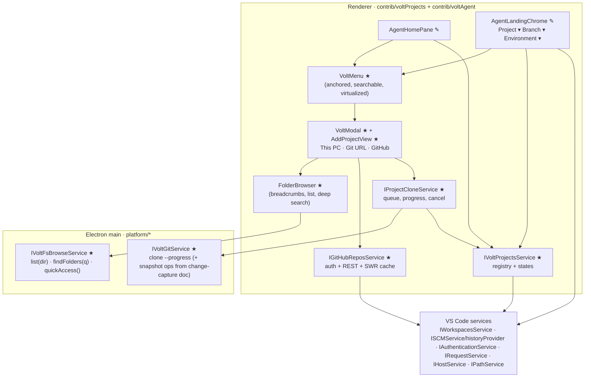
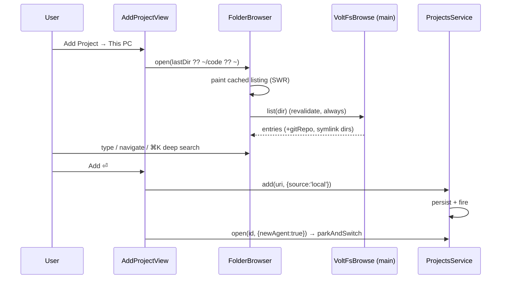

# Volt: Add Project (This PC · Git URL · GitHub) and Cursor-Style Agent Pickers

> **Two features, one system:**
> 1. **Add Project:** a Cursor-style menu opens a **custom in-app project picker** (T3-style; **never the native OS dialog**) with three sources: **This PC**, **Git URL** and **GitHub**. Cloned projects open immediately while the clone runs in the background.
> 2. **Agent tab pickers:** the three dropdowns on a new agent tab (**Project ▾ · Branch ▾ · Environment ▾**) become **Cursor-style anchored menus** instead of VS Code's top quick-pick. They reuse VS Code's data and logic (recents, SCM refs, git checkout); only the UI changes.

---

## 0. TL;DR

| Area | Decision |
|---|---|
| Entry | `+` on **Projects** (home pane), **Add Project…** in the Project dropdown, command palette `Volt: Add Project` (`⌘⌥A`, replacing `workbench.action.addRepository`) |
| First click | Small **Cursor-style menu**: *Open from This PC… · Clone from Git URL… · Clone from GitHub…* |
| Picker | **`VoltModal` + tabbed `AddProjectView`**, built only from VS Code primitives (`WorkbenchList`, `InputBox`, `BreadcrumbsWidget`, `ResourceLabels`, codicons, theme tokens) |
| Speed | One IPC call per directory (**main-process `IVoltFsBrowseService`**), stale-while-revalidate cache that **always revalidates on open**, virtualized list, prefetch on focus, and streaming deep search |
| Clone | New `IVoltGitService.clone()` in the main process: `git clone --progress`, live progress, cancel. The project appears **instantly** as "Cloning 42%" and the agent can be prompted right away (send waits for files) |
| GitHub | `IAuthenticationService('github')` + `IRequestService` → your repos (paged) + debounced search. **Beats T3**, which only takes pasted URLs |
| Registry | New **`IVoltProjectsService`** replaces the ad-hoc `volt.agent.projects` storage inside `agentHomePane.ts` |
| Dropdowns | New generic **`VoltMenu`** (anchored, searchable, sectioned, virtualized, keyboard-first), extracted from the patterns already in `agentModelPicker.ts` and `agentHistoryDropdown.ts` |
| Project ▾ | Current + Projects + Recent, search, footer *Add Project… · Clone Repository…* |
| Branch ▾ | Data from `ISCMHistoryProvider.provideHistoryItemRefs()` (local / remote / tags), checkout via `git.checkout(rootUri, name)`, inline **Create branch** |
| Environment ▾ | **Local / Worktree**, which plugs into `docs/volt/agent-change-capture.md` (worktree opt-in per thread) |

---

## 1. What exists today

| Piece | File | Today | Problem |
|---|---|---|---|
| Home pane "Projects" + `New Project` | `src/vs/workbench/contrib/voltAgent/browser/home/agentHomePane.ts` (`addProject()`, `PROJECTS_KEY='volt.agent.projects'`) | `IFileDialogService.showOpenDialog` | ❌ Native OS dialog; project storage is private to the pane |
| Home tree model | `home/agentHomeModel.ts` (`buildAgentHomeTree`, `sessionsForFolder`) | Projects + Workspaces + sessions | ✅ Keep; feed it from the registry |
| Agent-tab chrome (2 dropdowns) | `home/agentLandingChrome.ts` (mounted in `editor/agentEditor.ts` ≈L616) | Project → `IQuickInputService.pick` (top quick-pick); Branch → `git.checkout` (git ext quick-pick) | ❌ VS Code top quick-pick look, native "Open Folder…", **no third dropdown** |
| Project list helper | `home/agentLandingModel.ts` (`buildLandingProjectList`) | Dedupe current + recents | ✅ Reuse |
| Switch project | `hostService.openWindow([...], { parkAndSwitch: true })` (Volt option in `platform/window/common/window.ts`) | Parks the current window, switches | ✅ Keep for v1 |
| Add Repository command | `editor/agentEditor.contribution.ts` → `workbench.action.addRepository` (`⌘⌥A`) | `git.clone` quick-pick | 🔧 Point at the new flow |
| Cursor-like anchored dropdowns | `picker/agentModelPicker.ts` (`IContextViewService` + `InputBox` + `WorkbenchList`), `history/agentHistoryDropdown.ts`, access/table menus in `agentEditor.ts` | Each re-implements anchor, dismiss and keyboard handling | 🔧 **Extract `VoltMenu`** |
| Dropdown styling | `media/agentEditor.css` (`.volt-agent-dropdown`, `.volt-agent-dropdown-item`, `.volt-agent-landing-pick`) | Existing Volt menu look | ✅ Base tokens for `VoltMenu` |
| In-app file dialog (VS Code) | `src/vs/workbench/services/dialogs/browser/simpleFileDialog.ts` | Quick-input folder browser (path autocomplete, hidden files, remote-safe) | ✅ **Borrow logic** (path completion, trailing separators, `..`), not UI |
| Git refs (branches/remotes/tags) | `contrib/scm/common/history.ts` → `provideHistoryItemRefs`; git impl `extensions/git/src/historyProvider.ts` | Categorized refs | ✅ Branch menu data |
| Checkout | `extensions/git/src/commands.ts` `git.checkout(repository, treeish)` | Handles dirty tree / stash prompts | ✅ Reuse |
| GitHub repos | `extensions/github/src/remoteSourceProvider.ts` (`listForAuthenticatedUser`, `search.repos`) | Powers VS Code "Clone from GitHub" | ✅ Mirror the endpoints |
| GitHub auth | `IAuthenticationService` (`services/authentication/common/authentication.ts`) + `extensions/github-authentication` | Session with `repo` scope | ✅ Reuse |
| Home dir | `IPathService.userHome()` | – | ✅ |
| Process IPC pattern | `platform/voltStdio/*`, registered in `src/vs/code/electron-main/app.ts` ≈L1205 | – | ✅ Template for the new main services |

---

## 2. Research: what Cursor and T3 do (and what we copy)

| | Cursor | T3 Code | Volt (target) |
|---|---|---|---|
| Add-project entry | "New project" → **small menu** → options open the **native** folder dialog / clone | Command palette **Add Project** → provider list (GitHub, GitLab, Forgejo, Gitea, Bitbucket, Azure DevOps) or **paste Git URL** → **in-app** destination picker | Cursor's **menu**, then T3's **in-app** picker |
| Folder picker | Native OS | **In-app browser + path autocomplete** (`filesystem.browse` RPC), create-folder inline | In-app, faster, richer (git badges, deep search, quick access) |
| Clone UX | Clone repo → choose folder → open | **Project opens immediately; clone runs in background with a cancellable toast; send waits for files; retry banner** | Same as T3, plus progress on the project row and in the composer |
| GitHub repo search | Via GitHub integration for cloud agents | ❌ Paste URL only (search request [#8654](https://github.com/pingdotgg/t3code/issues/8654) closed "not planned") | ✅ **Your repos + search** |
| New-agent header | **Repository ▾ · Branch ▾ · Location (Local / Worktree / Cloud)** as anchored dropdown menus | Per-thread worktree toggle | **Project ▾ · Branch ▾ · Environment (Local / Worktree)** |

**Bugs in T3 we design around:**
- **Stale listings** ([#11476](https://github.com/pingdotgg/t3code/issues/11476)): the SWR cache never revalidated a warm directory, so new folders were missing. **Rule:** always revalidate when the picker opens, and watch the visible directory.
- **Symlinked dirs hidden** ([#8408](https://github.com/pingdotgg/t3code/issues/8408)): `readdir(withFileTypes)` uses lstat semantics. **Rule:** `stat()` symlinks and keep those that point to directories (guard against broken or cyclic links).
- **Native-picker clone destination bug** ([#12650](https://github.com/pingdotgg/t3code/pull/12650)): picking `~/code` should mean cloning to `~/code/<repo>`. **Rule:** one pure function, `resolveCloneDestination(parent, repoName)`, used everywhere.

> ⚠️ Cursor's exact visuals (spacing, wording, shortcuts) must be captured in **P0 (§12)** before any UI code. The spec in §3 is the target shape; P0 screenshots are the source of truth for pixel details.

---

## 3. UX spec

### 3.1 Entry points → one flow

| Where | Action |
|---|---|
| Home pane → **Projects** header `+` / "New Project" row | Opens the **Add Project menu** anchored to the button |
| Agent tab → **Project ▾** footer → *Add Project…* / *Clone Repository…* | Opens the modal on *This PC* / *Git URL* |
| Command palette | `Volt: Add Project` (`⌘⌥A`), `Volt: Clone Repository`, `Volt: Clone from GitHub` |
| Drag a folder from Finder/Explorer onto the home pane or modal | Adds it directly |

### 3.2 Add Project menu (Cursor-style, `VoltMenu`)

```
┌──────────────────────────────────┐
│ 🖥  Open from This PC…        ⌘O │
│ ⎇  Clone from Git URL…           │
│    Clone from GitHub…            │
│ ─────────────────────────────── │
│ Recent                           │
│ 📁 volt          ~/code/volt     │
│ 📁 api-server    ~/work/api      │
└──────────────────────────────────┘
```

### 3.3 Add Project modal (T3-style, VS Code primitives)

```
┌ Add Project ───────────────────────────────────────────────────── ✕ ┐
│  [ This PC ]  [ Git URL ]  [ GitHub ]                              │
│ ┌──────────────┬──────────────────────────────────────────────────┐ │
│ │ QUICK ACCESS │ ~ › code › ▸  [ ~/code/                   ⌘L ]   │ │  ← BreadcrumbsWidget ⇄ editable path (Tab completes)
│ │ 🏠 Home      │ 🔍 Filter this folder…      ⌘F  · Search all ⌘K  │ │
│ │ 🖥 Desktop   │ ─────────────────────────────────────────────────│ │
│ │ 📄 Documents │ 📁 api-server        ⎇ main   git   2d ago       │ │  ← WorkbenchList (virtualized)
│ │ 💻 code      │ 📁 design-system     ⎇ dev    git   5h ago       │ │     file-icon theme via ResourceLabels
│ │ ⏱ Recent    │ 📁 notes                             1w ago       │ │     "Added" badge if already a project
│ │ 💽 Volumes   │ 📁 volt              ⎇ main   git   Added        │ │
│ │              │ + New folder                                     │ │
│ └──────────────┴──────────────────────────────────────────────────┘ │
│  ☐ Show hidden            ~/code/design-system    [Cancel] [Add ⏎] │
└─────────────────────────────────────────────────────────────────────┘
```

**Keyboard (fast path, no mouse):**

| Key | Action |
|---|---|
| type | Filter the current folder (fuzzy, `matchesFuzzy`) |
| `↑ ↓` / `PgUp PgDn` | Move |
| `→` / `⏎` on a folder | Enter it |
| `←` / `⌫` (empty filter) | Parent folder |
| `⌘⏎` / **Add** | Add the **focused** folder (or the current folder if none is focused) |
| `⌘L` | Edit the path (Tab = autocomplete, `~` expands) |
| `⌘K` | **Search all folders** (deep, streaming) |
| `⌘⇧.` | Toggle hidden |
| `⌘N` | New folder inline |
| `⌘1/2/3` | Switch tab |
| `Esc` | Clear filter, then close |

### 3.4 Git URL tab

```
 Repository URL  [ https://github.com/org/repo.git | git@… | org/repo            ]
 Clone into      [ ~/code/ ▾ ]  /  [ repo ]     → ~/code/repo   ✓ available
 Branch          [ default ▾ ]   ☐ Recursive submodules
                                                    [Cancel] [Clone ⏎]
```
- *Clone into* opens the **same folder browser** in *destination* mode (a reused component).
- Live validation: URL shape, destination free / non-empty / **already cloned** (same remote), in which case the button becomes **Add existing**.

### 3.5 GitHub tab

```
 Signed in as @leularia ▾        🔍 Search your repositories…
 ─────────────────────────────────────────────────────────────
 🔒 leularia/volt            TypeScript  ★ 12   updated 2h ago
    leularia/dotfiles        Shell              updated 3d ago
    org/api-server   (org)   Go          ★ 88   updated 1w ago
 ─────────────────────────────────────────────────────────────
 Search all of GitHub for “…”                               ⏎
```
Not signed in → a **Sign in with GitHub** button (`IAuthenticationService.createSession`). Select a repo → the same *Clone into* step → Clone.

### 3.6 Clone in background (T3 behaviour, better surfaced)

- The project row appears **immediately** in Home → Projects as `⟳ api-server · Cloning 42%` with **Cancel**.
- The window switches to the project right away. The agent tab shows a **banner** above the composer: `Cloning… 42% · Receiving objects`. **Send is allowed**: the prompt queues and runs when the clone finishes (reuse `composer/agentComposerQueue.ts`).
- Failure: the row becomes `⚠ Clone failed` with **Retry · Details · Remove**, and the same banner appears on the agent tab.

### 3.7 Agent tab: three Cursor-style dropdowns

```
  [ 📁 volt ▾ ]  [ ⎇ main ▾ ]  [ 💻 Local ▾ ]
```

**Project ▾**
```
┌──────────────────────────────────────┐
│ 🔍 Search projects                   │
│ ✓ 📁 volt              ~/code/volt   │
│ PROJECTS                             │
│   📁 api-server        ~/work/api    │
│   ⟳ design-system      Cloning 42%   │
│ RECENT                               │
│   📁 notes             ~/notes       │
│ ──────────────────────────────────── │
│ +  Add Project…                  ⌘⌥A │
│ ⎇  Clone Repository…                 │
└──────────────────────────────────────┘
```

**Branch ▾** (disabled with a tooltip while an agent turn is running)
```
┌──────────────────────────────────────┐
│ 🔍 Search branches                   │
│ ✓ ⎇ main                             │
│ LOCAL                                │
│   ⎇ feat/pickers                     │
│ REMOTE                               │
│   ☁ origin/release-2.1               │
│ TAGS ▸                               │
│ ──────────────────────────────────── │
│ +  Create new branch…   (inline name)│
└──────────────────────────────────────┘
```

**Environment ▾**
```
┌──────────────────────────────────────────────┐
│ ✓ 💻 Local     Work directly in your checkout│
│   🌿 Worktree  Isolated copy, review to apply │
└──────────────────────────────────────────────┘
```

**Look (to confirm in P0):** anchored under the trigger (auto-flips up), 8px radius, 1px `widget.border`, `widget.shadow`, `quickInput.background` / `menu.background`, 13px text, 28px rows, muted uppercase section headers (`descriptionForeground`), hover and selection `list.hoverBackground` / `list.activeSelectionBackground`, right-aligned muted descriptions and keybinding hints, a check on the current item, and a sticky search field at the top. Only VS Code tokens and codicons are used.

---

## 4. Architecture



| Layer | Owns | Must NOT |
|---|---|---|
| `platform/voltFsBrowse` (main) | Fast `readdir`, symlink resolution, `.git` detection, deep folder search, quick-access roots | Know about projects or UI |
| `platform/voltGit` (main) | `clone` with progress events and cancellation (shared with the change-capture doc) | Prompt the user |
| `IVoltProjectsService` | The **single** project list: add/remove/rename, state (`ready · cloning · missing · error`), source, remote URL, last opened | Render UI |
| `IProjectCloneService` | Clone jobs, progress, retry, cancel, "send waits for files" | Talk to GitHub |
| `IGitHubReposService` | Session, repo pages, search, cache | Clone |
| `VoltMenu`, `VoltModal`, `FolderBrowser`, `AddProjectView` | Presentation and keyboard handling | Hold durable state |

---

## 5. Key decisions

| # | Decision | Why | Rejected |
|---|---|---|---|
| D1 | **No native dialogs.** All folder selection goes through the in-app `FolderBrowser` | Requested; consistent, fast, keyboard-first, themable | `IFileDialogService`; `SimpleFileDialog` as-is (quick-input look) |
| D2 | **Main-process `list(dir)`** returns `{name, kind, isSymlinkDir, isGitRepo, hidden, mtime}` in **one IPC call** | `IFileService.resolve` + a per-child `.git` check costs N round-trips | Renderer-only `IFileService` (kept as a fallback for remote/web) |
| D3 | **SWR cache that always revalidates on open**, plus `IFileService.watch` on the visible folder | Instant paint and never stale (T3 #11476) | TTL-only caches |
| D4 | **Deep search streams** from a bounded BFS (depth 5, skip list, time budget) with **git repos boosted** | Find `~/work/client/api` by typing `api` | Full-disk index, Spotlight-only |
| D5 | **One generic `VoltMenu`** for every Cursor-style dropdown | Removes 5+ copies of anchor/dismiss/keyboard code; one look | Styling `IQuickInputService` |
| D6 | **Reuse VS Code data and actions** (recents, SCM refs, `git.checkout`) | Behaviour parity (dirty-tree prompts, stash) for free | Re-implementing git flows |
| D7 | **Project opens before the clone finishes**, with prompts queued | Zero wait (T3), and it feels instant | Blocking modal progress |
| D8 | **Clone in our main service with `GIT_TERMINAL_PROMPT=0`**; GitHub HTTPS auth via a one-shot `http.extraheader` using the GitHub session token | In-app progress and cancel; no hanging prompts; token never persisted | `git.clone` command (notification-only progress, own prompts) |
| D9 | Project switch = **window switch** (`parkAndSwitch`) in v1 | Runtime assumes `folders[0]` today | Per-session project roots (v2, via `IAgentWorkspace.root` from the change-capture doc) |
| D10 | Environment ▾ = **Local / Worktree** stored per session | Matches Cursor's location picker and the change-capture design | Hidden setting only |

---

## 6. Interfaces

```ts
// platform/voltFsBrowse/common/voltFsBrowse.ts
export interface IFsEntry {
  readonly name: string;
  readonly path: string;              // absolute
  readonly kind: 'dir' | 'file';
  readonly symlink?: boolean;         // resolved: kind reflects the target
  readonly hidden: boolean;
  readonly gitRepo?: boolean;         // has .git (dir or file = worktree)
  readonly mtime?: number;
}
export interface IQuickAccessRoot { readonly id: 'home'|'desktop'|'documents'|'code'|'volume'; readonly label: string; readonly path: string; }
export interface IVoltFsBrowseService {
  readonly _serviceBrand: undefined;
  readonly onDidFindFolders: Event<{ requestId: string; entries: IFsEntry[]; done: boolean }>;
  list(dir: string, o?: { showHidden?: boolean; dirsOnly?: boolean }): Promise<{ entries: IFsEntry[]; truncated: boolean }>;
  findFolders(requestId: string, query: string, roots: string[], o?: { maxDepth?: number; budgetMs?: number }): Promise<void>;
  cancelFind(requestId: string): Promise<void>;
  quickAccess(): Promise<IQuickAccessRoot[]>;      // home, desktop, documents, detected ~/code|~/dev|~/Developer|~/projects|~/src, volumes/drives
  mkdir(parent: string, name: string): Promise<string>;
  inspect(path: string): Promise<{ exists: boolean; empty: boolean; gitRemote?: string }>;
}
```

```ts
// platform/voltGit/common/voltGit.ts  (extends the change-capture service)
export interface ICloneRequest { readonly jobId: string; readonly url: string; readonly dest: string; readonly ref?: string; readonly recursive?: boolean; readonly authHeader?: string; }
export interface ICloneProgress { readonly jobId: string; readonly phase: 'counting'|'compressing'|'receiving'|'resolving'|'checkout'|'done'|'error'; readonly percent?: number; readonly message?: string; }
// IVoltGitService += onDidCloneProgress: Event<ICloneProgress>; clone(r: ICloneRequest): Promise<void>; cancelClone(jobId: string): Promise<void>;
```

```ts
// contrib/voltProjects/common/projects.ts
export type ProjectState = { kind: 'ready' } | { kind: 'cloning'; jobId: string; percent?: number; phase?: string } | { kind: 'missing' } | { kind: 'error'; message: string };
export interface IVoltProject {
  readonly id: string;                 // stable hash of uri
  readonly uri: URI;
  readonly name: string;
  readonly source: 'local' | 'git' | 'github';
  readonly remoteUrl?: string;
  readonly addedAt: number;
  readonly lastOpenedAt?: number;
  readonly state: ProjectState;
}
export interface IVoltProjectsService {
  readonly _serviceBrand: undefined;
  readonly onDidChange: Event<void>;
  list(): readonly IVoltProject[];
  get(uri: URI): IVoltProject | undefined;
  add(uri: URI, o?: { source?: IVoltProject['source']; remoteUrl?: string; name?: string }): Promise<IVoltProject>;
  remove(id: string): Promise<void>;
  rename(id: string, name: string): Promise<void>;
  setState(id: string, state: ProjectState): void;
  open(id: string, o?: { newAgent?: boolean }): Promise<void>;    // parkAndSwitch (+ open a new agent tab)
}
```

```ts
// contrib/voltProjects/browser/githubRepos.ts
export interface IGitHubRepo { readonly fullName: string; readonly owner: string; readonly name: string; readonly private: boolean; readonly cloneUrl: string; readonly sshUrl: string; readonly language?: string; readonly stars: number; readonly pushedAt: string; readonly defaultBranch: string; }
export interface IGitHubReposService {
  readonly onDidChangeAccount: Event<void>;
  account(): Promise<{ login: string; avatarUrl: string } | undefined>;   // silent
  signIn(): Promise<boolean>;
  page(n: number): Promise<{ repos: IGitHubRepo[]; hasMore: boolean }>; // /user/repos?sort=pushed&per_page=100&affiliation=owner,collaborator,organization_member
  search(q: string, token: CancellationToken): Promise<IGitHubRepo[]>;  // local filter first, then /search/repositories?q=<q> in:name user:<login> (+ org:<orgs>)
  authHeader(): Promise<string | undefined>;                             // for clone of private https repos
}
```

```ts
// contrib/voltAgent/browser/ui/menu/voltMenu.ts
export interface IVoltMenuItem<T> { readonly id: string; readonly label: string; readonly description?: string; readonly icon?: ThemeIcon | (() => HTMLElement); readonly checked?: boolean; readonly disabled?: boolean; readonly keybinding?: string; readonly data: T; }
export interface IVoltMenuSection<T> { readonly id: string; readonly title?: string; readonly items: readonly IVoltMenuItem<T>[]; readonly collapsed?: boolean; }
export interface IVoltMenuOptions<T> {
  readonly anchor: HTMLElement;
  readonly position?: 'below' | 'above';           // auto-flips
  readonly search?: { placeholder: string; filter?: (item: IVoltMenuItem<T>, q: string) => IMatch[] | null };
  readonly sections: readonly IVoltMenuSection<T>[] | ((q: string, token: CancellationToken) => Promise<readonly IVoltMenuSection<T>[]>);
  readonly footer?: readonly IVoltMenuItem<T>[];
  readonly inlineInput?: { itemId: string; placeholder: string; validate?: (v: string) => string | undefined; onSubmit: (v: string) => Promise<void> };
  readonly width?: number;
  readonly onPick: (item: IVoltMenuItem<T>) => void | Promise<void>;
}
export function showVoltMenu<T>(accessor: ServicesAccessor, o: IVoltMenuOptions<T>): IDisposable;
```

```ts
// contrib/voltProjects/browser/ui/voltModal.ts
export function showVoltModal(accessor: ServicesAccessor, o: { title: string; width?: number; height?: number; render: (body: HTMLElement, close: () => void) => IDisposable }): IDisposable;
// mounts in ILayoutService.activeContainer, backdrop, trapFocus, Esc, restores focus; colors: quickInput.background, widget.border, widget.shadow
```

---

## 7. Workflows

### 7.1 Add from This PC


### 7.2 Clone (Git URL or GitHub)
```mermaid
sequenceDiagram
  participant M as AddProjectView
  participant C as CloneService
  participant G as VoltGit (main)
  participant P as ProjectsService
  participant A as Agent tab
  M->>C: clone(url, parent, name, ref)
  C->>C: dest = resolveCloneDestination(parent, name); inspect(dest)
  C->>P: add(dest, {source, remoteUrl}) state=cloning
  C->>G: clone(jobId, url, dest, authHeader?)
  C->>P: open(id, {newAgent:true})
  G-->>C: progress events → P.setState(cloning %)
  A->>A: banner "Cloning 42%" · prompts queue
  G-->>C: done → P.setState(ready) → A flushes queued prompt
```
**Cancel:** kill the process, delete the partial `dest` (only if Volt created it), and remove the project. **Error:** state `error` with Retry.

### 7.3 Project ▾
Open → sections from `IVoltProjectsService.list()` + `IWorkspacesService.getRecentlyOpened()` (dedupe via `buildLandingProjectList`) → pick → `projects.open(id, { newAgent: true })`. The new agent tab in the target window shows that project in the chip, as requested: *"created in that folder, it should show you that."*

### 7.4 Branch ▾
Open → the active `ISCMRepository` (`scmViewService.activeRepository`) → `historyProvider.provideHistoryItemRefs()` → group by `category` (branches / remote branches / tags) → pick → `commandService.executeCommand('git.checkout', provider.rootUri, ref.name)`, which inherits the git extension's dirty-tree, stash and remote-tracking handling. **Create branch:** inline input → `IVoltGitService.switchCreate(root, name)` (`git switch -c`), and SCM updates via the watcher.

### 7.5 Environment ▾
Pick Local / Worktree → stored on the session (`IVoltSession.isolation`), used by `IAgentWorkspace.prepare()` (see `agent-change-capture.md` §5a / §6.5). Locked after the first message of a session.

---

## 8. Performance budget (and how)

| Metric | Target | How |
|---|---|---|
| Menu open (any dropdown) | < 16 ms | DOM built once and reused; data prefetched on trigger hover (`pointerenter`) |
| Modal open | < 50 ms | Lazy-construct once, keep hidden; restore last tab and dir |
| First listing paint | < 30 ms local | SWR cache paint, then main `readdir` (one IPC call, `dirsOnly`) |
| 10k-entry folder | 60 fps scroll | `WorkbenchList` virtualization, no per-row async |
| Deep search first results | < 150 ms | Streaming BFS (`fs.opendir`, concurrency 16, depth 5, skip `node_modules .git Library AppData .cache dist build target .venv vendor Pods`), a persisted **known-repos** list gives instant hits |
| GitHub list | < 400 ms (cached: instant) | Memory + storage cache, revalidate on open, page 1 first, infinite scroll |
| Clone start | < 200 ms to the project appearing | Registry update before spawning git |

---

## 9. Security

- Spawn git with `execFile`/`spawn` (no shell): `git clone --progress [--branch <ref>] [--recurse-submodules] -- <url> <dest>`.
- Allow URL schemes `https:`, `ssh:`, `git@host:path`, and `owner/repo` shorthand (expands to GitHub HTTPS). **Reject** `ext::`, `file::`, anything starting with `-`, and control characters.
- `GIT_TERMINAL_PROMPT=0` and `GIT_ASKPASS=` (empty) so git never hangs.
- GitHub token: passed per-command as `-c http.https://github.com/.extraheader=AUTHORIZATION: basic <b64(x-access-token:token)>`. **Never written to `.git/config`**, never logged; redact it in errors.
- `dest` must be absolute, under a user-chosen parent, and not an existing non-empty directory unless you pick "Add existing".

---

## 10. Folder structure (★ new, ✎ changed)

```
src/vs/platform/voltFsBrowse/
  common/voltFsBrowse.ts                         ★ interface, IFsEntry, channel name
  electron-main/voltFsBrowseMainService.ts       ★ readdir+stat, symlink dirs, .git detect, BFS search, quickAccess, mkdir
src/vs/platform/voltGit/                         ★ (shared with agent-change-capture.md)
  common/voltGit.ts                              ★ + clone/cancelClone/onDidCloneProgress/switchCreate
  electron-main/voltGitMainService.ts            ★ progress parser ("Receiving objects: 42% (…)")
src/vs/code/electron-main/app.ts                 ✎ register both channels (next to voltStdio)

src/vs/workbench/contrib/voltProjects/           ★ new contribution
  common/projects.ts                             ★ IVoltProject, IVoltProjectsService
  common/cloneUrl.ts                             ★ PURE: parse/validate URL, repo name, resolveCloneDestination
  common/folderSearch.ts                         ★ PURE: scoring (fuzzy + git boost + recency)
  browser/voltProjectsService.ts                 ★ APPLICATION storage 'volt.projects.v1' (migrates 'volt.agent.projects')
  browser/projectCloneService.ts                 ★ jobs, progress, cancel, retry, prompt gating
  browser/githubRepos.ts                         ★ IGitHubReposService
  browser/ui/voltModal.ts                        ★ modal primitive
  browser/ui/addProjectMenu.ts                   ★ the small entry menu (VoltMenu)
  browser/ui/addProjectView.ts                   ★ tabs + footer
  browser/ui/folderBrowser.ts                    ★ breadcrumbs, path input, list, deep search, quick-access rail
  browser/ui/folderBrowserModel.ts               ★ PURE-ish: SWR cache, navigation stack, filter state
  browser/ui/gitUrlPane.ts                       ★
  browser/ui/githubPane.ts                       ★
  browser/media/addProject.css                   ★ tokens only
  browser/voltProjects.contribution.ts           ★ commands, keybindings, singleton registration
  electron-browser/voltProjects.contribution.ts  ★ registerMainProcessRemoteService(IVoltFsBrowseService / IVoltGitService)
  test/common/{cloneUrl,folderSearch}.test.ts    ★
  test/browser/folderBrowserModel.test.ts        ★
  test/node/voltFsBrowse.integration.test.ts     ★ temp dirs: symlinks, hidden, .git file, 10k entries

src/vs/workbench/contrib/voltAgent/browser/
  ui/menu/voltMenu.ts                            ★ generic Cursor-style menu
  ui/menu/voltMenuList.ts                        ★ virtualized renderer + delegate
  ui/menu/voltMenu.css                           ★ (moves shared .volt-agent-dropdown rules here)
  home/agentLandingChrome.ts                     ✎ 3 triggers → VoltMenu; Environment trigger added
  home/agentHomePane.ts                          ✎ uses IVoltProjectsService; "+" → addProjectMenu; cloning rows
  home/agentHomeModel.ts                         ✎ folder state (cloning/missing/error) on IAgentHomeFolder
  editor/agentEditor.ts                          ✎ clone banner; queue sends while cloning
  editor/agentEditor.contribution.ts             ✎ addRepository → Volt: Add Project
  picker/agentModelPicker.ts                     (later) migrate to VoltMenu
src/vs/workbench/workbench.common.main.ts        ✎ import voltProjects.contribution
src/vs/workbench/workbench.desktop.main.ts       ✎ import electron-browser contribution
```

---

## 11. Settings

```jsonc
"volt.projects.cloneDirectory": "",             // empty = first existing of ~/code ~/dev ~/Developer ~/projects ~/src, else ~/Volt
"volt.projects.showHiddenFolders": false,
"volt.projects.deepSearchRoots": ["~"],
"volt.projects.deepSearchMaxDepth": 5,
"volt.agent.defaultEnvironment": "local"        // "local" | "worktree"
```

---

## 12. Parity protocol: Cursor and T3 (P0, before UI code, and after each phase)

**Capture flows with screenshots or a screen recording, saved in `docs/volt/add-project-parity/` with notes in `docs/volt/add-project-parity.md`:**

| # | Flow | In Cursor | In T3 Code |
|---|---|---|---|
| A1 | Click **New/Add project** | Menu items, order, icons, shortcuts | Palette/entry items, provider list |
| A2 | Add a local folder | What opens (native), steps to confirm | In-app browser: breadcrumbs, autocomplete, create folder, keyboard |
| A3 | Clone by URL | Destination choice, progress, when the project opens | Background clone toast, send gating, retry banner |
| A4 | Clone from GitHub | Repo list and search | Provider flow |
| A5 | New agent tab header | **All three dropdowns**: size, radius, shadow, search field, sections, checkmark, footer actions, hover, keyboard, anchor side | Worktree toggle placement |
| A6 | Switch project from dropdown | Same window or new window, what the new tab shows | – |
| A7 | Switch branch / create branch | Dirty-tree handling, inline create | – |

**Loop:** build the phase → run A1–A7 in Volt → mark **match / better / worse** → fix every *worse* by copying the interaction detail → repeat. **Deliberate divergence:** Volt never opens the native folder dialog.

> If you (the implementing agent) cannot operate Cursor or T3 Code, **stop and ask the user** to record A1–A7 and share the screenshots. Do not guess visuals.

---

## 13. Phases and "done when"

| Phase | Scope | Done when |
|---|---|---|
| **P0** | Parity capture (§12) | A1–A7 documented with screenshots for Cursor and T3 |
| **P1** | `VoltMenu` + migrate **Project ▾ / Branch ▾** + new **Environment ▾** | Dropdowns match P0 Cursor screenshots; no `IQuickInputService` in `agentLandingChrome.ts`; branch list and checkout work, including a dirty tree |
| **P2** | `IVoltProjectsService` (+ migration from `volt.agent.projects`), home pane wired | Existing projects survive the upgrade; add/remove/rename works from the home pane and Project ▾ |
| **P3** | `IVoltFsBrowseService` + `VoltModal` + `FolderBrowser` (This PC) | No native dialog anywhere in Volt project flows; 10k-folder dir scrolls smoothly; symlink dirs and hidden toggle work; newly created external folders appear on reopen |
| **P4** | Deep search + quick access + inline new folder | `⌘K` "api" finds `~/work/client/api` in < 150 ms (warm) |
| **P5** | Git URL clone + background progress + prompt queue | Project appears < 200 ms after Clone; progress on the row and banner; cancel cleans up; the queued prompt runs after the clone |
| **P6** | GitHub tab (auth, pages, search, private clone) | Private repo clones without prompts; search works on 500+ repo accounts without loading all |
| **P7** | Polish and parity loop | `add-project-parity.md` shows match/better on A1–A7; a11y labels; lint and tests green |

---

## 14. Edge cases

- The folder is already a project: focus it (don't duplicate). The folder is inside an existing project: allow it, but show "inside *volt*".
- Destination exists: empty → use it; same remote → **Add existing**; different content → suggest `name-2`.
- Permission denied or unreadable folder: show an inline row "No access" and keep navigating.
- Network drive or slow volume: listing timeout (1.5 s) with a spinner row; never block the UI.
- A moved or deleted project: state `missing`, with **Locate…** (opens `FolderBrowser`) or **Remove**.
- Windows: drives in quick access, `\\` paths, case-insensitive dedupe. macOS: `/Volumes`. Linux: `/media`, `/mnt`.
- Remote/web workbench: `IVoltFsBrowseService` is unavailable, so `FolderBrowser` falls back to `IFileService.resolve` (slower, same UI).
- Branch ▾ with no repo: disabled "No git repository" with an **Initialize repository** action (`git.init`).
- Detached HEAD: show the short SHA with a "detached" badge.

---

## Sources

T3 Code: [source-control docs](https://github.com/pingdotgg/t3code/blob/main/docs/user/source-control.md) · [stale picker listing #11476](https://github.com/pingdotgg/t3code/issues/11476) · [symlinked dirs hidden #8408](https://github.com/pingdotgg/t3code/issues/8408) · [GitHub repo search request #8654](https://github.com/pingdotgg/t3code/issues/8654) · [clone destination fix #12650](https://github.com/pingdotgg/t3code/pull/12650) · [create folder in palette #13947](https://github.com/pingdotgg/t3code/pull/13947) · [readable clone names #12474](https://github.com/pingdotgg/t3code/pull/12474) · [Better Stack guide](https://betterstack.com/community/guides/ai/t3-code/)
Cursor: [Worktrees docs](https://cursor.com/docs/configuration/worktrees) · [New-agent branch dropdown](https://forum.cursor.com/t/web-new-agent-branch-dropdown-ignores-base-branch-setting/163351) · [Select repository dropdown](https://forum.cursor.com/t/cloud-agents-select-repository-dropdown-empty-not-selectable-despite-full-github-access-pro-plan/144795) · [Agents window default branch](https://forum.cursor.com/t/start-a-new-agent-from-the-remote-default-branch-in-agents-window/160362) · [Parallel agents with worktrees](https://engincanveske.substack.com/p/running-parallel-agents-in-cursor)

---

## 15. Implementation prompt (copy-paste to the implementing agent)

```text
ROLE
You are a senior engineer on Volt, a Cursor-class agentic editor built on VS Code (Code-OSS).

MISSION
Build two things that feel as fast and polished as Cursor and T3 Code:
1. Add Project, with three sources: This PC, Git URL and GitHub. It uses a custom in-app
   project and folder picker. Never open the native OS file dialog.
2. The three dropdowns on a new agent tab (Project, Branch, Environment). Turn them into
   Cursor-style anchored menus. Keep VS Code's data and behaviour and change only the UI.

READ FIRST
- docs/volt/add-project-and-agent-pickers.md. This is the spec: architecture, decisions
  D1-D10, interfaces, workflows, performance budget, security, phases.
- docs/volt/agent-change-capture.md, for Environment = Local / Worktree and IVoltGitService.
- Existing code to reuse or change:
  - contrib/voltAgent/browser/home/agentLandingChrome.ts (today's 2 dropdowns)
  - home/agentHomePane.ts (Projects section, native dialog to remove)
  - home/agentHomeModel.ts, home/agentLandingModel.ts
  - picker/agentModelPicker.ts and history/agentHistoryDropdown.ts (the anchored-menu
    pattern to extract into VoltMenu)
  - media/agentEditor.css (.volt-agent-dropdown*)
  - services/dialogs/browser/simpleFileDialog.ts (path-completion logic to borrow)
  - contrib/scm/common/history.ts (provideHistoryItemRefs)
  - extensions/git/src/commands.ts (git.checkout(repository, treeish))
  - extensions/github/src/remoteSourceProvider.ts (GitHub endpoints to mirror)
  - platform/voltStdio/* and code/electron-main/app.ts (main-process IPC pattern)

STEP 0: STUDY CURSOR AND T3 CODE (before writing UI code)
Run parity flows A1-A7 from §12 in Cursor and in T3 Code. Add a local folder, clone by
URL, clone from GitHub, open a new agent tab and use all three dropdowns, switch project,
switch branch and create a branch. Save screenshots to docs/volt/add-project-parity/ and
notes to docs/volt/add-project-parity.md. Record spacing, radius, shadow, the search
field, section headers, the checkmark, footer actions, keyboard handling and anchor side.
If you cannot drive Cursor or T3 Code, stop and ask the user to record these flows.
Do not guess.

REQUIREMENTS
R1 Entry: the home pane "+", Project ▾ footer (Add Project… / Clone Repository…), command
   palette entries (Volt: Add Project ⌘⌥A, Volt: Clone Repository, Volt: Clone from
   GitHub), and dropping a folder onto the home pane. The first click shows a small
   Cursor-style menu: Open from This PC… / Clone from Git URL… / Clone from GitHub… /
   Recent.
R2 This PC: a VoltModal with a tabbed AddProjectView and a FolderBrowser that includes:
   - a breadcrumb path that also works as an editable path (Tab autocomplete, ~ expands)
   - a quick-access rail (Home, Desktop, Documents, detected code folders, Recent, volumes)
   - a virtualized folder list with file-icon-theme icons, git and branch badges, an
     "Added" badge and modified time
   - type-to-filter, deep search (⌘K, streaming), inline New folder, a Show hidden toggle
   - the keyboard map from §3.3
   Build it only from VS Code primitives (WorkbenchList, InputBox, BreadcrumbsWidget,
   ResourceLabels, codicons, theme tokens). No IFileDialogService and no native dialog.
R3 Speed: meet the §8 budget. Use the main-process IVoltFsBrowseService (one IPC call per
   directory; resolve symlinked dirs; detect .git). Use a stale-while-revalidate cache that
   ALWAYS revalidates when the picker opens, plus a watcher on the visible folder. Prefetch
   on focus and hover.
R4 Git URL: validate URLs (reject ext::, leading "-" and control characters). Clone into a
   destination chosen with the same FolderBrowser in destination mode, via
   resolveCloneDestination(parent, repoName). Detect "already cloned" and offer Add
   existing. Support an optional branch and recursive submodules.
R5 GitHub: sign in with IAuthenticationService('github'). List the user's repos (paged,
   sorted by last push), with instant local filtering plus debounced server search.
   Show private, language, stars and updated. Clone private repos with a one-shot
   http.extraheader token; never persist or log the token.
R6 Clone UX: the project appears immediately as "Cloning N%" (home row and agent-tab
   banner) with Cancel. The window switches to it at once. Prompts sent during the clone
   are queued and run when the files arrive. Failure offers Retry, Details and Remove.
   Cancel removes the partial folder only if Volt created it.
R7 Registry: IVoltProjectsService is the single source of truth. Migrate the old
   'volt.agent.projects' storage. Track states ready, cloning, missing and error.
R8 Dropdowns: build a generic VoltMenu (anchored, auto-flipping, sticky search, sections,
   virtualized, checkmark, footer actions, inline input, full keyboard support, a11y).
   Use it for:
   - Project ▾: current, projects and recent, with Add Project… and Clone Repository…
   - Branch ▾: data from provideHistoryItemRefs; checkout via
     git.checkout(rootUri, name); inline Create branch; disabled while a turn is running
   - Environment ▾: Local / Worktree, stored per session and locked after the first message
   A new agent tab shows the project it was created in.
R9 Look and feel: match the Cursor screenshots from Step 0. Use only VS Code theme tokens
   and codicons. Follow Volt's code style (tabs, localize, registerAction2, Disposable
   services, createDecorator). Keep common/* pure and unit-tested.

EXECUTION
Work in phases P0-P7 from §13 and commit after each phase. After each phase:
  1. Run the unit tests and the node integration tests (temp dirs with symlinks, hidden
     folders, a .git file, and 10k entries).
  2. Run the relevant parity flows in Volt and in Cursor/T3, side by side.
  3. Update add-project-parity.md with verdicts (match / better / worse).
  4. Fix every "worse" and repeat until none remain.

DEFINITION OF DONE
- No native folder dialog appears in any Volt project flow.
- Adding a local project takes 3 keystrokes or fewer from the menu.
- Deep search returns first results in under 150 ms (warm).
- A cloned project is usable immediately, with visible progress and a working queued
  prompt.
- The GitHub tab finds any accessible repo by name, private repos included.
- All three dropdowns match Cursor's look and behaviour (screenshots in the parity doc)
  while reusing VS Code's data and checkout logic.
- Tests pass and the changed files are lint clean.

NON-GOALS (v1)
Per-session project roots without a window switch (v2), GitLab/Bitbucket OAuth (use Git
URL), cloud agents, SSH-remote folder browsing (it falls back to IFileService).
```
