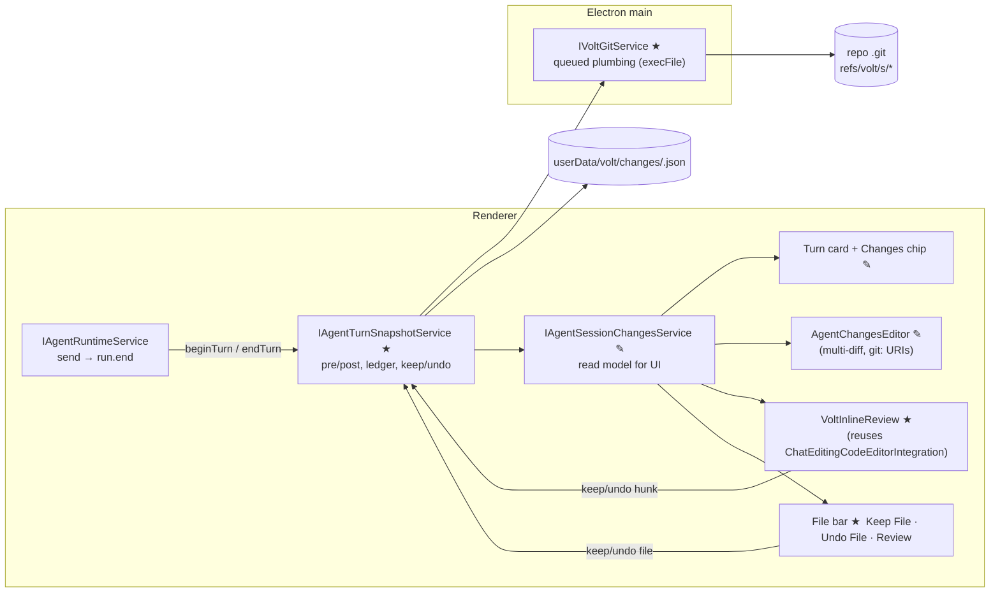

# Volt: Per-Message Agent Diffs, Inline Keep / Undo (T3-style)

> **One line:** every message you send gets a before and after Git snapshot stored under hidden refs. The diff between them is exactly what the agent changed. Volt draws it **inline in the editor like Cursor**, with Keep and Undo per change, **Keep File** at the top, and **Review** to open the full diff. **Keep stages in Git. Undo removes it from disk and from Git.**

---

## 0. TL;DR

| | Decision |
|---|---|
| **Model** | T3 Code approach: **in-place by default** (the agent edits your real files on your branch), with an **optional worktree per thread** |
| **Capture** | Per turn: `pre` snapshot before sending and `post` snapshot after the agent responds, each a hidden commit under `refs/volt/s/<session>/<turn>/…` |
| **Truth** | `git diff pre post`, meaning the filesystem, not what the agent says it changed. It catches shell edits, `apply_patch`, codegen and formatters |
| **Inline UI** | Reuse VS Code's own chat-editing inline diff (`ChatEditingCodeEditorIntegration` with its hunk widget) and its theme colors |
| **Review** | Reuse the existing multi-diff editor (`AgentChangesEditor`). Its original side comes from the built-in **`git:` URI** at the snapshot commit |
| **Keep** | Hunk or file: write the accepted content into the **Git index** (staged) |
| **Undo** | Hunk or file: revert the text in the real file. After Keep: also restore the index entry |
| **Parity** | Before building, run a **Cursor side-by-side protocol** (§11) and repeat it after each phase until Volt matches or beats it |

---

## 1. Mental model

```
You: "make the header blue"                           You: "and the button"
        │                                                    │
   pre₁ ─── agent edits real files ─── post₁            pre₂ ─── agent ─── post₂
   (snapshot)                          (snapshot)        (snapshot)         (snapshot)
        └──── turn 1 diff = pre₁..post₁ ────┘                └── turn 2 = pre₂..post₂ ──┘

Editor shows (per file):  accepted content  ⇄  live file on disk
                          (starts = pre of the first turn that touched it)
Keep hunk  → accepted += hunk → written to Git index (staged)
Undo hunk  → live file −= hunk (agent's change removed from disk)
```

- A **hidden ref** is a Git name like a branch, but outside `refs/heads/`. `git branch`, `git log` and `git status` don't show it, and it isn't pushed by default. It keeps the snapshot commit alive for diffing and restoring.
- Snapshots use a **private `GIT_INDEX_FILE`**, so your real staging area is never touched by capture.
- Taking a **`pre` per turn** (not just `post`) means edits you make between messages are never blamed on the agent.

---

## 2. What exists today (reuse, don't rebuild)

| Existing | Path | Use it for |
|---|---|---|
| Changes service + multi-diff source + snapshot URIs | `src/vs/workbench/contrib/voltAgent/browser/review/agentSessionChangesService.ts` | Keep the API and **swap the data source** from transcript blocks to the ledger |
| Changes editor (scopes: uncommitted, last turn, staged, unstaged) | `review/agentChangesEditor.ts` | **Review** target; add "Turn N" scopes |
| File toolbar actions (Copy Path, Discard) | `review/agentChangesActions.ts` | Add Keep / Undo |
| Thread diff cards | `review/fileChangePreview*.ts`, `blocks/agentBlocks.ts` | Per-turn summary card |
| Composer "Changes" chip | `composer/agentComposerChips.ts` | Pending stats + Keep All / Undo All |
| **Inline diff + hunk Keep/Undo widget** | `src/vs/workbench/contrib/chat/browser/chatEditing/chatEditingCodeEditorIntegration.ts` (`DiffHunkWidget`, `IDocumentDiff2.keep/undo`) | **Inline editor UI.** Same look as VS Code and Cursor |
| Editor overlay bar (`‹ 1/3 ›  Keep  Undo`) | `chatEditing/chatEditingEditorOverlay.ts` | Top-of-file **Keep File / Undo File** bar |
| Keep/Undo actions and keybindings pattern | `chatEditing/chatEditingEditorActions.ts` | Copy action shapes and keybindings |
| Git content provider (`git:` scheme, `git show <ref>:<path>`) | `extensions/git/src/uri.ts` → `toGitUri`, `fileSystemProvider.ts` | Original side of diffs. **No new content provider** in in-place mode |
| Diff engine | `IEditorWorkerService.computeDiff`, `linesDiffComputers` | Hunks for inline and cards |
| Theme tokens | `diffEditor.insertedLineBackground`, `diffEditor.removedLineBackground`, `editorGutter.*` | **No new colors** |
| Spawn with `env` (IPC service pattern) | `src/vs/platform/voltStdio/*` + registration in `src/vs/code/electron-main/app.ts` (≈L1205) | Template for the new Git service |
| Agent cwd and tool root | `services/voltRuntime/browser/voltRuntimeService.ts` (≈L257, 603, 1011, 1028, 1171, 1231) | Point at the worktree only when a thread opts in |

**Root bug today:** `agentSessionChanges.ts` builds the change list from what the agent *reports* (`file` blocks). Codex and Cursor CLI write straight to disk or run shell commands, so those edits are missed. Snapshots fix this.

---

## 3. Architecture



| Layer | Owns | Must NOT |
|---|---|---|
| `IVoltGitService` (main) | Plumbing: snapshot, diff, blob read and write, index update, refs, worktree. **Serial queue per repo** | Know about sessions or UI |
| `IAgentTurnSnapshotService` | Turn lifecycle, ledger, accepted-content per file, Keep/Undo semantics | Render anything |
| `IAgentSessionChangesService` | UI read model (files, stats, multi-diff items) | Call Git directly |
| UI (inline, bar, review, card, chip) | Presentation and commands | Hold state beyond view state |

---

## 4. Key decisions

| # | Decision | Why |
|---|---|---|
| D1 | **Snapshots, not tool events**, are the truth | Works for Claude, Codex, Cursor CLI, DeepSeek-native, any ACP agent |
| D2 | **In-place default, worktree opt-in per thread** (T3) | Fast and familiar; isolation only when you want parallel or long runs |
| D3 | **`pre` and `post` per turn** | Precise per-message diff even if you edit between messages |
| D4 | Snapshot commits live in the **user's object DB** under `refs/volt/s/…` | Deduped, fast, survive restart, not pushed |
| D5 | **Private index** per session (`userData/volt/index/<session>.idx`) | No `index.lock` races, warm stat cache, so capture is O(changed files) |
| D6 | Inline diff = **accepted content ⇄ live file** | Identical to VS Code chat-editing and Cursor; multiple turns stack naturally |
| D7 | **Keep writes the index** (`hash-object -w` then `update-index --cacheinfo`) | Hunk-level staging without touching the working file. Cursor doesn't stage on Keep; **we do**, by requirement |
| D8 | **Undo edits the text model** (not a raw disk write) | Respects open buffers, the editor undo stack and dirty state |
| D9 | **Reuse VS Code components and theme** | Native look, less code, fewer bugs |
| D10 | **Never swallow Git errors**; publish the ref only after objects are written | The known failure modes of opencode and T3 |

---

## 5. Data model

```ts
// services/voltRuntime/common/changes/changeTypes.ts
export type TurnState = 'running' | 'captured' | 'captureFailed';
export type HunkState = 'pending' | 'kept' | 'undone';

export interface ITurnSnapshot {
  readonly sessionId: string;
  readonly turnId: string;           // == runId
  readonly index: number;            // 1..n
  readonly pre: string;              // commit sha  (refs/volt/s/<S>/<n>/pre)
  readonly post?: string;            // commit sha  (refs/volt/s/<S>/<n>/post)
  readonly indexTree: string;        // your real index at turn start (for Undo-after-Keep)
  readonly state: TurnState;
  readonly files: readonly ITurnFile[];
  readonly stats: { files: number; additions: number; deletions: number };
  readonly error?: string;
}

export interface ITurnFile {
  readonly path: string;             // repo-relative posix
  readonly oldPath?: string;         // rename (-M)
  readonly kind: 'added' | 'modified' | 'deleted' | 'renamed';
  readonly binary: boolean;
  readonly additions: number;
  readonly deletions: number;
  readonly preBlob?: string;
  readonly postBlob?: string;
}

/** Per-file review state across all pending turns. Drives the inline editor. */
export interface IPendingFile {
  readonly path: string;
  acceptedBlob: string | null;       // "original" side; null = file did not exist
  readonly turns: readonly string[]; // turnIds that touched it
  readonly firstPreIndexBlob?: string; // index entry before the first touching turn
}
```

```ts
// platform/voltGit/common/voltGit.ts
export interface IVoltGitService {
  readonly _serviceBrand: undefined;
  resolveRepo(folder: string): Promise<{ repoRoot: string; gitDir: string } | undefined>;
  snapshot(o: { repoRoot: string; workTree: string; indexFile: string; parent?: string; ref: string; message: string; paths?: string[] }): Promise<{ commit: string; tree: string }>;
  writeIndexTree(o: { repoRoot: string }): Promise<string>;                  // git write-tree (real index, read-only)
  diffSummary(o: { repoRoot: string; from: string; to: string }): Promise<IDiffEntry[]>; // --raw --numstat -M -z
  readBlob(o: { repoRoot: string; sha: string }): Promise<Uint8Array>;
  writeBlob(o: { repoRoot: string; content: Uint8Array }): Promise<string>;  // hash-object -w --stdin
  setIndexEntry(o: { repoRoot: string; path: string; blob: string | null; mode?: string }): Promise<void>; // update-index --cacheinfo / --force-remove
  resetIndexPaths(o: { repoRoot: string; treeish: string; paths: string[] }): Promise<void>;          // git reset -q <treeish> -- paths
  updateRef(o: { repoRoot: string; ref: string; commit?: string }): Promise<void>;
  deleteRefs(o: { repoRoot: string; prefix: string }): Promise<void>;
  // worktree (opt-in threads)
  addWorktree(o: { repoRoot: string; path: string; commit: string }): Promise<void>;
  removeWorktree(o: { repoRoot: string; path: string }): Promise<void>;
  applyPatch(o: { repoRoot: string; from: string; to: string; paths?: string[]; reverse?: boolean; index: boolean }): Promise<IApplyResult>; // diff --binary | apply --3way
}
```

```ts
// services/voltRuntime/common/changes/turnSnapshots.ts
export interface IAgentTurnSnapshotService {
  readonly onDidChange: Event<string /* sessionId */>;
  beginTurn(sessionId: string, runId: string): Promise<void>;
  endTurn(sessionId: string, runId: string, reason: 'done' | 'abort' | 'fail'): Promise<ITurnSnapshot>;
  getTurns(sessionId: string): readonly ITurnSnapshot[];
  getPendingFiles(sessionId: string): readonly IPendingFile[];
  keep(sessionId: string, t: ReviewTarget): Promise<void>;
  undo(sessionId: string, t: ReviewTarget): Promise<void>;
  disposeSession(sessionId: string): Promise<void>;
}
export type ReviewTarget =
  | { kind: 'all' } | { kind: 'turn'; turnId: string }
  | { kind: 'file'; path: string } | { kind: 'hunk'; path: string; range: LineRangeMapping };
```

**Ledger:** `userData/volt/changes/<sessionId>.json`, written atomically (same `ATOMIC` pattern as `agentHistoryService.ts`). Refs are the durable truth; the ledger can be rebuilt from them.

---

## 5a. Worktree snapshotting and live changes (how git captures a snapshot)

This is the core mechanic. It's worth understanding before touching code.

**Three things that sound alike but aren't:**

| Thing | What it is | Who owns it |
|---|---|---|
| **Working tree** | The actual files on disk (`src/Header.css`) | You and the agent |
| **Your index** (`.git/index`) | Your staging area: what `git commit` would record | **You.** Volt only writes it on **Keep** |
| **Volt's private index** (`userData/volt/index/<session>.idx`) | A second staging area Volt uses only to build snapshots | **Volt capture only** |

`GIT_INDEX_FILE=<path>` tells any Git command to use a different index file. Snapshotting with the private index lets Volt do `git add -A` and `write-tree` **without ever touching your staged changes**.

### How one snapshot is built (4 plumbing commands)

```bash
export GIT_INDEX_FILE=$USERDATA/volt/index/<session>.idx
git -C <root> -c core.untrackedCache=true add -A [-- <touched paths>]  # 1. copy working-tree state into the private index
TREE=$(git -C <root> write-tree)                                      # 2. index → tree object (a full folder snapshot)
C=$(git -C <root> commit-tree $TREE -p <parent> -m "volt <S> t<n> pre|post")  # 3. wrap it in a commit (timestamp + parent chain)
git -C <root> update-ref refs/volt/s/<S>/<n>/pre|post $C             # 4. publish a hidden name LAST (atomic)
```

1. `add -A` hashes changed files into blobs (`.git/objects`) and records them in the **private** index. Untracked files are included and `.gitignore` is respected.
2. `write-tree` turns the index into a **tree**, a complete folder snapshot. Unchanged files reuse existing blobs, so it's nearly free.
3. `commit-tree` wraps the tree in a commit. It moves no branch and doesn't change `HEAD`.
4. `update-ref` gives the commit a **hidden name**, which protects it from `git gc` and makes it findable after a restart.

**Why it's fast:** the private index persists between turns, so it caches each file's size and mtime. Step 1 only re-hashes files whose stat changed: O(changed files), not O(repo). On huge repos, pass the paths the file watcher saw change (`-- <paths>`) and use `core.untrackedCache` (optionally `core.fsmonitor`).

### Live changes during a run (before `post` exists)

The snapshot is the **truth**; live updates are **hints** so the UI isn't frozen for a long run:

```
beginTurn → pre snapshot
   │  agent writes files ──► IFileService.onDidFilesChange (in-place: the workspace watcher already sees it)
   │                         └► collect touchedPaths; update chip "Working… · 3 files"
   │                         └► optional: throttled mini-snapshot (every ~2s, only touchedPaths) for a live "Peek" diff
   │  ACP tool_call diffs / DeepSeek `file.change` events → draw provisional cards immediately
endTurn → post snapshot (full `add -A`, touchedPaths first) → diff pre..post → replace provisional cards with exact ones
```

- **In-place:** the agent writes into your real files, so you see text change live (same as Cursor). **Inline hunks with Keep/Undo appear when the turn ends**, from the exact `pre..post` diff. Optional: show a subtle "agent editing" gutter marker on touched files during the run.
- **Worktree mode:** the agent writes in `userData/volt/worktrees/<repo>/<S>`, and **your files don't change at all**. Watch the worktree folder with `IFileService.watch(worktreeUri)` to power the live chip and the "Peek live diff" (read-only multi-diff `pre..current`).

### Worktree mode, step by step (opt-in per thread)

```bash
# 1. Snapshot YOUR current state (tracked + untracked + uncommitted edits) → base
GIT_INDEX_FILE=<priv> git -C <repo> add -A && T=$(git write-tree) && B=$(git commit-tree $T -p HEAD -m base)
git update-ref refs/volt/s/<S>/base $B
# 2. Create a detached checkout of that exact state outside the workspace
git -C <repo> worktree add --detach $USERDATA/volt/worktrees/<repo>/<S> $B
# 3. Link heavy ignored dirs so builds and tests work (setting: node_modules, .venv, target…)
ln -s <repo>/node_modules <wt>/node_modules
# 4. Start the agent with cwd = <wt>. Each turn snapshots <wt> (not <repo>) with the same 4 commands.
# 5. Keep = bring the change back into your repo, staged
git -C <repo> diff --binary --full-index <pre> <post> [-- paths] | git -C <repo> apply --3way --index
# 6. Undo (before Keep) = reset the worktree; your repo was never touched
git -C <wt> reset --hard -q <pre> && git -C <wt> clean -fdq -e node_modules
```

- The worktree shares **the same object database** as your repo, so snapshots from the worktree are directly diffable and appliable in your repo with no copying.
- Base = **your working tree**, not `HEAD`, so the agent sees your uncommitted work and the diff shows only the agent's changes.
- In worktree mode the inline hunks appear **after Keep**, or you review first in the multi-diff (Review) and then Keep.

### Gotchas to handle (learned from T3, opencode and Cline)

| Gotcha | Guard |
|---|---|
| `git add` fails silently, leaving a stale snapshot and data loss on undo (opencode) | Check exit codes; mark the turn `captureFailed` and never Undo from it |
| Two processes using the same index hit `index.lock` (opencode) | One private index **per session**, and a per-repo serial queue |
| Ref published before objects are flushed (T3) | Order is always add, then write-tree, then commit-tree, then **update-ref last** |
| Monorepo `add -A` times out (T3) | Warm index, then `-- touchedPaths`, then untrackedCache and fsmonitor, then a timeout with a visible fallback |
| Refs pile up forever (T3) | Retention: delete on session delete, plus a `retentionDays` sweep |
| Agent writes outside the worktree via absolute paths | Map ACP `fs/*` paths into the worktree, give prompts repo-relative paths, and run a post-turn leak check on the real repo |

---

## 6. Workflows

### 6.1 Send → capture

```mermaid
sequenceDiagram
  participant U as You
  participant RT as Runtime
  participant TS as TurnSnapshots
  participant G as VoltGit
  participant A as Agent
  U->>RT: send("make header blue")
  RT->>TS: beginTurn(runId)
  TS->>G: writeIndexTree() → indexTree ; snapshot(private idx) → pre
  RT->>A: prompt
  A->>A: edits files (any tool, shell, formatter)
  A-->>RT: run.end
  RT->>TS: endTurn(runId)
  TS->>G: snapshot(parent=pre) → post ; diffSummary(pre, post)
  TS-->>U: turn card "2 files +3 −1 · Review" + inline hunks in open editors
```

### 6.2 Inline Keep / Undo (per change, like Cursor)

| Action | Effect on disk | Effect on Git |
|---|---|---|
| **Keep hunk** | none | `accepted += hunk` → `writeBlob` → `setIndexEntry` (**staged**) |
| **Undo hunk** | text-model edit removes the hunk, then save | none (if already staged by an earlier Keep: restore that part of the index too) |
| **Keep file** (top bar) | none | index entry = live file (`git add -- path`; `git rm --cached` if deleted) |
| **Undo file** (top bar) | file = accepted content (created → delete; deleted → restore) | index entry = `firstPreIndexBlob` |
| **Keep all / Undo all** | loop over files in one progress operation | same |
| **Undo after Keep** (from the turn card) | restore `pre` content for the turn's files | `resetIndexPaths(indexTree, paths)`, which **removes it from Git** |

**The hunk is fully resolved** when nothing is left between accepted and live, and the file then leaves the pending list.

### 6.3 Second message

`beginTurn` takes a fresh `pre₂` (so your edits in between aren't counted). After `post₂`, the new hunks **stack** onto the same inline view. `accepted` for already-pending files is unchanged, so the editor shows everything still unreviewed, and each turn card shows only its own `preₙ..postₙ` diff.

### 6.4 You type in a file that has pending hunks

Mirror non-overlapping user edits into the `accepted` model, the same way chat-editing does in `chatEditingModifiedDocumentEntry.ts`. Otherwise your own typing shows up as agent hunks.

### 6.5 Worktree thread (opt-in toggle in the composer: `Local ▾ / Worktree`)

A detached worktree lives at `userData/volt/worktrees/<repo>/<session>`, based on a snapshot of your working tree. The agent's cwd and tool root point there. Keep = `applyPatch(pre, post, paths, index:true)` into the real repo. Undo = reset the worktree. The same Review diff is used. Snapshots from the worktree use the volt snapshot scheme (the `git:` provider only knows opened repos).

### 6.6 Restart / crash

On startup, load ledgers and `refs/volt/s/*`. A turn stuck in `running` gets `post` captured now. Rebuild pending files and inline state.

---

## 7. Git cheat-sheet

```bash
# pre/post snapshot (never touches your index)
export GIT_INDEX_FILE=$USERDATA/volt/index/<S>.idx
git -C <root> -c core.untrackedCache=true add -A [-- <touched paths>]
C=$(git -C <root> commit-tree $(git -C <root> write-tree) -p <parent> -m "volt <S> t<n> pre|post")
git -C <root> update-ref refs/volt/s/<S>/<n>/pre|post $C      # publish LAST
unset GIT_INDEX_FILE && git -C <root> write-tree               # indexTree (your real index, read-only)

# review data
git diff --raw --numstat -M -z <pre> <post>
git cat-file blob <sha>

# keep hunk/file → staged
SHA=$(git hash-object -w --stdin < accepted.txt)
git update-index --add --cacheinfo 100644,$SHA,<path>          # or: git add -- <path> / git rm --cached -- <path>

# undo after keep → remove from Git
git reset -q <indexTree> -- <paths>

# cleanup
git for-each-ref --format='delete %(refname)' refs/volt/s/<S>/ | git update-ref --stdin
```

---

## 8. UI spec (match Cursor, native VS Code look)

```
┌ Header.tsx ─────────────────────────────────  ‹ 1/3 ›  Keep File ⌘⏎  Undo File ⌘⌫  Review ┐  ← file bar (reuse ChatEditingEditorOverlay style)
│ 12   <h1                                                                                  │
│ 13 - style={{ color: 'red' }}          ░ removed line (diffEditor.removedLineBackground)   │
│ 13 + style={{ color: 'blue' }}         ▓ inserted line (diffEditor.insertedLineBackground) │
│                                        [ Keep ⌘Y ] [ Undo ⌘N ]   ← DiffHunkWidget on hover  │
└───────────────────────────────────────────────────────────────────────────────────────────┘
Thread:  ● Turn 2 · Edited 2 files  +3 −1   [Review]  [Undo]
Chip:    Changes +12 −4 ▾   → Keep All · Undo All · Review
```

- **Inline:** removed lines as a view zone and inserted lines highlighted, with a hover hunk toolbar. This is `ChatEditingCodeEditorIntegration`, reused as is.
- **File bar:** `‹ n/m ›` navigation, **Keep File**, **Undo File**, **Review**. It follows the `ChatEditingEditorOverlay` pattern with Volt's own `MenuId`s.
- **Review:** opens `AgentChangesEditor` (multi-diff) scoped to `All pending | Turn n | Staged | Unstaged`. The file toolbar has Keep / Undo. It must work from the thread card, the chip and the file bar.
- **Keybindings** (copy chat-editing): next/prev hunk, keep/undo hunk, keep/undo file, keep all.
- **Theme:** only existing tokens and codicons. No new colors.

---

## 9. Folder structure (★ new, ✎ changed)

```
src/vs/platform/voltGit/
  common/voltGit.ts                                  ★ interface + channel name
  electron-main/voltGitMainService.ts                ★ execFile git, per-repo queue, typed errors, timeouts
src/vs/code/electron-main/app.ts                     ✎ register channel (next to voltStdio)

src/vs/workbench/services/voltRuntime/
  common/changes/changeTypes.ts                      ★
  common/changes/turnSnapshots.ts                    ★ service interface
  common/changes/pendingModel.ts                     ★ PURE: accepted⇄live, hunk keep/undo math, stacking
  common/changes/ledger.ts                           ★ PURE: (de)serialize, rebuild from refs
  browser/changes/agentTurnSnapshotService.ts        ★ lifecycle, ledger IO, keep/undo orchestration
  browser/changes/worktreeProvisioner.ts             ★ opt-in threads
  electron-browser/voltGit.contribution.ts           ★ registerMainProcessRemoteService
  browser/voltRuntimeService.ts                      ✎ beginTurn/endTurn around each run; worktree cwd when opted in
  browser/agents/acpProvider.ts                      ✎ fs/* path mapping for worktree threads
  common/events.ts                                   ✎ + { type: 'changes.captured', turn }
  test/common/changes/*.test.ts                      ★ pendingModel, ledger
  test/node/voltGit.integration.test.ts              ★ real temp repos

src/vs/workbench/contrib/voltAgent/browser/review/
  agentSessionChangesService.ts                      ✎ back with ledger; original side = git: URI at pre sha
  agentSessionChanges.ts                             ✎ transcript parsing = provisional cards only
  agentChangesEditor.ts / agentChangesActions.ts     ✎ Turn scopes, Keep/Undo actions
  inline/voltInlineReview.contribution.ts            ★ attach ChatEditingCodeEditorIntegration to pending files
  inline/voltModifiedFileEntry.ts                    ★ adapter implementing IModifiedFileEntry
  inline/voltFileReviewBar.ts                        ★ Keep File / Undo File / Review bar
  inline/voltInlineReviewActions.ts                  ★ keybindings + menus
  agentTurnSummaryBlock.ts                           ★ per-turn card
src/vs/workbench/contrib/voltAgent/browser/composer/agentComposerChips.ts   ✎ chip actions + Local/Worktree toggle
```

**Adapter note:** `IModifiedFileEntry` (`contrib/chat/common/chatEditingService.ts`) references `IChatResponseModel` only through observables. Implement those as `constObservable(undefined)`. If the coupling blocks you, fork `DiffHunkWidget` and the decoration code into `inline/` and **keep the same CSS classes**, so the theme and look carry over.

---

## 10. Settings

```jsonc
"volt.agent.changes.enabled": true,
"volt.agent.changes.stageOnKeep": true,
"volt.agent.changes.defaultIsolation": "local",       // "local" | "worktree"
"volt.agent.worktree.linkIgnored": ["node_modules", ".venv", "target"],
"volt.agent.changes.retentionDays": 14,
"volt.agent.changes.captureTimeoutMs": 20000
```

---

## 11. Cursor parity protocol (run BEFORE building, then after every phase)

**Setup:** the same small repo (for example a Vite + React app) opened in **Cursor** and in **Volt**, the same model family where possible, and a clean `git status`.

| # | Prompt / action | Observe and record (screenshots or a short screen recording) |
|---|---|---|
| S1 | "Change the header text color to blue" | Where the diff appears, hunk widget placement, colors, Keep/Undo labels and shortcuts |
| S2 | "Rename `Button` to `PrimaryButton` everywhere and add a `Badge` component" | Multi-file list, new-file display, file-top bar, **Review** view |
| S3 | Second message: "also make the button blue" | How turns stack, what each message's diff shows, per-message undo |
| S4 | "Run a script that generates `src/version.ts`" | Are **shell-made** edits tracked? (Cursor: often not. Volt: must be) |
| S5 | Type in a file with pending hunks, then Keep | User edits vs agent hunks |
| S6 | Keep one hunk, Undo another, Keep File on a third | `git status` / `git diff --cached` after each step. **Volt must stage kept parts** |
| S7 | Undo after Keep | File **and** index are back to their state before the turn |
| S8 | Restart the app with pending changes | Are the pending diffs still there? |
| S9 | 3,000-line file with 20 scattered edits | Latency and navigation (`‹ n/m ›`) |

**Record** into `docs/volt/cursor-parity.md`: a table with Cursor and Volt behaviour, a verdict (match / better / worse) and a fix note. **Loop:** implement, run S1–S9 in both, fix every "worse", and repeat until everything is match or better. Copy Cursor's interaction details (placement, wording, shortcuts, navigation). **Deliberate divergences:** Keep stages in Git, and shell edits are tracked.

---

## 12. Phases and "done when"

| Phase | Scope | Done when |
|---|---|---|
| **P0** | Cursor baseline (§11), `cursor-parity.md` filled | S1–S9 documented with screenshots |
| **P1** | `IVoltGitService` + integration tests | Snapshots of dirty and untracked trees; the user's index is byte-identical before and after capture |
| **P2** | Turn capture wired into runtime; ledger; changes service swapped to the ledger | Codex/Cursor-CLI shell edits appear with exact `+/−` per message |
| **P3** | Inline review (adapter), file bar, keybindings | S1, S3, S5 match Cursor |
| **P4** | Keep → index, Undo, Undo-after-Keep, Review scopes | S6, S7 pass with `git diff --cached` checks |
| **P5** | Worktree opt-in threads | Real files unchanged mid-run; Keep lands staged |
| **P6** | Hardening: retention, crash recovery, big-repo path hints, perf | S8, S9 pass; 5-file capture under 300 ms on a 50k-file repo |

---

## 13. Reliability rules (learned from T3, opencode and Cline)

1. Every Git call returns `{ ok, code, stderr }`. **A failure is visible** (`captureFailed` plus Retry), never silent.
2. **Private index per session** and a **serial queue per repo**, so there are no `index.lock` races.
3. Order: objects, then `update-ref`, then ledger. Publish the ref last.
4. Warm private index plus touched-path hints from `IFileService.onDidFilesChange`, then a full scan, with a timeout.
5. Retention: delete refs on session delete, plus a `retentionDays` sweep.
6. Never write over a **dirty editor buffer**. Go through text models.
7. Binary files and files over 2 MB: no inline diff, show a "Binary/large file changed" row with Keep/Undo.

---

## Sources

[T3 checkpoint refs #14090](https://github.com/pingdotgg/t3code/issues/14090) · [T3 flush-before-publish #10944](https://github.com/pingdotgg/t3code/pull/10944) · [T3 monorepo timeout #3646](https://github.com/pingdotgg/t3code/issues/3646) · [opencode index.lock #48848](https://github.com/anomalyco/opencode/issues/48848) · [opencode swallowed add #12719](https://github.com/anomalyco/opencode/issues/12719) · [Cursor worktrees](https://cursor.com/docs/configuration/worktrees) · [Cursor Keep/Undo issues](https://forum.cursor.com/t/keep-undo-buttons-missing-and-discard-to-checkpoint-not-reverting-changes-auto-applies-edits/152621) · [Cline checkpoints](https://docs.cline.bot/core-workflows/checkpoints)

---

## 14. Implementation prompt (copy-paste to the implementing agent)

```text
ROLE
You are a senior engineer on Volt, a Cursor-class editor built on VS Code (Code-OSS).
Volt runs agents: Claude Code, Codex and Cursor CLI over ACP, plus a native DeepSeek loop.

MISSION
After every message sent to an agent, Volt captures exactly what the agent changed.
It shows those changes inline in the editor the way Cursor does, and lets the user
Keep or Undo each change, each file, or everything. Keep stages the change in Git.
Undo removes it from disk and from Git.

READ FIRST (required)
1. docs/volt/agent-change-capture.md. This is the spec. Follow its architecture,
   decisions (D1-D10), the snapshot mechanics (§5a), the data model and the phases.
2. Existing code you must reuse:
   - src/vs/workbench/contrib/voltAgent/browser/review/* (changes service, multi-diff
     changes editor, actions, cards)
   - src/vs/workbench/contrib/chat/browser/chatEditing/chatEditingCodeEditorIntegration.ts
     (inline diff + DiffHunkWidget), chatEditingEditorOverlay.ts,
     chatEditingEditorActions.ts
   - extensions/git/src/uri.ts (the `git:` scheme; `git show <ref>:<path>` content)
   - src/vs/platform/voltStdio/* (the main-process IPC service pattern)
   - src/vs/workbench/services/voltRuntime/browser/voltRuntimeService.ts (send/run
     lifecycle, cwd and tool root)

STEP 0: CURSOR BASELINE (before writing any code)
Open the same small test repo in Cursor and in Volt. Run scenarios S1-S9 from §11 in Cursor.
For each one, record where diffs appear, what the hunk controls look like, the Keep/Undo
wording and shortcuts, the file-top bar, what "Review" opens, how a second message stacks
its changes, and what `git status` / `git diff --cached` show after Keep and after Undo.
Save the notes and screenshots to docs/volt/cursor-parity.md.
If you cannot drive Cursor yourself, stop and ask the user to run S1-S9 and share
screenshots or recordings. Do not guess Cursor's behaviour.

REQUIREMENTS
R1 Capture: for every turn, take a pre snapshot before the send and a post snapshot after
   the agent responds. Store them as hidden commits under refs/volt/s/<session>/<turn>/{pre,post},
   built with a private GIT_INDEX_FILE. The user's index must be byte-identical before and
   after capture. The per-message diff is `git diff pre post`, so shell, apply_patch,
   formatter and codegen edits are all included.
R2 Inline review: every file with pending changes shows Cursor-style inline diffs
   (removed lines as a view zone, inserted lines highlighted) with Keep and Undo on each
   hunk, and next/prev navigation. Reuse ChatEditingCodeEditorIntegration through an
   IModifiedFileEntry adapter. Fork only if the coupling blocks you, and keep the same
   CSS classes if you do.
R3 File bar: at the top of each changed file, show `‹ n/m ›  Keep File  Undo File  Review`.
   Keep File accepts every change in that file at once.
R4 Review: clicking Review (from the thread turn card, the Changes chip or the file bar)
   opens AgentChangesEditor with scopes All pending / Turn N / Staged / Unstaged. Build
   the original side with the built-in `git:` URI at the pre commit. Keep/Undo must work
   from there too.
R5 Git semantics:
   - Keep (hunk/file/all): write the accepted content to the Git index (staged), using
     hash-object -w and update-index --cacheinfo, or git add / git rm --cached.
   - Undo (hunk/file/all): edit through text models (never clobber dirty buffers), then
     save.
   - Undo after Keep: also restore the index entries from the turn's indexTree
     (git reset -q <indexTree> -- <paths>).
R6 Multiple messages: each turn card shows only its own pre..post diff. The inline view
   stacks every pending change. Edits the user makes between messages or while reviewing
   must never appear as agent changes.
R7 Worktree mode is opt-in per thread (composer toggle Local / Worktree). The agent's cwd
   and tool root point at a detached worktree in userData. Keep applies the patch with
   --3way --index into the real repo.
R8 Reliability: never swallow Git errors (show captureFailed with a Retry action). Use a
   serial queue per repo, publish refs last, clean refs up on session delete plus a
   retention sweep, recover pending state after a restart, and use touched-path hints for
   large repos.
R9 Look and feel: reuse existing VS Code components, codicons and theme tokens
   (diffEditor.insertedLineBackground, diffEditor.removedLineBackground, editorGutter.*).
   Add no new colors. Match Volt's code style (tabs, localize, registerAction2, Disposable
   services, createDecorator). Keep common/changes/* pure and unit-tested.

EXECUTION
Work in the phases from §12 (P0 to P6). Commit after each phase with a clear message.
After each phase:
  1. Run the unit tests and the voltGit integration tests on real temp repos (dirty base,
     untracked, rename, delete, binary, conflict, reverse).
  2. Run the relevant S1-S9 scenarios in Volt and in Cursor, side by side.
  3. Update docs/volt/cursor-parity.md with verdicts (match / better / worse).
  4. Fix every "worse", copying Cursor's interaction details where they are better.
     Repeat until nothing is marked worse.
The only deliberate divergences from Cursor are: Keep stages in Git, and shell-made edits
are tracked.

DEFINITION OF DONE
- Every agent message produces an exact, reviewable diff, including shell edits.
- Inline Keep/Undo per hunk, Keep File/Undo File, and Keep All/Undo All all work.
  Review opens from every entry point.
- After Keep, `git diff --cached` equals exactly the kept content.
- After Undo, or Undo after Keep, `git status` and `git diff --cached` match the state
  before the turn.
- Pending review state survives a restart.
- On a 50k-file repo, capturing a 5-file turn takes under 300 ms.
- docs/volt/cursor-parity.md shows match or better on S1-S9, with screenshots.
- Unit and integration tests pass, and the changed files are lint clean.

NON-GOALS (v1)
Multi-root workspaces (use folders[0], like today), submodule recursion, notebook diffs,
and auto-commit.
```
