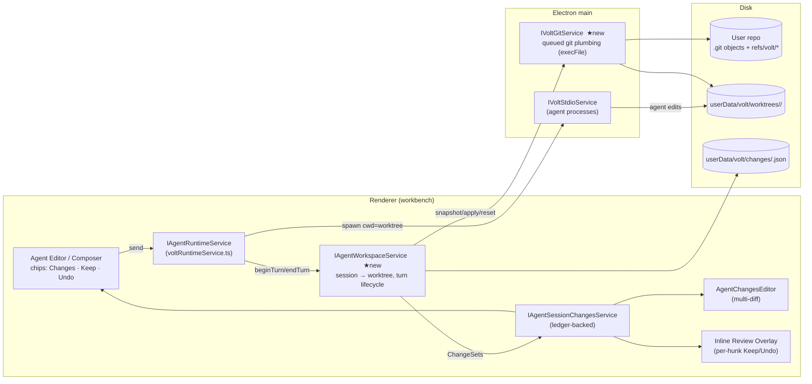

# Volt Agent Change Capture: Keep / Undo per Message

> **Goal:** Every message sent to an agent (Claude, Codex, Cursor, DeepSeek-native, any ACP CLI) produces an exact, reviewable diff. **The user's checkout doesn't change while the agent runs.** When the run ends, the user reviews it and picks **Keep** (the change lands in the workspace and is **staged** in Git) or **Undo** (it's gone, with no trace in Git).

---

## 0. TL;DR

| What | How |
|---|---|
| Isolation | Each agent session runs in its **own Git worktree** outside the workspace. The agent's `cwd` and Volt's tool root point there. |
| Capture | At the end of each turn: `git add -A` into a **private index**, then `write-tree` and `commit-tree`. The result goes to a hidden ref `refs/volt/s/<session>/t/<n>`. |
| Diff | `git diff <base> <turnN>` gives the exact per-turn diff. Nothing depends on what the agent *says* it changed. |
| Keep | `git diff --binary <base> <tip> \| git apply --3way --index` in the real repo applies the change and stages it. |
| Undo (before Keep) | Reset the worktree to the previous turn and drop the ref. The real repo and index are never touched. |
| Undo (after Keep) | `git apply -R --3way --index` with the same patch. It leaves the working tree **and** the index. |
| Non-Git folders | The same flow runs against a **shadow repo** in `userData` (`--git-dir` outside the workspace). |
| Why it beats others | Covers every agent (it captures the filesystem, not tool calls), gives per-turn refs like T3, isolation like Cursor/Conductor worktrees, and fixes the known failure modes of opencode, T3 and Cline (§3). |

---

## 1. Where Volt is today

| Piece | File | Status |
|---|---|---|
| Change list is **derived from transcript blocks** (`type:'file'`) | `contrib/voltAgent/browser/review/agentSessionChanges.ts` | ❌ Misses edits the agent makes via shell, `apply_patch`, or its own write tool (Codex/Cursor write directly to disk) |
| Changes service, multi-diff source, snapshot URIs, discard | `contrib/voltAgent/browser/review/agentSessionChangesService.ts` | ⚠️ Good surface; unreliable data. Discard writes `original` text from the transcript |
| Changes editor + actions (Copy Path, Discard) | `review/agentChangesEditor.ts`, `review/agentChangesActions.ts` | ✅ Reuse |
| Inline diff cards in the thread | `review/fileChangePreview*.ts`, `blocks/agentBlocks.ts` | ✅ Reuse |
| `file.change` event (native tools only) | `services/voltRuntime/common/events.ts`, `browser/tools/fileTools.ts` | ⚠️ Only DeepSeek-native emits it |
| ACP `fs/write_text_file` handler | `services/voltRuntime/browser/agents/acpProvider.ts` → `bindClientRequests` | ⚠️ Writes straight to the real workspace |
| Agent cwd / tool root = `folders[0]` | `browser/voltRuntimeService.ts` (≈L257, 603, 1011, 1028, 1171, 1231) | 🔧 Must become the session's worktree root |
| Process spawn (supports `env`) | `platform/voltStdio/*` | ✅ Pattern to copy for the Git service |
| Harness checkpoint event (`kind:'git'`) | `common/events.ts`, `common/harness/runHarness.ts` | 🔧 Wire to real snapshots |

**Root problem:** the source of truth is the agent's narration. It needs to be the **filesystem**.

---

## 2. Research snapshot (what others do)

| Tool | Mechanism | Lesson |
|---|---|---|
| **Cursor** | Agent edits live; inline Keep/Undo per hunk plus checkpoints; 2.0 adds **worktree** isolation (up to 8 parallel) | Worktrees are the proven isolation model. Its live-edit mode causes "Keep/Undo missing" and "checkpoint didn't revert" bugs |
| **T3 Code** | Per-thread optional worktree; **per-turn hidden refs** `refs/t3/checkpoints/<thread>/turn/<n>` via `add / write-tree / commit-tree / update-ref` | Per-turn refs are the right shape. Known issues: **ref retention/GC**, `git add` **timeouts on big monorepos**, **flush objects before publishing refs** |
| **opencode** | Separate snapshot gitdir in data dir; `track()` = `write-tree` hash; revert = checkout files | Bugs: **`index.lock` races** across processes, **silently swallowed `git add` failures** → stale snapshot → data loss on undo, stale baseline |
| **Cline** | Shadow Git repo in global storage, commit after **every tool use** | Captures untracked files; slow on large repos |
| **Conductor / Claude Code / Codex app** | Worktree per workspace/agent, built-in diff viewer | Isolation plus a diff viewer is now standard |
| **Antigravity** | Agent artifacts plus review surface | Review as a first-class artifact, not a side effect |

**Rules we adopt from their bugs:**

1. **Never swallow Git errors.** A failed snapshot marks the turn `captureFailed` and blocks Undo from using it.
2. **One private index per session.** It's never shared, so there are no `index.lock` races, and all Git ops per repo go through a serial queue.
3. **Publish the ref only after objects are written.** `commit-tree` then `update-ref`, never the other way around.
4. **Retention built in.** Delete refs when the session is deleted; prune stale refs after N days.
5. **Incremental capture.** Keep the private index warm (stat cache), use `core.untrackedCache`, optionally fsmonitor, and add a timeout with a fallback to watcher-reported paths.
6. **The baseline rotates** on every Keep/Undo, so it never goes stale.

---

## 3. Mental model

```
Real workspace (user sees)          Session worktree (agent sees)
────────────────────────────        ─────────────────────────────
HEAD + user's dirty edits  ──snap──▶ base  (refs/volt/s/S/base)
                                      │ agent turn 1 → refs/volt/s/S/t/1
                                      │ agent turn 2 → refs/volt/s/S/t/2   ← "pending stack"
   ◀──────── Keep (apply + stage) ────┘
   ✗ Undo → worktree reset, refs dropped, real repo untouched
```

- **Session** means one agent thread and one worktree (the agent process is long-lived and its `cwd` is fixed at `start()`).
- **Turn** means one user message and one snapshot commit.
- **Pending stack** means the turns not yet reviewed. New messages keep building on the stack, so the agent always sees its own work.

---

## 4. Architecture



### Layers

| Layer | Responsibility | Knows about |
|---|---|---|
| `IVoltGitService` (main) | Raw Git plumbing: `snapshot`, `diff`, `apply`, `resetWorktree`, `updateRef`, `deleteRefs`. Serial queue per repo. No UI. | Paths, SHAs |
| `IAgentWorkspaceService` (renderer) | Session → worktree mapping, turn lifecycle, ledger, Keep/Undo semantics, conflict routing | Sessions, turns, Git service |
| `IAgentSessionChangesService` (existing, rewired) | Read model for UI: files, stats, multi-diff items, snapshot text | Ledger only |
| UI (existing, extended) | Cards, chips, changes editor, inline overlay | Changes service |

---

## 5. Key decisions (ADR-lite)

| # | Decision | Why | Rejected |
|---|---|---|---|
| D1 | **Filesystem snapshot is the truth**, not tool events | Works for every CLI agent, whether it edits via shell, `apply_patch` or MCP | Parsing ACP `tool_call` diffs (lossy, agent-specific) |
| D2 | **Git worktree per session** (default `isolation: "worktree"`) | Real checkout stays untouched while the agent runs; the agent can run builds and tests; parallel sessions don't collide | FS overlay/interception (impossible for native CLIs); copying the repo (slow) |
| D3 | Worktrees live in **`userData/volt/worktrees/…`**, outside the workspace | No file-watcher churn, no search/indexing noise, no SCM noise | `.volt/worktrees` inside the repo |
| D4 | Baseline = **snapshot of the user's working tree** (tracked + untracked, respects `.gitignore`), not `HEAD` | The agent sees the user's uncommitted work; the diff shows only what the agent did | `HEAD`-based worktree (loses dirty state) |
| D5 | Snapshots are **commits under `refs/volt/s/<session>/…`** in the user's object DB | Deduped, fast, survives restart, invisible to branches, not pushed by default | Separate object DB (duplicates blobs) |
| D6 | **Private `GIT_INDEX_FILE` per session** for capture | No lock contention with the user's index or the agent's own `git` usage | Using the worktree's own index |
| D7 | **Keep = `git apply --3way --index`** | Stages exactly the agent's change; 3-way merges if the user edited meanwhile | Overwriting files |
| D8 | **Hunk-level ops computed in TS** (existing `linesDiffComputers`), file/all-level ops via Git | Git can't cherry-pick hunks cleanly; TS already has the diff engine | Hand-built partial patches |
| D9 | `isolation: "inPlace"` fallback (also for non-Git and quick edits) | Same snapshots and refs, but the agent writes into the real tree; Undo = reverse apply | – |
| D10 | Live `file.change` events are **UX hints only**; the end-of-turn snapshot wins | Fast feedback plus correct final state | – |

---

## 6. Data model (interfaces)

```ts
// services/voltRuntime/common/changes/changeTypes.ts
export type IsolationMode = 'worktree' | 'inPlace';
export type TurnState = 'running' | 'pending' | 'kept' | 'undone' | 'partial' | 'captureFailed';
export type FileState = 'pending' | 'kept' | 'undone';

export interface IAgentWorkspace {
  readonly sessionId: string;
  readonly repoRoot: string;          // real repo (or shadow git-dir owner)
  readonly gitDir: string;            // real .git or userData shadow
  readonly root: string;              // where the agent runs (worktree path or repoRoot)
  readonly isolation: IsolationMode;
  readonly baseRef: string;           // refs/volt/s/<id>/base
}

export interface ITurnChangeSet {
  readonly sessionId: string;
  readonly turnId: string;            // == runId
  readonly index: number;             // 1..n
  readonly parentCommit: string;      // base or previous turn
  readonly commit?: string;           // snapshot commit (undefined while running)
  readonly state: TurnState;
  readonly files: readonly ITurnFileChange[];
  readonly stats: { files: number; additions: number; deletions: number };
  readonly startedAt: number;
  readonly endedAt?: number;
  readonly error?: string;
}

export interface ITurnFileChange {
  readonly path: string;              // repo-relative, posix
  readonly oldPath?: string;          // renames (git diff -M)
  readonly kind: 'added' | 'modified' | 'deleted' | 'renamed';
  readonly binary: boolean;
  readonly additions: number;
  readonly deletions: number;
  readonly oldBlob?: string;          // git blob sha → content on demand
  readonly newBlob?: string;
  state: FileState;
}
```

```ts
// platform/voltGit/common/voltGit.ts  (IPC like voltStdio)
export interface IVoltGitService {
  readonly _serviceBrand: undefined;
  resolveRepo(folder: string): Promise<{ repoRoot: string; gitDir: string } | undefined>;
  ensureShadowRepo(folder: string, shadowDir: string): Promise<{ gitDir: string }>;
  snapshot(o: { repoRoot: string; workTree: string; indexFile: string; parent?: string; message: string; ref: string; paths?: string[] }): Promise<{ commit: string; tree: string }>;
  addWorktree(o: { repoRoot: string; path: string; commit: string }): Promise<void>;
  resetWorktree(o: { workTree: string; commit: string; keepPaths: string[] }): Promise<void>;
  removeWorktree(o: { repoRoot: string; path: string }): Promise<void>;
  diffSummary(o: { repoRoot: string; from: string; to: string }): Promise<IDiffEntry[]>; // --raw --numstat -M -z
  patch(o: { repoRoot: string; from: string; to: string; paths?: string[] }): Promise<string>; // --binary --full-index
  apply(o: { repoRoot: string; patch: string; reverse?: boolean; index: boolean; threeWay: boolean; check?: boolean }): Promise<IApplyResult>;
  readBlob(o: { repoRoot: string; sha: string }): Promise<Uint8Array>;
  updateRef(o: { repoRoot: string; ref: string; commit?: string /* undefined = delete */ }): Promise<void>;
  deleteRefs(o: { repoRoot: string; prefix: string }): Promise<void>;
}
```

```ts
// services/voltRuntime/common/changes/agentWorkspace.ts
export interface IAgentWorkspaceService {
  readonly onDidChangeTurns: Event<string /*sessionId*/>;
  prepare(sessionId: string): Promise<IAgentWorkspace>;           // before provider.start()
  beginTurn(sessionId: string, runId: string): Promise<void>;     // before send
  endTurn(sessionId: string, runId: string, reason: 'done'|'abort'|'fail'): Promise<ITurnChangeSet>;
  getTurns(sessionId: string): readonly ITurnChangeSet[];
  getPending(sessionId: string): { files: readonly ITurnFileChange[]; from: string; to: string };
  keep(sessionId: string, target: ReviewTarget): Promise<IApplyOutcome>;
  undo(sessionId: string, target: ReviewTarget): Promise<IApplyOutcome>;
  dispose(sessionId: string, opts?: { keepRefs?: boolean }): Promise<void>;
}
export type ReviewTarget =
  | { kind: 'all' }
  | { kind: 'turn'; turnId: string }
  | { kind: 'file'; path: string }
  | { kind: 'hunk'; path: string; hunkId: string };
```

**Ledger file:** `userData/volt/changes/<sessionId>.json` holds `{ workspace, turns: ITurnChangeSet[] }` and is written atomically (same `ATOMIC` pattern as `agentHistoryService.ts`). Refs are the durable data; the ledger is an index you can rebuild from refs.

---

## 7. Workflows

### 7.1 Send a message (isolated)

```mermaid
sequenceDiagram
  participant U as User
  participant RT as RuntimeService
  participant WS as AgentWorkspaceService
  participant G as VoltGitService
  participant A as Agent CLI
  U->>RT: send(text)
  RT->>WS: prepare(session)  (first turn only)
  WS->>G: snapshot(real tree) → base; addWorktree(base)
  RT->>A: start(cwd = worktree)  (first turn only)
  RT->>WS: beginTurn(runId)
  WS-->>RT: parent = last pending commit or base
  A->>A: edits files in worktree (real checkout untouched)
  A-->>RT: run.end
  RT->>WS: endTurn(runId)
  WS->>G: snapshot(worktree, privateIndex, parent) → t/n
  WS->>G: diffSummary(parent, t/n)
  WS-->>RT: ITurnChangeSet (pending)
  RT-->>U: Turn card "3 files +42 −7 · Review · Keep · Undo"
```

### 7.2 Keep

1. `patch = git diff --binary --full-index <base> <tipOfSelection>` (optionally with `-- <paths>`)
2. `git apply --check --3way --index` in the real repo, then the real apply.
3. Success: files mark `kept`. If everything is kept: **rotate baseline** (new base = snapshot of the real tree; worktree reset to it; drop turn refs, or keep them for history per setting).
4. Conflict: open the merge editor for the conflicted paths; the turn is `partial` until resolved.
5. Open dirty editors on target files: prompt "Save or revert first" (never clobber unsaved buffers).

### 7.3 Undo

| When | Action |
|---|---|
| Latest pending turn | `resetWorktree(parentCommit)`, `updateRef(t/n, delete)`, state `undone`. **Real repo untouched.** |
| Older pending turn | Allowed only as "Undo back to here" (pops the stack), which keeps the rule simple and deterministic |
| Pending file | `git checkout <base> -- path` in the worktree (the agent sees the revert on its next turn) |
| Pending hunk | TS: rebuild file content without that hunk and write it into the worktree |
| **Already kept** | `git apply -R --3way --index` with the kept patch. It leaves the working tree and index (the user's "remove from Git" requirement) |

### 7.4 Follow-up while turns are pending

The agent continues on top of `t/n`. The review UI shows **per-turn** diffs (`t/n-1..t/n`) and **cumulative** diffs (`base..t/n`). Keep All applies `base..tip`.

### 7.5 User edits the real repo mid-run

Nothing breaks. Keep uses `--3way`. Before the next turn starts, if there are no pending turns, the baseline rotates to pick up the user's edits. If turns are pending, offer "Sync my edits into agent workspace" (3-way apply `oldBase..newSnapshot` into the worktree).

### 7.6 Crash / restart

On startup: read ledgers, then `git worktree list` and `refs/volt/s/*`. A turn stuck in `running` gets re-snapshotted and marked `pending`. Orphan worktrees get `git worktree prune`.

### 7.7 Non-Git folder

`ensureShadowRepo(folder, userData/volt/shadow/<hash>.git)` then the same flow with `--git-dir=<shadow>`. Keep writes files with no staging and shows a toast: "Not a Git repo; changes applied."

---

## 8. Git plumbing cheat-sheet

```bash
# Snapshot any tree without touching the user's index (baseline or turn)
export GIT_INDEX_FILE=$USERDATA/volt/index/<session>.idx     # private, persistent → warm stat cache
git -C <workTree> -c core.untrackedCache=true add -A [-- <paths>]
TREE=$(git -C <workTree> write-tree)
COMMIT=$(git -C <workTree> commit-tree $TREE -p <parent> -m "volt turn <n> <runId>")
git -C <repoRoot> update-ref refs/volt/s/<session>/t/<n> $COMMIT   # publish LAST

# Worktree (detached, outside workspace)
git -C <repoRoot> worktree add --detach $USERDATA/volt/worktrees/<repo>/<session> <baseCommit>
# link heavy ignored dirs (node_modules, .venv, target) per setting
git -C <wt> reset --hard -q <commit> && git -C <wt> clean -fdq -e <linkedDirs>   # resetWorktree

# Review data
git -C <repoRoot> diff --raw --numstat -M -z <from> <to>      # summary
git -C <repoRoot> diff --binary --full-index <from> <to> [-- paths]   # patch
git -C <repoRoot> cat-file blob <sha>                          # side content

# Keep / Undo-after-keep (real repo)
git -C <repoRoot> apply --3way --index [--reverse] --whitespace=nowarn -   # patch on stdin

# Cleanup
git -C <repoRoot> for-each-ref --format='delete %(refname)' refs/volt/s/<session>/ | git update-ref --stdin
git -C <repoRoot> worktree remove --force <wt> && git worktree prune
```

---

## 9. Folder structure (new ★ / changed ✎)

```
src/vs/platform/voltGit/                         ★ main-process Git plumbing
  common/voltGit.ts                              ★ IVoltGitService, types, channel name
  electron-main/voltGitMainService.ts            ★ execFile git, per-repo serial queue, timeouts, typed errors
src/vs/code/electron-main/app.ts                 ✎ register VOLT_GIT channel (next to voltStdio ≈L1205)

src/vs/workbench/services/voltRuntime/
  common/changes/
    changeTypes.ts                               ★ ITurnChangeSet, ITurnFileChange, ReviewTarget
    agentWorkspace.ts                            ★ IAgentWorkspaceService decorator + interface
    ledger.ts                                    ★ pure: state transitions, stack rules (unit-testable)
    hunks.ts                                     ★ pure: hunk ids, apply/drop hunk on text (uses linesDiffComputers)
    pathMap.ts                                   ★ real-root ↔ worktree-root mapping + leak detection
  browser/changes/
    agentWorkspaceService.ts                     ★ lifecycle, ledger IO, keep/undo orchestration
    worktreeProvisioner.ts                       ★ create/reuse/reset/link-ignored/prune
  electron-browser/voltGit.contribution.ts       ★ registerMainProcessRemoteService(IVoltGitService)
  browser/voltRuntimeService.ts                  ✎ prepare/beginTurn/endTurn; cwd + tool root = workspace.root
  browser/agents/acpProvider.ts                  ✎ fs/read|write_text_file → map to worktree; reject writes into real root
  browser/tools/workspacePath.ts                 ✎ resolve against session root, not folders[0]
  browser/prompt/promptCompiler.ts               ✎ emit mentions as repo-relative paths (no real absolute paths)
  common/events.ts                               ✎ + { type:'changes.captured'; turn: ITurnChangeSet }
  test/common/changes/{ledger,hunks,pathMap}.test.ts   ★
  test/node/voltGit.integration.test.ts          ★ real temp repos

src/vs/workbench/contrib/voltAgent/browser/review/
  agentSessionChanges.ts                         ✎ keep helpers; transcript path becomes fallback only
  agentSessionChangesService.ts                  ✎ back getFiles/getMultiDiffItems/getSnapshotText with the ledger (blob SHAs)
  agentChangesActions.ts                         ✎ + Keep / Undo (file, turn, all), Undo-after-Keep
  agentChangesEditor.ts                          ✎ scope picker gets "Turn n" entries + Keep All / Undo All header
  agentReviewOverlay.ts                          ★ per-hunk Keep/Undo in the real code editor (see §10)
  agentTurnSummaryBlock.ts                       ★ end-of-turn card in the thread
src/vs/workbench/contrib/voltAgent/browser/composer/agentComposerChips.ts  ✎ "Changes" chip → pending stats + Keep/Undo
src/vs/workbench/contrib/voltSettings/…          ✎ settings (§11)
```

---

## 10. UX spec (Cursor-grade, brief)

- **While running:** the composer chip shows `Working… · 3 files` (from live watcher hints). The real editor is **untouched**. An optional read-only "Peek live diff" opens the changes editor on `base..worktree`.
- **Turn end:** a `agentTurnSummaryBlock` card shows files with `+/−`, plus **Review**, **Keep**, **Undo**. Undo is the Undo of the *last turn*; the chip carries Keep All / Undo All.
- **Review:** the multi-diff editor (existing), with scopes `All pending · Turn 1…n · Staged · Unstaged`. Each file toolbar has Keep / Undo.
- **In-file review:** opening a file with pending changes shows an **inline diff overlay** (green/red) with per-hunk Keep/Undo and a floating bar `‹ 2/5 › Keep file · Undo file`. Borrow patterns from `contrib/chat/browser/chatEditing/chatEditingCodeEditorIntegration.ts` and `chatEditingEditorOverlay.ts`; don't depend on the chat service.
- **Keyboard:** `⌘⏎` Keep file, `⌘⌫` Undo file, `⌥]`/`⌥[` next/prev hunk, `⌘⇧⏎` Keep all.
- **After Keep:** files show as **staged** in the SCM view immediately. The thread card flips to `Kept ✓ (staged)` with an `Undo` affordance (reverse apply).

---

## 11. Settings

```jsonc
"volt.agent.changes.isolation": "worktree",          // "worktree" | "inPlace" | "auto" (auto: inPlace for Ask/Plan & non-git tiny edits)
"volt.agent.changes.stageOnKeep": true,
"volt.agent.worktree.linkIgnored": ["node_modules", ".venv", "target", "dist"],
"volt.agent.worktree.linkMode": "symlink",          // "symlink" | "reflinkCopy" | "none"
"volt.agent.changes.retentionDays": 14,              // prune refs/volt/s/* of deleted/old sessions
"volt.agent.changes.captureTimeoutMs": 20000         // then fall back to watcher paths (never silent)
```

---

## 12. Performance and reliability rules

| Rule | Detail |
|---|---|
| Warm private index | Persist `index/<session>.idx`, so `add -A` is stat-only for unchanged files (O(changed)) |
| Path hints | A worktree watcher collects touched paths during the turn. Large repos run `add -A -- <paths>` first and a full scan only if `status --porcelain` disagrees |
| One queue per repo | All `IVoltGitService` ops per `gitDir` are serialized. Parallel sessions are fine (separate indexes and worktrees) |
| Worktree reuse | One worktree per session, reset between baselines (`reset --hard` touches only differing files) |
| Pooled worktrees (Phase 3) | Pre-create 1 spare worktree per repo so the first message has near-zero latency |
| Lazy content | The ledger stores blob SHAs only. Text is loaded on demand via `cat-file`, with an LRU cache in the snapshot content provider |
| No silent failure | Every Git call returns `{ok:false, code, stderr}`. The turn becomes `captureFailed` with a visible error and a "Retry capture" action |
| Atomic publish | Objects are written, then `update-ref`, then the ledger write |
| Binary / large | `diff --binary` for apply. The UI shows "Binary file changed" and skips files over 2 MB in inline preview |
| Leak detection | After each turn, cheaply check the real tree for paths the agent touched outside the worktree (absolute-path writes). If found, warn and offer to fold them into the turn |

---

## 13. Edge cases checklist

- Agent runs `git commit` or `git checkout` inside the worktree: capture uses the private index plus the working files, so this is unaffected.
- Submodules: record as gitlinks; don't recurse in v1.
- Renames: detect with `-M`, show as `renamed`, and apply cleanly via the patch.
- File-mode or permission changes: covered by `--binary --full-index` patches.
- Line endings (CRLF): let Git's `core.autocrlf` apply; don't normalize in TS.
- User switches branch mid-review: Keep still works via 3-way. If base is unreachable from the new HEAD, warn "Review based on a different branch".
- Multi-root workspace: one `IAgentWorkspace` per repo root (v1: `folders[0]`, matching today's runtime).
- Dirty editor buffers: block apply on those paths and prompt.
- Cancelled or failed run: still snapshot (partial work is reviewable), and label the card "Stopped".
- Session delete: `dispose()` removes the worktree, refs and ledger.

---

## 14. Implementation plan (hand this to the implementing agent)

| Phase | Scope | Done when |
|---|---|---|
| **P1 · Plumbing** | `platform/voltGit` service and IPC; `snapshot`, `diffSummary`, `patch`, `apply`, `readBlob`, refs; integration tests on temp repos | Tests: snapshot of dirty tree + untracked; apply/reverse round-trip leaves index identical; errors are typed |
| **P2 · Capture (inPlace)** | `agentWorkspaceService` with `isolation:inPlace`; `beginTurn/endTurn` hooked in `voltRuntimeService.send/finish`; ledger; rewire `agentSessionChangesService` to the ledger | Codex/Cursor shell edits appear in the review with exact `+/−`; Undo last turn restores bytes exactly |
| **P3 · Isolation (worktree)** | Provisioner, cwd/tool-root switch (all `folders[0]` call sites), ACP fs mapping, prompt path relativization, leak detection, Keep via `apply --3way --index` | During a run the real tree hash is unchanged; after Keep, `git diff --cached` equals the turn diff; after Undo, `git status` is identical to before |
| **P4 · Review UX** | Turn summary block, chip actions, changes-editor turn scopes, Keep/Undo actions (file/turn/all), Undo-after-Keep | Manual script in §15 passes |
| **P5 · Hunk-level plus inline overlay** | `hunks.ts`, `agentReviewOverlay.ts`, keybindings | Keep 1 of 3 hunks leaves exactly that hunk staged |
| **P6 · Hardening** | Retention/prune, crash recovery, pooled worktrees, non-Git shadow repo, big-repo path hints | 50k-file repo: capture < 300 ms for a 5-file turn; restart mid-run recovers |

**Coding guidelines:** match the existing Volt style (tabs, `localize`, `registerAction2`, `Disposable` services, `createDecorator`). Keep `common/changes/*` **pure** (no services) so it's unit-testable. Never call `git` from the renderer except through `IVoltGitService`.

---

## 15. Test plan

- **Unit** (`test/common/changes`): ledger transitions (pending→kept/undone/partial, stack pop rules), hunk drop/keep on text, path mapping and leak detection.
- **Integration** (`test/node`): real temp repos covering dirty base, untracked, rename, binary, delete, 3-way conflict, reverse apply, non-Git shadow.
- **Manual smoke:**
  1. Dirty a file, ask the agent to edit 3 files (one new). The editor shows no change mid-run.
  2. The card shows 3 files. Keep 1 file: SCM **Staged** shows exactly it.
  3. Undo the rest: `git status` shows only the user's original dirt.
  4. Send 2 more turns and Undo the latest: the worktree is back at turn 1 and the agent's next read confirms it.
  5. Keep all, then Undo-after-Keep: index and working tree are back to the pre-Keep state.

---

## Sources

- Cursor: [Worktrees docs](https://cursor.com/docs/configuration/worktrees) · [Checkpoints (Steve Kinney)](https://stevekinney.com/courses/ai-development/cursor-checkpoints) · [Keep/Undo bugs](https://forum.cursor.com/t/keep-undo-buttons-missing-and-discard-to-checkpoint-not-reverting-changes-auto-applies-edits/152621) · [Checkpoint not agent-independent](https://forum.cursor.com/t/in-2-0-undo-checkpoint-is-not-agent-independent/139630) · [Cursor 2.0 guide](https://www.digitalapplied.com/blog/cursor-2-0-agent-first-architecture-guide)
- T3 Code: [Checkpoint ref retention #14090](https://github.com/pingdotgg/t3code/issues/14090) · [Flush objects before refs #10944](https://github.com/pingdotgg/t3code/pull/10944) · [Big-monorepo add timeout #3646](https://github.com/pingdotgg/t3code/issues/3646) · [Better Stack guide](https://betterstack.com/community/guides/ai/t3-code/)
- opencode: [index.lock race #48848](https://github.com/anomalyco/opencode/issues/48848) · [Swallowed git add #12719](https://github.com/anomalyco/opencode/issues/12719) · [Stale baseline #49732](https://github.com/anomalyco/opencode/issues/49732) · [Mutation epochs redesign #44511](https://github.com/anomalyco/opencode/issues/44511)
- Cline: [Checkpoints docs](https://docs.cline.bot/core-workflows/checkpoints) · [DeepWiki](https://deepwiki.com/cline/cline/10.1-checkpoints-and-snapshots)
- Worktrees for agents: [Claude Code worktrees](https://code.claude.com/docs/en/worktrees) · [Nimbalyst guide](https://nimbalyst.com/blog/git-worktrees-for-ai-coding-agents-complete-guide/)
